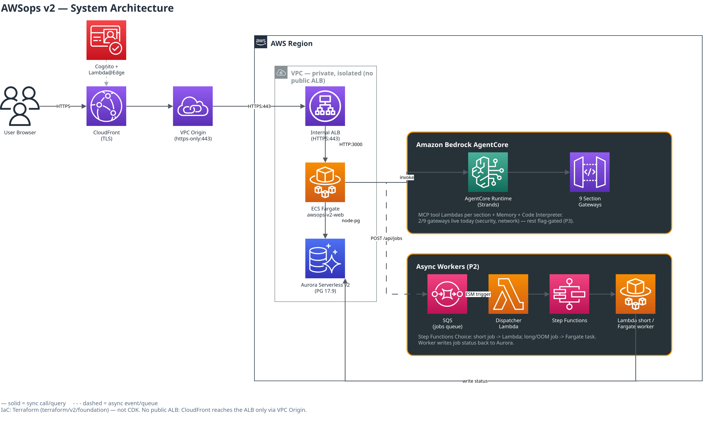

# AWSops Dashboard

[](https://github.com/Atom-oh/awsops/stargazers)
[](https://github.com/Atom-oh/awsops/network/members)
[](https://github.com/Atom-oh/awsops/issues)
[](LICENSE)
[](https://github.com/Atom-oh/awsops/releases)
[](https://github.com/Atom-oh/awsops/commits/main)
[](https://github.com/Atom-oh/awsops/actions/workflows/pr-review.yml)

<a href="#english"></a>
<a href="#korean"></a>

AWS + Kubernetes operations dashboard with real-time monitoring, a private CloudFront/Fargate edge, Aurora Serverless v2 state, and AI-powered diagnosis via Amazon Bedrock AgentCore. | 비공개 CloudFront/Fargate 엣지, Aurora Serverless v2 상태 저장, Amazon Bedrock AgentCore 기반 AI 진단을 갖춘 실시간 모니터링 AWS + Kubernetes 운영 대시보드입니다.

---

<a id="english"></a>

# English

## Overview

AWSops v2 is a single-pane operations dashboard for AWS and Kubernetes, rebuilt as a Terraform-based MSA: a private edge (CloudFront VPC Origin → internal ALB → ECS Fargate), Cognito + Lambda@Edge auth, Aurora Serverless v2 persistent state, AgentCore section agents for live AWS queries, and an OOM-safe async worker tier. The previous v1 architecture (single EC2, CDK, embedded Steampipe) is being decommissioned per ADR-016 — per ADR-016 (decision records are maintained in the private upstream repository).



```
Internet -> CloudFront (TLS, Lambda@Edge Cognito auth) -> VPC Origin (https-only) -> internal ALB (HTTPS)
  -> ECS Fargate: Next.js 14 thin-BFF :3000 (arm64, no basePath) -> Aurora Serverless v2 (PG 17.9, node-pg)
  -> Amazon Bedrock AgentCore: Runtime (Strands) + 9 section Gateways + Memory + Code Interpreter
  -> async workers: POST /api/jobs -> SQS -> Step Functions -> Lambda or Fargate worker
```

Stats: 41 pages, 99 API routes, 110 components (`web/`), 21 consolidated ADRs, Terraform-managed (`terraform/foundation`, no CDK).

> **No public ALB.** The edge is fully private — CloudFront reaches the ALB only through a VPC Origin, and the ALB only accepts traffic from CloudFront's managed security group. v2's posture is a **read-only ops dashboard + AI diagnosis**: AWS-resource mutation and autonomous remediation are FROZEN by design (ADR-005) — infra changes stay with the operator's own IaC/Change Manager, with one narrowly-scoped exception for self-healing service restarts (ADR-015). (ADR-019's SG-rules Athena role is a separate, ordinary GATED feature — ADR-019 concludes it sits inside the existing read-only invariant and is not an ADR-005 exception.)

## Features

- **Resource inventory** -- EC2, EKS, Lambda, ECS clusters/tasks, ECR, storage/DB, network, and security groupings, derived from Aurora-persisted inventory snapshots (with an optional flag-gated Steampipe sync layer).
- **AI assistant** -- Bedrock AgentCore Runtime (Strands agent) routes each question to 1-3 of 9 section gateways in parallel and synthesizes the result, with SSE streaming, AgentCore Memory (conversation history), and a Python Code Interpreter.
- **CIS compliance** -- Powerpipe benchmark runs with history (`compliance_runs`/`compliance_results`), flag-gated.
- **Cost and FinOps** -- Cost Explorer, Bedrock usage/spend tracking, and 14-day resource-trend charts on the dashboard.
- **Async diagnosis and jobs** -- long-running work (AI diagnosis reports via `POST /api/diagnosis`, compliance scans via `POST /api/compliance/run`) is enqueued to the same SQS + Step Functions + Lambda/Fargate worker tier as the generic `POST /api/jobs` route — the web tier never blocks on OOM-risk work. `/api/jobs` itself only accepts `noop`/`noop-heavy` job types (diagnosis/compliance compute `requestedBy` server-side and reject attacker-controlled report/run ids); `GET /api/jobs` and `GET /api/jobs/[id]` enforce owner-or-admin visibility.
- **EKS onboarding** -- interactive `configure.mjs` flow grants the web task role an EKS Access Entry with view access, per cluster.

### AI Gateways (Amazon Bedrock AgentCore)

9 section gateways are defined in Terraform (`ai.tf`); each is provisioned idempotently and routes to Lambda-backed MCP tools. **All 9 gateways hold READY MCP targets** — the fleet (`local.agent_lambdas`, 30 slices: 21 gated on `agentcore_enabled`, 9 on `integrations_enabled`) is deployed; the table below reflects the live shape.

| Gateway | Capabilities | Status |
|---------|--------------|--------|
| network | VPC, ENI, reachability, flow logs, TGW, VPN, firewall | ✅ live |
| security | IAM users/roles/policies + policy simulation (14 tools, iam-mcp) | ✅ live |
| container | EKS, ECS, Istio, Kubernetes | ✅ live |
| data | DynamoDB, RDS/Aurora, ElastiCache, MSK, OpenSearch | ✅ live |
| cost | Cost Explorer, forecast, budgets, container cost | ✅ live |
| monitoring | CloudWatch, CloudTrail | ✅ live |
| iac | CloudFormation, CDK, Terraform | ✅ live |
| ops | Aurora-backed inventory/topology reads + AWS docs/CLI suggestions (no live Steampipe) | ✅ live |
| external-obs | External observability & integrations (Prometheus, ClickHouse, Notion) | ✅ live |

All 9 rows are gated behind `agentcore_enabled`/`integrations_enabled` (default `false` in a fresh clone/deploy — `plan` = No changes, $0); "live" here describes this project's actual running deployment, which has both flags on.

Models: Claude Sonnet 5 (default), Opus 4.8 (deep analysis), Haiku 4.5 (fast/low-cost).

## Prerequisites

- Terraform >= 1.15 (S3 native state locking via `use_lockfile`)
- Node.js >= 18 (configurator TUI, migration scripts)
- Docker with buildx (arm64 image builds)
- AWS CLI configured with credentials for the target account
- kubectl and a kubeconfig, if onboarding EKS clusters

## Installation

```bash
# Clone the repository
git clone https://github.com/Atom-oh/awsops.git
cd awsops

# Interactive TUI: choose new/existing VPC, domain, bucket, EKS clusters
make configure          # -> terraform.tfvars + backend.hcl

# Provision the foundation stack
terraform -chdir=terraform/foundation init -backend-config=backend.hcl
terraform -chdir=terraform/foundation plan -out tfplan
terraform -chdir=terraform/foundation apply tfplan

# Build + push the web image, roll ECS, wait for /api/health
make deploy

# After apply: apply DB migrations FIRST (creates the awsops_sql_reader role and syncs its
# password — make agentcore does neither, and skipping it leaves execute_sql and inventory-read
# failing Data API auth). See docs/runbooks/agent-sql-reader.md.
make migrate
# then build/push the agent image and run the idempotent AgentCore provisioner
make agentcore

# After apply with workers_enabled=true: build/push the worker image
make workers
```

## Usage

```bash
make help              # list all available targets
make migrate-status    # offline: app version + each pending migration's release
make backfill-owner-sub # PLAN the legacy email-keyed requested_by -> Cognito sub rewrite (changes
                        # nothing). Review the plan, delete entries you cannot vouch for, then
                        # `node scripts/v2/backfill-owner-sub.mjs --apply <plan.json>`. Quiesce the
                        # schedule dispatcher first — the plan output prints the exact commands. Step 2
                        # of ADR-009's Ownership Amendment; step 3 is legacy_email_owner_match=false.
DRY_RUN=1 make migrate  # preview pending DB migrations before applying
make upgrade            # safe release upgrade: RDS snapshot -> migrate -> deploy
```

## Configuration

Runtime configuration is **flag-gated in Terraform** (`variables.tf`). The feature gates below all default `false`, so a fresh `plan` is a no-op. Three operational switches deliberately do NOT: `legacy_email_owner_match` (default **true** — accepts the legacy email-keyed ownership match at every `matchesIdentity()` gate — reads *and* report PATCH/DELETE via `canMutateReport()`, not reads alone; flip to `false` only after a successful `--apply` leaves zero legacy email-keyed rows, or a plan that finds none at all — a clean *plan* over rows that still need rewriting is not enough, `make backfill-owner-sub` only plans; see ADR-009's Ownership Amendment) and the pre-existing `create_network` / `allow_vpc_db_access`:

| Flag | Gates |
|------|-------|
| `agentcore_enabled` | 21 of the AgentCore Lambda slices |
| `integrations_enabled` | remaining 6 AgentCore Lambda slices |
| `workers_enabled` | the async worker tier (SQS/SFN/Lambda/Fargate) |
| `steampipe_enabled` | the Steampipe inventory-sync data layer |
| `finops_baseline_enabled` | the FinOps baseline-recommendations engine (ADR-020): a daily Fargate rule batch (unattached EBS volumes; EC2/RDS rightsizing via Compute Optimizer) writing to `finops_findings`, read-only, rendered on `/cost`. Requires `workers_enabled` only at the Terraform level — but the EBS rule additionally needs a fresh `steampipe_enabled=true` inventory sync at runtime; without it, that rule honestly reports `partial` (EC2/RDS rightsizing still work) |
| `official_mcp_enabled` | ADR-017 curated official-vendor MCP presets — the **3 vendor-hosted** ones (Datadog·Dynatrace·New Relic) as external-obs `mcpServer` targets. (The runtime fail-closed tool allowlist is NOT gated by this flag — it is written on every provisioner run and enforced unconditionally; that unconditionality is the fail-closed property.) Operator notes: Dynatrace ships with a deliberately EMPTY allowlist (zero tools until its hosted tool list is transcribed into catalog.py); `make agentcore` waits for runtime READY (default 300s, `AGENTCORE_RUNTIME_READY_TIMEOUT`) and a failed/slow rollout temporarily retires eligible live targets until the next successful run. |
| `graph_querygen_enabled` | LLM fallback for the ONE ClickHouse `trace_spans` graph query (ADR-018). Note it does NOT carry the diag-signal path's identifier sanitising, relevance gate, weekly budget or read-side gate — ADR-018 §C |
| `diag_signal_querygen_enabled` | LLM fallback for ONE Explore diag-signal chip, only when a kind's deterministic catalog yields **zero ready rows** (a partial match is not topped up), and only for the chips — the diagnosis report never uses generated rows, and a flag-off read excludes them too. Separate from `graph_querygen_enabled`; both need `datasource_diagnosis_enabled`; `graph_querygen_enabled` ALSO requires `agentcore_enabled` (it provisions the Code Interpreter session IAM) |
| `sg_rule_activity_enabled` | the SG Rules Athena-based traffic-evidence pipeline (`/network/security-groups/rules`) — the Athena/Glue broker Lambda, the daily `sg_rule_scan` worker job, and their Terraform (`sg-rules.tf`) |
| `network_path_check_enabled` | the Network Path Check page/worker (`network-path.tf`) — `fetch_live_topology()` is now real (cache-only, from Aurora's synced topology), but a full live AWS/Kubernetes re-read at run time is still deliberately unimplemented, so `POST .../runs` still 503s `unimplemented` even with this flag on; see the Network Path Check changelog entry. A pod/node source's live identity confirmation additionally needs an EKS Access Entry — for the **worker task role** on a host-account cluster (this feature's `_default_k8s_get()` uses that role's own credentials directly when the source's account is the host account), or for the target account's **`AWSopsReadOnlyRole`** on a member-account cluster (the K8s GET is authenticated via that assumed session instead, so registering the worker task role there is a no-op and every GET 403s) — see [`docs/runbooks/network-path-eks-access.md`](docs/runbooks/network-path-eks-access.md) + `scripts/v2/eks/register-network-path-access.sh` (`ROLE_ARN=...` overrides the principal for the member-account case) |

One more ADR-017 gate is **not** a terraform flag: **`CLICKHOUSE_OFFICIAL_MCP`** is an AgentCore runtime env recorded by the provisioner (`CLICKHOUSE_OFFICIAL_MCP=true make agentcore`) that embeds the official `mcp-clickhouse` as a stdio subprocess in the runtime container. It is **FROZEN / do-not-enable**: the stdio path has no replacement for the in-house lambda's table-function SSRF guard, so unfreezing requires both the technical precondition and a new ADR + multi-AI panel + dated owner-override (ADR-017 §Status, BASELINE §2).

Two companion **maps** (not booleans, both default `{}`) configure ADR-017 per preset — `official_mcp_endpoints` (`map(string)`, `preset_key` -> `https://` endpoint) and `official_mcp_read_only_ack` (`map(string)`, `preset_key` -> **the exact endpoint URL the operator reviewed**, echoed verbatim — *not* `true`). A preset provisions only when its ack equals its current endpoint; anything else is a fail-closed SKIP that retires any live target:

```hcl
official_mcp_endpoints     = { datadog = "https://mcp.datadoghq.com/v1/mcp" }
official_mcp_read_only_ack = { datadog = "https://mcp.datadoghq.com/v1/mcp" }
```

AgentCore's own config (runtime ARN, Memory ID, Code Interpreter ID) is written to SSM (`/ops/awsops-v2/agentcore/*`) by the provisioner and read by the web BFF at runtime — never passed via task-def `valueFrom` (avoids a startup race).

## Project Structure

```
awsops/
  web/                    # Next.js 14 thin-BFF: 41 pages, 99 API routes, 110 components
  agent/                  # Strands Agent (Runtime source) + MCP Lambda tool sources
  terraform/foundation/  # single Terraform root: network, edge, auth, data, workload, ai, workers, eks
  scripts/v2/             # configure/deploy/migrate/agentcore/workers tooling (all Node.js/Python)
  tests/                  # repo-wide hook/structure tests + PR-review/Steampipe/ExternalId wiring checks
  docs/                   # guides, runbooks, decisions/ (BASELINE.md + 21 consolidated ADRs)
  docs-site/              # Docusaurus user guide (deployed separately)
```

## Testing

```bash
bash scripts/v2/merge-verify.sh   # Python pytest (scripts/v2 + agent) + web vitest + terraform validate
bash tests/run-all.sh             # repo-wide hook/structure tests + agent Python unittests
cd web && npx vitest run          # web unit tests only
```

## API Documentation

The 99 API routes live under `web/app/api/`. Key routes: `health` (public), `stream` (SSE chat), `db` (Aurora ping), `jobs` (+`/[id]`, async job submission/status), `security`, `compliance`, `auth/login`. See the docs site for user-facing guidance.

## Contributing

1. Fork the repository
2. Create your branch (`git checkout -b feat/amazing-feature`)
3. Commit your changes (`git commit -m 'feat: add amazing feature'`)
4. Push to the branch (`git push origin feat/amazing-feature`)
5. Open a Pull Request

## License

Licensed under the MIT License. See [LICENSE](LICENSE) for details.

## Contact

- Maintainer: [Atom-oh](https://github.com/Atom-oh)
- Issues: [github.com/Atom-oh/awsops/issues](https://github.com/Atom-oh/awsops/issues)

---

<a id="korean"></a>

# 한국어

## 개요

AWSops v2는 AWS와 Kubernetes를 위한 단일 화면 운영 대시보드로, Terraform 기반 MSA로 재구축되었습니다: 비공개 엣지(CloudFront VPC Origin → 내부 ALB → ECS Fargate), Cognito + Lambda@Edge 인증, Aurora Serverless v2 영속 상태, 라이브 AWS 조회를 수행하는 AgentCore 섹션 에이전트, OOM-안전 비동기 워커 계층으로 구성됩니다. 이전 v1 아키텍처(단일 EC2, CDK, 내장 Steampipe)는 ADR-016에 따라 폐기 진행 중입니다 — (결정 기록은 비공개 upstream 리포지토리에서 관리됩니다).


```
Internet -> CloudFront (TLS, Lambda@Edge Cognito 인증) -> VPC Origin (https-only) -> 내부 ALB (HTTPS)
  -> ECS Fargate: Next.js 14 thin-BFF :3000 (arm64, basePath 없음) -> Aurora Serverless v2 (PG 17.9, node-pg)
  -> Amazon Bedrock AgentCore: Runtime (Strands) + 9 섹션 Gateway + Memory + Code Interpreter
  -> 비동기 워커: POST /api/jobs -> SQS -> Step Functions -> Lambda 또는 Fargate 워커
```

현황: 41 페이지, 99 API 라우트, 110 컴포넌트(`web/`), 21개 통합 ADR, Terraform 관리(`terraform/foundation`, CDK 없음).

> **공개 ALB 없음.** 엣지는 완전히 비공개입니다 — CloudFront는 VPC Origin을 통해서만 ALB에 도달하고, ALB는 CloudFront 관리형 보안 그룹의 트래픽만 허용합니다. v2의 자세는 **read-only 운영 대시보드 + AI 진단**입니다: AWS 리소스 변경·자율 조치는 설계상 FROZEN(ADR-005) — 인프라 변경은 운영자 자신의 IaC/Change Manager가 담당하며, 자가치유 서비스 재시작 하나만 좁게 예외 허용됩니다(ADR-015). (ADR-019의 SG-rules Athena role은 별개의 일반 GATED 기능입니다 — ADR-019는 이것이 기존 read-only 불변식 내부에 있다고 결론 내리며, ADR-005 예외가 아닙니다.)

## 주요 기능

- **리소스 인벤토리** -- EC2, EKS, Lambda, ECS 클러스터/태스크, ECR, 스토리지/DB, 네트워크, 보안 그룹핑을 Aurora에 저장된 인벤토리 스냅샷 기반으로 제공(선택적 flag-gated Steampipe sync 계층 포함).
- **AI 어시스턴트** -- Bedrock AgentCore Runtime(Strands 에이전트)이 각 질문을 9개 섹션 게이트웨이 중 1~3개로 병렬 라우팅한 뒤 결과를 통합하며, SSE 스트리밍·AgentCore Memory(대화 히스토리)·Python Code Interpreter를 지원합니다.
- **CIS 컴플라이언스** -- Powerpipe 벤치마크 실행 이력 관리(`compliance_runs`/`compliance_results`), flag-gated.
- **비용 및 FinOps** -- Cost Explorer, Bedrock 사용량/비용 추적, 대시보드의 14일 리소스 트렌드 차트.
- **비동기 진단·작업** -- AI 진단 리포트(`POST /api/diagnosis`)·컴플라이언스 스캔(`POST /api/compliance/run`) 등 장시간 작업은 범용 `POST /api/jobs`와 동일한 SQS + Step Functions + Lambda/Fargate 워커 계층에 큐잉 — 웹 티어는 OOM 위험 작업을 절대 직접 실행하지 않습니다. `/api/jobs` 자체는 `noop`/`noop-heavy` 타입만 허용하며(진단/컴플라이언스는 `requestedBy`를 서버 측에서 계산해 report/run id 위조를 막음), `GET /api/jobs`·`GET /api/jobs/[id]`는 소유자-또는-관리자 가시성을 강제합니다.
- **EKS 온보딩** -- 대화형 `configure.mjs` 플로우로 클러스터별 웹 태스크 역할에 view 권한 EKS Access Entry를 부여합니다.

### AI 게이트웨이 (Amazon Bedrock AgentCore)

Terraform(`ai.tf`)에 9개 섹션 게이트웨이가 정의되어 있으며, 각각 멱등하게 프로비저닝되어 Lambda 기반 MCP 도구로 라우팅됩니다. **9개 게이트웨이 전부 READY MCP 타깃을 보유**합니다 — 함대(`local.agent_lambdas`, 슬라이스 30개: 21개 `agentcore_enabled` + 9개 `integrations_enabled` 게이트)가 배포되어 있으며, 아래 표는 실제 live 상태를 반영합니다.

| Gateway | 주요 기능 | 상태 |
|---------|-----------|------|
| network | VPC, ENI, reachability, flow logs, TGW, VPN, firewall | ✅ live |
| security | IAM 사용자/역할/정책 + 정책 시뮬레이션 (14개 도구, iam-mcp) | ✅ live |
| container | EKS, ECS, Istio, Kubernetes | ✅ live |
| data | DynamoDB, RDS/Aurora, ElastiCache, MSK, OpenSearch | ✅ live |
| cost | Cost Explorer, forecast, budgets, 컨테이너 비용 | ✅ live |
| monitoring | CloudWatch, CloudTrail | ✅ live |
| iac | CloudFormation, CDK, Terraform | ✅ live |
| ops | Aurora 기반 인벤토리/토폴로지 조회 + AWS 문서/CLI 제안(라이브 Steampipe 없음) | ✅ live |
| external-obs | 외부 옵저버빌리티 & 연동(Prometheus, ClickHouse, Notion) | ✅ live |

9개 행 모두 `agentcore_enabled`/`integrations_enabled` 뒤에 게이트되어 있습니다(새로 클론·배포 시 기본값은 `false` — `plan` = No changes, $0). 여기서 "live"는 이 프로젝트의 실제 운영 배포 기준이며, 그 배포는 두 플래그 모두 켜져 있습니다.

모델: Claude Sonnet 5(기본), Opus 4.8(심층 분석), Haiku 4.5(빠르고 저렴).

## 사전 요구 사항

- Terraform >= 1.15 (S3 native state locking, `use_lockfile`)
- Node.js >= 18 (구성 TUI, 마이그레이션 스크립트)
- Docker with buildx (arm64 이미지 빌드)
- 대상 계정 자격 증명이 설정된 AWS CLI
- EKS 클러스터를 온보딩한다면 kubectl 및 kubeconfig

## 설치 방법

```bash
# 저장소 복제
git clone https://github.com/Atom-oh/awsops.git
cd awsops

# 대화형 TUI: VPC/도메인/버킷/EKS 클러스터 선택
make configure          # -> terraform.tfvars + backend.hcl

# foundation 스택 프로비저닝
terraform -chdir=terraform/foundation init -backend-config=backend.hcl
terraform -chdir=terraform/foundation plan -out tfplan
terraform -chdir=terraform/foundation apply tfplan

# web 이미지 빌드+푸시, ECS 롤링, /api/health 대기
make deploy

# apply 이후: 먼저 DB 마이그레이션 (awsops_sql_reader 롤 생성 + 비밀번호 동기화 —
# make agentcore는 둘 다 하지 않으므로 생략하면 execute_sql·inventory-read가 Data API auth 실패).
# docs/runbooks/agent-sql-reader.md 참조.
make migrate
# 그 다음 agent 이미지 빌드+푸시, 멱등 AgentCore provisioner 실행
make agentcore

# workers_enabled=true로 apply 이후: worker 이미지 빌드+푸시
make workers
```

## 사용법

```bash
make help               # 사용 가능한 전체 타겟 목록
make migrate-status     # 오프라인: 앱 버전 + 각 미적용 마이그레이션의 release
make backfill-owner-sub # legacy email-keyed requested_by -> Cognito sub 재작성 '계획'만 생성(변경 없음).
                        # 계획을 검토해 확신 못 하는 항목을 지운 뒤
                        # `node scripts/v2/backfill-owner-sub.mjs --apply <plan.json>`.
                        # apply 전에 schedule dispatcher 를 정지한다(명령은 plan 출력에 있음).
                        # ADR-009 소유권 Amendment 2단계; 3단계는 legacy_email_owner_match=false.
DRY_RUN=1 make migrate  # DB 마이그레이션 적용 전 미리보기
make upgrade             # 안전한 릴리스 업그레이드: RDS 스냅샷 -> migrate -> deploy
```

## 환경 설정

런타임 설정은 **Terraform에서 flag-gated**(`variables.tf`)입니다. 아래 표의 feature gate 는 모두 기본값 `false`라 갓 받은 상태에서 `plan`은 no-op입니다. 다만 **의도적으로 그렇지 않은 운영 스위치가 셋** 있습니다: `legacy_email_owner_match`(기본 **true** — legacy email-keyed 소유권 매칭을 `matchesIdentity()` 를 거치는 **모든 게이트**에서 계속 수용합니다 — 읽기뿐 아니라 `canMutateReport()`(리포트 PATCH/DELETE)도 포함입니다. `make backfill-owner-sub` 는 **계획만** 만들므로 재작성이 남은 상태의 clean plan 만으로는 부족합니다 — `--apply` 가 성공하고 잔여 legacy row 가 0 인 것을 확인한 뒤(또는 애초에 legacy 행이 없어 plan 이 zero-row 인 경우)에만 `false` 로 내리세요. ADR-009 소유권 Amendment 참조)와, 기존부터 있던 `create_network` / `allow_vpc_db_access`:

| Flag | 게이트 대상 |
|------|-------------|
| `agentcore_enabled` | AgentCore Lambda 슬라이스 21개 |
| `integrations_enabled` | 나머지 AgentCore Lambda 슬라이스 6개 |
| `workers_enabled` | 비동기 워커 계층(SQS/SFN/Lambda/Fargate) |
| `steampipe_enabled` | Steampipe 인벤토리 sync 데이터 계층 |
| `finops_baseline_enabled` | FinOps 기본 권장 엔진(ADR-020): 일별 Fargate 룰 배치(미사용 EBS 볼륨; Compute Optimizer 기반 EC2/RDS rightsizing)가 `finops_findings`에 적재, read-only, `/cost`에 렌더. terraform 레벨로는 `workers_enabled`만 선행 — 단 EBS 룰은 런타임에 `steampipe_enabled=true`의 최신 동기화가 있어야 동작하고, 없으면 그 룰만 정직하게 `partial`로 표면화(EC2/RDS는 무관하게 동작) |
| `official_mcp_enabled` | ADR-017 큐레이션 공식 벤더 MCP 프리셋 — **벤더 호스팅 3종**(Datadog·Dynatrace·New Relic)을 external-obs `mcpServer` target으로 등록. (런타임 fail-closed 툴 allowlist는 이 플래그와 무관하게 매 provisioner run에 기록·무조건 강제된다 — 그 무조건성이 fail-closed의 본체) 운영 주의: Dynatrace는 hosted 툴 목록 전사 전까지 의도적으로 툴 0개; `make agentcore`는 런타임 READY를 대기(기본 300s, `AGENTCORE_RUNTIME_READY_TIMEOUT`)하며 롤아웃 실패/지연 시 자격을 갖춘 live target을 다음 성공 run까지 일시 회수한다 |
| `graph_querygen_enabled` | ClickHouse `trace_spans` 그래프 쿼리 **1건**에 대한 LLM 폴백 (ADR-018). diag-signal 경로의 식별자 정화·관련성 게이트·주간 예산·읽기 게이트는 **없다** — ADR-018 §C |
| `diag_signal_querygen_enabled` | Explore diag-signal 칩 **1개**의 LLM 폴백 — 그 kind의 결정론 카탈로그가 **ready 0행**일 때만 발동(부분 매칭은 보충하지 않음), 생성 행은 칩 전용(진단 리포트 미사용, 플래그 OFF 면 읽기에서도 제외). `graph_querygen_enabled`와 **별개**, 둘 다 `datasource_diagnosis_enabled` 선행. `graph_querygen_enabled`는 **추가로** `agentcore_enabled`도 선행(Code Interpreter 세션 IAM 프로비저닝 때문) |
| `sg_rule_activity_enabled` | SG Rules Athena 기반 트래픽 근거 파이프라인(`/network/security-groups/rules`) — Athena/Glue 브로커 Lambda, 일일 `sg_rule_scan` 워커 job, 관련 Terraform(`sg-rules.tf`) |
| `network_path_check_enabled` | Network Path Check 페이지/워커(`network-path.tf`) — `fetch_live_topology()`는 이제 실제 구현이다(캐시된 Aurora 토폴로지 기반), 다만 run 시점의 실시간 AWS/Kubernetes 재조회는 여전히 의도적으로 미구현이라 이 플래그가 켜져 있어도 `POST .../runs`는 여전히 503 `unimplemented`를 반환한다; Network Path Check CHANGELOG 항목 참고. pod/node 소스의 live identity 확인에는 EKS Access Entry가 추가로 필요하다 — 소스 계정이 호스트 계정이면 **워커 task role**용(이 경우 `_default_k8s_get()`이 그 role 자신의 자격증명을 직접 사용), 멤버 계정이면 대상 계정의 **`AWSopsReadOnlyRole`**용(그 assume된 세션으로 K8s GET을 인증하므로, 워커 task role을 등록해도 아무 효과가 없고 모든 GET이 403된다) — [`docs/runbooks/network-path-eks-access.md`](docs/runbooks/network-path-eks-access.md) + `scripts/v2/eks/register-network-path-access.sh`(멤버 계정의 경우 `ROLE_ARN=...`로 principal 오버라이드) 참고 |

ADR-017에는 terraform flag가 **아닌** 게이트가 하나 더 있습니다: **`CLICKHOUSE_OFFICIAL_MCP`** — provisioner가 기록하는 AgentCore 런타임 env(`CLICKHOUSE_OFFICIAL_MCP=true make agentcore`)로, 공식 `mcp-clickhouse`를 런타임 컨테이너에 stdio 서브프로세스로 내장합니다. **FROZEN / do-not-enable**입니다: 자체 람다의 테이블 함수 SSRF 가드에 대응하는 방어가 stdio 경로에 없어, 해제에는 기술 선결조건과 새 ADR + 멀티-AI 패널 + 날짜박힌 owner-override가 모두 필요합니다(ADR-017 §Status, BASELINE §2).

ADR-017은 프리셋별 설정용 **맵 변수 2개**(불리언 아님, 둘 다 기본 `{}`)를 함께 씁니다 — `official_mcp_endpoints`(`map(string)`, `preset_key` -> `https://` 엔드포인트)와 `official_mcp_read_only_ack`(`map(string)`, `preset_key` -> **운영자가 검토한 엔드포인트 URL 그대로**. `true`가 아닙니다). ack 값이 현재 엔드포인트와 정확히 같을 때만 provisioning되고, 그 밖의 모든 경우는 fail-closed SKIP(기존 target 회수)입니다:

```hcl
official_mcp_endpoints     = { datadog = "https://mcp.datadoghq.com/v1/mcp" }
official_mcp_read_only_ack = { datadog = "https://mcp.datadoghq.com/v1/mcp" }
```

AgentCore 자체 설정(runtime ARN, Memory ID, Code Interpreter ID)은 provisioner가 SSM(`/ops/awsops-v2/agentcore/*`)에 기록하고 web BFF가 런타임에 읽습니다 — 시작 시 레이스를 피하기 위해 task-def `valueFrom`으로는 절대 전달하지 않습니다.

## 프로젝트 구조

```
awsops/
  web/                      # Next.js 14 thin-BFF: 41 페이지, 99 API 라우트, 110 컴포넌트
  agent/                    # Strands Agent(Runtime 소스) + MCP Lambda 도구 소스
  terraform/foundation/  # 단일 Terraform 루트: network, edge, auth, data, workload, ai, workers, eks
  scripts/v2/               # configure/deploy/migrate/agentcore/workers 도구(전부 Node.js/Python)
  tests/                    # repo 전반의 hook/structure 테스트 + PR-review/Steampipe/ExternalId 배선 체크
  docs/                     # 가이드, 런북, decisions/(BASELINE.md + 통합 ADR 21개)
  docs-site/                # Docusaurus 사용자 가이드(별도 배포)
```

## 테스트

```bash
bash scripts/v2/merge-verify.sh   # Python pytest(scripts/v2 + agent) + web vitest + terraform validate
bash tests/run-all.sh             # repo 전반 hook/structure 테스트 + agent Python unittest
cd web && npx vitest run          # web 유닛 테스트만
```

## API 문서

99개 API 라우트가 `web/app/api/`에 있습니다. 주요 라우트: `health`(공개), `stream`(SSE 채팅), `db`(Aurora ping), `jobs`(+`/[id]`, 비동기 작업 제출/상태), `security`, `compliance`, `auth/login`. 사용자 가이드는 docs site를 참고하세요.

## 기여 방법

1. 저장소를 Fork 합니다
2. 브랜치를 생성합니다 (`git checkout -b feat/amazing-feature`)
3. 변경 사항을 커밋합니다 (`git commit -m 'feat: add amazing feature'`)
4. 브랜치에 Push 합니다 (`git push origin feat/amazing-feature`)
5. Pull Request를 엽니다

## 라이선스

MIT License로 배포됩니다. 자세한 내용은 [LICENSE](LICENSE)를 참고하세요.

## 연락처

- 메인테이너: [Atom-oh](https://github.com/Atom-oh)
- 이슈: [github.com/Atom-oh/awsops/issues](https://github.com/Atom-oh/awsops/issues)
