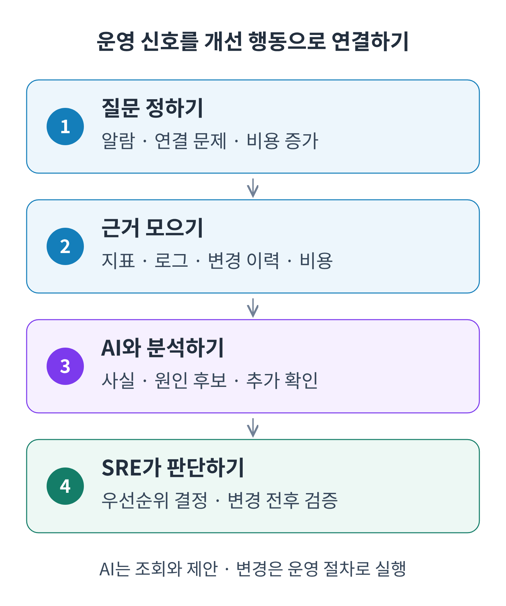
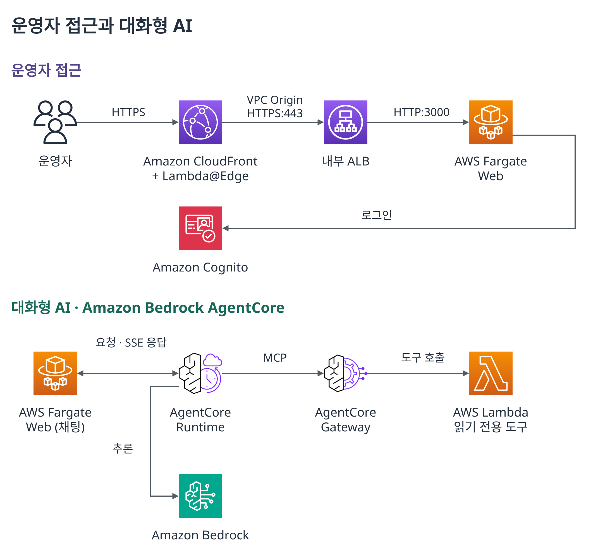
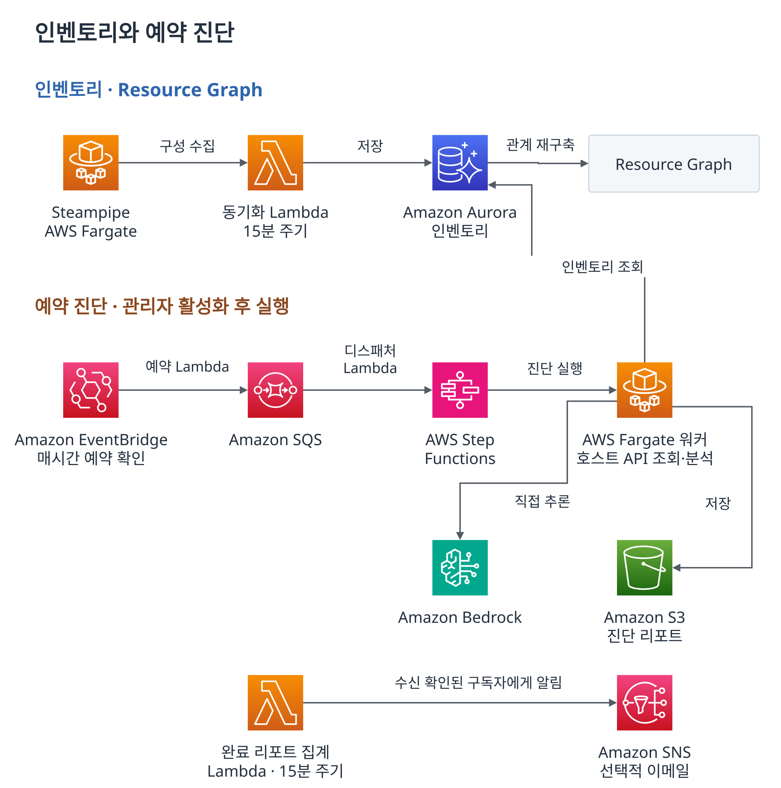

# Amazon Bedrock AgentCore와 읽기 전용 MCP 도구로 SRE 장애 조사와 정기 진단 연결하기

온콜 담당자에게 API 지연, 컨테이너 재시작, 데이터베이스 연결 오류 알람이 함께 들어오면 무엇부터 확인해야 할까요? 하나의 실패가 여러 증상으로 나타난 것인지 판단하려면 영향을 받는 서비스, 리소스 관계, 최근 변경, 로그를 함께 살펴봐야 합니다. 비용 점검에서도 청구액이 늘어난 서비스와 실제 구성을 바꿀 수 있는 리소스를 연결하는 과정이 필요합니다.

두 작업의 공통점은 **흩어진 운영 데이터를 같은 서비스와 리소스의 맥락으로 연결해야 한다**는 것입니다. AWSops는 구성 정보를 수집하고 필요한 근거를 조회해 이 과정을 돕는 AWS 운영 대시보드입니다. AWSops가 구성한 리소스 관계 그래프(이 글에서는 Resource Graph로 표기)로 조사 대상을 좁히면, Amazon Bedrock AgentCore Runtime의 에이전트가 Gateway에 등록한 읽기 전용 도구를 호출해 근거를 모읍니다. 사이트 신뢰성 엔지니어링(SRE) 담당자는 그 결과로 원인 후보와 다음 조치를 검토합니다.

이 글에서는 AWS 운영 환경에 AI 진단을 도입하려는 SRE와 플랫폼 엔지니어를 위해 (1) 흩어진 운영 데이터를 조사 가능한 질문으로 바꾸는 설계, (2) Amazon Bedrock AgentCore에 읽기 전용 조회 도구를 연결하는 방법, (3) AWS Well-Architected Framework의 여섯 가지 기둥을 활용한 정기 진단 자동화를 살펴봅니다.

이 글과 함께 공개할 [AWSops 샘플 GitHub 저장소](https://github.com/aws-samples/sample-awsops)에서 구현을 확인할 수 있도록 코드 경로를 연결했습니다. 아래의 ‘샘플로 첫 번째 AWS 조회 실행하기’에서는 테스트 환경 준비부터 질문 전송, 실제 조회 결과를 확인하는 순서까지 설명합니다.

<!-- 게시 전 확인: aws-samples/sample-awsops 공개 전환, 비로그인 clone 및 본문의 dev 브랜치 문서·코드 링크 재확인. -->

## 운영 질문과 설계 요구

운영 환경에는 이미 많은 정보가 있습니다. Amazon CloudWatch에는 알람과 로그가 있고, AWS API에서는 리소스 구성을 읽으며, AWS Cost Explorer에서는 비용을 확인합니다. Prometheus나 ClickHouse에 애플리케이션 관측 데이터를 따로 저장하기도 합니다. 결제 API에서 오류가 늘면 담당자는 진입점과 로드 밸런서, 백엔드 워크로드, 로그 그룹을 찾아 연결해야 합니다. 각 도구의 정보를 같은 사건의 근거로 묶는 일이 조사에 포함됩니다.

알람이 동시에 늘어나면 우선순위를 정하는 일과 자료를 찾는 일이 겹칩니다. 여러 서비스에서 보이는 오류가 공통 의존성에서 시작되었을 수도 있고, 비슷한 시각에 발생한 별개의 문제일 수도 있습니다. 담당자는 리소스 이름을 확인하는 데서 더 나아가 요청이 지나가는 경로, 오류가 시작된 시점, 함께 바뀐 설정을 대조해야 합니다. 같은 실패의 증상을 여러 번 조사하면 원인 가설을 검증할 시간이 줄어듭니다.

계정이 나뉘면 접근 조건도 달라집니다. 교차 계정(cross-account) 환경에서는 콘솔에 보이는 데이터가 도구의 실행 역할에서는 보이지 않을 수 있습니다. 동기화된 정보와 현재 조회한 결과의 시점도 다릅니다. 교대 시에는 어떤 조회가 성공했고 무엇을 권한 문제로 확인하지 못했는지까지 전달해야 다음 담당자가 같은 작업을 반복하는 일을 줄일 수 있습니다.

구성을 잘 아는 담당자에게 질문이 집중되는 상황도 고려했습니다. 새 담당자는 계정·리전·리소스·로그 그룹의 관계를 다시 익혀야 합니다. 조사 결과에 최종 판단만 남아 있으면 어떤 조건으로 조회했는지, 이미 배제한 가설은 무엇인지 재구성해야 합니다. 따라서 근거의 출처와 조회 조건, 아직 확인하지 못한 항목을 다음 담당자가 이어받을 수 있도록 남기는 것이 중요합니다.

비용 담당자는 같은 리소스를 다른 방향에서 살펴봅니다. 청구 내역에서 지출이 큰 서비스를 찾아도 해당 용량이 중요한 경로에 쓰이는지, 특정 시기에만 부하가 발생하는지, 크기 조정 권고안을 적용해도 되는지는 워크로드 맥락을 알아야 판단할 수 있습니다. 비용을 줄이라는 요청과 성능 여유를 확보하라는 요청을 함께 받는 SRE에게는 비용·부하·의존 관계를 대조할 자료가 필요합니다.

알람으로 드러나지 않는 점검도 있습니다. 공개 접근 범위, 백업·복구 조건, 관측 자료의 누락, 장기간 유지한 과대 용량은 서비스가 현재 응답한다는 사실만으로 확인되지 않습니다. 이런 자료를 보안·아키텍처 리뷰 때마다 다시 모으는 일은 장애 대응과 경쟁하는 반복 업무가 됩니다. 생성형 AI를 활용할 때도 모델이 읽은 자료의 범위와 시점, 조회 성공 여부를 설명할 수 있어야 운영 판단에 사용할 수 있습니다.

AWSops는 반복 탐색에 사용할 자료를 저장하고, 관계를 따라 범위를 좁힌 뒤 필요한 현재 상태를 추가 조회하도록 구성했습니다. 장애 대응 사이에는 정해진 자료를 모아 반복 점검 보고서를 만듭니다. 자동화 범위는 수집·분석·보고서 생성이며, 운영 리소스에 대한 조치는 담당자가 결정합니다.

| 조사에서 막히는 지점 | 필요한 정보와 조건 | 설계의 대응 |
|---|---|---|
| 같은 리소스 구성을 반복 조회 | 구성 정보와 수집 시각 | Steampipe 동기화와 Amazon Aurora 저장 |
| 목록만으로 영향 범위 파악이 어려움 | 진입점·워크로드·네트워크 관계 | Resource Graph 탐색 |
| 모델이 현재 상태와 접근 범위를 모름 | 조회 도구, 권한, 결과와 오류 | AgentCore Gateway에 등록한 조회 도구와 교차 계정 연결 |
| 장애 대응에 평시 점검이 밀림 | 공통 기준, 근거, 후속 검증 | 여섯 가지 기둥의 정기 진단 |



*그림 1. 문제를 조사 가능한 질문으로 바꾸는 흐름. 리소스와 관측 근거를 확인하고, AI가 자료를 정리하면 SRE가 원인 후보와 다음 조치를 검토합니다. 실제 변경은 운영팀의 변경 관리 절차를 따릅니다.*

## 전제 조건

대상 AWS 계정에는 필요한 조회 전용 AWS Identity and Access Management(IAM) 역할과 호출 주체에 대한 신뢰 정책을 준비합니다. 교차 계정 조회를 사용한다면 대상 계정 온보딩 후 실제 도구 실행 역할로 접근을 확인합니다. 에이전트와 보고서 워커에는 사용할 Amazon Bedrock 모델에 대한 호출 권한과 접근 조건이 필요합니다. 외부 관측 자료를 연결할 때는 지원되는 데이터 소스의 자격증명과 네트워크 접근도 준비합니다.

## 데이터 수집·관계·조회 경로

전체 구성은 대화형 조사, 인벤토리·관계 정보, 정기 진단이라는 세 흐름으로 나뉩니다. 운영자의 질문은 AgentCore의 조회 도구로 이어지고, 예약 진단은 별도 워커가 자료를 수집해 보고서를 생성합니다. 먼저 대화형 조사의 진입 경로와 데이터 연결을 살펴보겠습니다.

이 흐름을 나눈 이유는 질문마다 필요한 자료와 실행 시간이 다르기 때문입니다. 리소스 목록을 탐색하는 화면에는 반복해서 읽을 수 있는 구성 정보가 필요하고, 진행 중인 장애에는 현재 상태를 확인할 도구가 필요합니다. 여러 관점의 보고서를 생성하는 작업은 웹 요청보다 오래 걸릴 수 있습니다. 저장된 자료로 조사 범위를 좁히고 필요한 조회를 추가하는 방식으로 각 단계의 책임을 구분했습니다.

그림에서 ALB(Application Load Balancer)는 내부 로드 밸런서를, SSE(Server-Sent Events)는 웹으로 전달하는 스트리밍 응답을 뜻합니다.



*그림 2a. 보호된 웹 진입 경로에서 받은 운영자의 질문을 AgentCore와 읽기 전용 조회 도구로 연결합니다.*

### AgentCore가 맡은 실행과 도구 연결

이 설계에서 해결해야 했던 핵심은 운영자의 질문을 권한 있는 데이터 조회로 이어 주는 일이었습니다. 모델에 로그나 구성을 한 번 전달해 설명하게 하는 것에서 더 나아가, 필요한 도구를 선택하고 결과를 읽은 뒤 다음 조회를 이어 갈 실행 흐름이 필요했습니다. AWSops는 그 흐름을 실행하는 곳과 도구를 제공하는 인터페이스를 나누었습니다.

**AgentCore Runtime은 에이전트의 실행을 맡습니다.** AWS가 공개한 오픈소스 에이전트 SDK인 Strands Agents로 에이전트를 작성했습니다. 웹 백엔드는 사용자 요청과 접근 권한을 확인하고, Runtime의 에이전트는 모델에 사용할 도구를 전달해 질문을 처리합니다. 도구 결과가 돌아오면 그 근거로 답변하거나 추가 조회를 이어 가고, 생성한 응답을 웹으로 스트리밍합니다. 운영 질문을 처리하는 에이전트 코드는 `agent/agent.py`에 모아 두었습니다.

**AgentCore Gateway는 조회 도구를 MCP(Model Context Protocol)로 연결합니다.** 각 도구의 이름·설명·입력 형식을 모델이 사용할 수 있게 제공하고, 선택한 호출을 AWS Lambda 타깃에 전달합니다. AWSops가 구현하는 부분은 네트워크 인터페이스(ENI) 설정, 알람, 비용처럼 운영 질문에 필요한 조회 로직입니다. 이 로직을 Lambda에 두고 Gateway에 등록하면 에이전트가 정해진 입력으로 호출할 수 있습니다.

예를 들어 네트워크 설정을 읽는 Lambda가 준비되면, `get_eni_details`의 입력에 ENI 식별자가 필요하다는 정의를 등록합니다. Runtime에서 실행되는 에이전트는 이 정의를 읽어 도구를 선택하고, Lambda가 반환한 구성 정보로 답변을 만듭니다. **질문 → 도구 선택 → AWS 조회 → 근거를 이용한 설명**이 이어지는 구조입니다. 실제 AWS 접근 범위는 Lambda의 실행 역할과 조회 코드가 정합니다.

### 반복 탐색을 위한 구성 정보 수집

AWS Config는 리소스 구성·관계와 변경 이력을 확인하는 데, AWS Resource Explorer는 이름·태그·식별자로 리소스를 찾는 데 사용할 수 있습니다. AWSops에서는 Steampipe로 수집한 구성을 자체 인벤토리에 저장하고 관계 그래프와 진단 자료에 재사용합니다. 기존 서비스의 검색·구성 관리 기능과 함께 검토할 수 있는 애플리케이션 수준의 구성입니다.

구성 정보는 오픈소스 도구 Steampipe(Turbot)로 수집합니다. 동기화를 활성화하면 기본 15분 간격으로 실행됩니다. Steampipe는 클라우드 API의 데이터를 SQL 테이블 형태로 제공하며, 동기화 작업은 AWS Fargate에서 실행되는 Steampipe를 조회해 결과를 Aurora에 적재합니다. 이렇게 반복 탐색할 자료와 질문 시점에 확인할 운영 상태를 나눕니다.

Amazon EC2 구성 정보 중 관계 생성에 필요한 속성을 읽는 SQL을 축약하면 다음과 같습니다. 인스턴스가 속한 VPC·서브넷과 보안 그룹을 함께 가져와 후속 관계 구성에 사용합니다.

```sql
SELECT instance_id, instance_type, region,
       vpc_id, subnet_id, security_groups
FROM aws_ec2_instance;
```

이 쿼리는 배치 수집 경로의 예시입니다. 채팅은 저장된 인벤토리나 AgentCore 조회 도구를 사용하며, Steampipe에 실시간 SQL을 실행하는 웹 경로는 비활성화되어 있습니다. 인벤토리를 읽을 때는 마지막 동기화 시각과 성공 여부를 함께 확인해, 수집 실패와 리소스 부재를 구분합니다. 정기적으로 모은 구성은 조사 시작점을 제공하고, 방금 바뀐 설정은 해당 AWS 조회 도구로 추가 확인합니다.

수집과 조회를 분리하면 화면에서 같은 리소스를 반복 탐색할 때 저장된 구성 정보를 사용할 수 있습니다. 대신 마지막 성공 이후 변경된 리소스는 추가 조회로 확인해야 합니다. 운영자는 조사에 필요한 최신성에 따라 저장된 자료로 충분한 질문과 서비스 API를 다시 읽어야 하는 질문을 나누어 진행합니다.

### 리소스 목록에서 관계 그래프로

Resource Explorer로 조사할 리소스를 찾았다면, 다음 질문은 그 리소스가 어느 서비스 경로에 연결되어 있는가입니다. AWSops의 Resource Graph는 저장된 구성과 지원되는 관측 자료로 관계를 만들고, 화면 탐색과 AI의 후속 질문에 사용합니다.

Amazon CloudFront의 오리진, 로드 밸런서와 대상 그룹, 리소스가 속한 VPC·서브넷·보안 그룹을 노드와 연결선으로 표현합니다. 관계 구성 로직은 Aurora 인벤토리를 읽어 결과를 노드·연결선 테이블에 저장합니다. 저장 그래프를 읽는 경로와 다시 만드는 작업을 분리해, 조회할 때마다 전체 그래프를 재구성하지 않도록 했습니다.

| 관점 | 관계의 근거 | 답하려는 질문 |
|---|---|---|
| 트래픽 경로 | 진입점·오리진·로드 밸런서·대상 그룹 구성 | 요청이 어떤 구성 경로를 거치는가? |
| 인프라 관계 | VPC·서브넷·보안 그룹과 리소스 연결 | 어떤 네트워크 구성에 의존하는가? |
| 서비스 호출 | 지원되는 트레이스와 호출 메트릭 | 관측 기간에 어떤 서비스가 서로 호출했는가? |

앞의 두 관점은 주로 구성 정보에서, 서비스 호출 그래프는 외부 관측 데이터에서 관계를 만듭니다. 따라서 구성상 연결된 경로와 관측된 호출을 나누어 해석합니다. 특정 기간에 호출이 관측되지 않았다면 해당 기간과 데이터 소스의 수집 범위를 확인할 필요가 있습니다.

리소스별 화면에서는 전체 그래프를 한 번에 해석하기보다 선택한 리소스의 주변 관계를 좁혀 봅니다. 예를 들어 로드 밸런서에서 대상 그룹과 백엔드로 이동하면서 조사할 식별자를 확보할 수 있습니다. 그 식별자를 후속 질문에 사용하면 모델이 이름만으로 대상을 추측하는 대신, 운영자가 확인한 범위의 설정과 관측 자료를 요청할 수 있습니다.

AI 조사에서는 `get_topology`로 저장 그래프를, `query_inventory`로 리소스 목록을, `inventory_summary`로 수집 범위와 마지막 동기화 상태를 확인합니다. 대상 그룹을 선택했다면 저장된 백엔드 관계를 읽고, 현재 대상 상태(target health)는 AWS 콘솔에서 확인합니다. 이어서 네트워크 인터페이스(ENI)를 식별하면 `get_eni_details`로 보안 그룹·네트워크 ACL(NACL)·라우팅 설정을 조회할 수 있습니다.

자동 재구성은 기본적으로 꺼져 있고 주기를 설정해 켭니다. 인벤토리 동기화와 별도 작업이므로 수집 시각과 그래프 재구성 시각을 함께 확인합니다. 현재 인벤토리 MCP 조회는 호스트 계정의 저장 데이터에 한정되므로, 화면에 선택된 계정과 실제 자료 범위도 대조합니다.

### AgentCore Gateway와 Lambda 조회 도구

실제 연결에는 Lambda 도구 코드와 Gateway에 등록할 정의가 필요합니다. 이 글에서 Lambda MCP 도구는 Gateway의 Lambda 타깃으로 연결한 구현을 뜻합니다. 하나의 Lambda가 여러 도구를 구현할 수 있으며, 호출된 도구 이름에 따라 조회 로직을 선택합니다. AWSops는 도메인별 게이트웨이 9개에 조회 Lambda를 등록하도록 구성했습니다.

다음은 저장소 프로비저너의 등록 호출을 도구 하나로 축약한 예시입니다. 새 Gateway와 `get_eni_details`를 구현한 Lambda를 먼저 준비하고, Gateway 역할에 그 함수의 호출 권한을 부여합니다. 실행 주체에는 Gateway 타깃 생성 권한이 필요합니다. 코드를 `register_target.py`로 저장한 뒤 `python register_target.py <REGION> <GATEWAY_ID> <LAMBDA_ARN>`으로 실행하면 타깃을 등록합니다.

Python 환경에는 이 API를 지원하는 boto3를 설치하고 SDK가 사용할 AWS 자격증명을 준비합니다. 예제에는 키를 직접 넣지 않으며, 전달하는 Lambda ARN은 앞서 준비한 조회 함수의 값입니다. 테스트용 Gateway에 등록한 뒤 노출된 도구 정의가 입력과 일치하는지 확인하고, 실제 조회에는 대상 ENI를 읽을 수 있는 Lambda 실행 역할을 사용합니다.

```python
import sys
import boto3

def main():
    region, gateway_id, lambda_arn = sys.argv[1:4]
    control = boto3.client("bedrock-agentcore-control", region_name=region)
    tool = {
        "name": "get_eni_details",
        "description": "ENI details with SG, NACL, routes",
        "inputSchema": {
            "type": "object",
            "properties": {"eni_id": {"type": "string", "description": "ENI ID"}},
            "required": ["eni_id"],
        },
    }
    target = control.create_gateway_target(
        gatewayIdentifier=gateway_id,
        name="eni-read-target",
        targetConfiguration={
            "mcp": {"lambda": {
                "lambdaArn": lambda_arn,
                "toolSchema": {"inlinePayload": [tool]},
            }},
        },
        credentialProviderConfigurations=[
            {"credentialProviderType": "GATEWAY_IAM_ROLE"}
        ],
    )
    print(target["targetId"])


if __name__ == "__main__":
    main()
```

이 코드는 운영 질문을 처리하는 도구가 아닌 구축 단계의 등록 예제입니다. 같은 이름의 타깃이 없는 준비된 Gateway에서 한 번 실행하는 형태이며, 실제 프로비저너는 기존 타깃과 정의를 비교해 생성 또는 갱신합니다. 등록된 도구의 필수 입력은 `eni_id`이므로, 모델이 조사 대상 ENI를 지정하면 Lambda가 관련 설정을 조회합니다.

뒤의 전체 샘플 실행 경로에서는 `make agentcore`가 타깃 등록을 수행하므로 이 등록 예제를 별도로 실행할 필요가 없습니다. 이 코드는 샘플의 연결 원리를 읽거나 개별 타깃을 실험할 때 참고합니다.

반환된 타깃 ID로 등록 상태를 확인하고 준비가 끝난 뒤 도구를 호출합니다. 오류가 나면 Gateway의 Lambda 호출 권한과 함수의 입력 처리부터 확인합니다.

정의와 구현이 만나는 지점도 확인할 필요가 있습니다. 입력 스키마는 모델에 전달할 인자를 설명하고, Lambda 코드는 그 값으로 수행할 조회를 결정합니다. 결과에는 조회한 설정이나 오류가 담기므로 에이전트는 자료가 충분한지 판단해 설명하거나 다음 도구를 호출합니다. 등록한 정의만 바꾸고 실제 함수의 입력 처리를 맞추지 않으면 호출이 실패할 수 있습니다.

조회 도구를 모니터링·네트워크·비용으로 나누면 질문에 맞는 도구 집합을 제공할 수 있습니다. 웹 계층은 활성화된 라우팅 구성에 따라 정규식 분류와 분류 모델을 사용합니다. Gateway의 Lambda 호출 권한과 Lambda의 AWS 조회 권한은 따로 확인합니다. 현재 게이트웨이와 다수의 Lambda가 역할을 공유하므로 도메인 구분 자체를 IAM 권한 격리로 해석해서는 안 됩니다.

예를 들어 ENI 설정을 확인하는 질문에는 네트워크 도메인의 도구를, 비용 변동을 확인하는 질문에는 비용 도메인의 도구를 제공합니다. 하이브리드 라우팅을 활성화한 구성에서는 정규식 분류를 분류 모델로 보완합니다. 여러 도메인의 결과를 병렬로 합성하는 경로도 별도의 설정과 라우팅 조건을 충족할 때 사용합니다. 도구가 등록되어 있다는 사실과 특정 질문에서 그 도구를 사용할 경로가 준비되어 있다는 사실을 함께 확인해야 합니다.

자료의 출처도 도구마다 다릅니다. AWS 상태 조회 도구는 서비스 API를, 인벤토리 도구는 Amazon RDS Data API를 통해 Aurora의 허용된 뷰를 읽습니다. 외부 관측 커넥터는 등록된 데이터 소스의 API를 사용합니다. 이 구분을 알면 답변이 저장된 스냅샷과 현재 조회한 상태 중 무엇에 근거하는지 확인하면서 다음 질문을 정할 수 있습니다.

실제 접근 범위는 도구 정의, 실행 역할, 데이터 소스의 권한을 함께 보아야 합니다. 입력 형식이 정해져 있어도 Lambda 실행 역할에 필요한 조회 권한이 없으면 자료를 가져올 수 없습니다. 반대로 모델이 적절한 질문을 받았다는 사실만으로 과도한 실행 권한이 제한되는 것도 아닙니다. 도구의 이름과 설명은 모델이 무엇을 호출할지 판단하는 정보이고, 권한과 코드의 요청 제한은 그 호출이 읽을 수 있는 범위를 정합니다.

그림의 BFF(Backend for Frontend)는 웹 화면의 요청과 응답을 처리하는 백엔드를 가리킵니다.


*그림 3. AgentCore Runtime과 Gateway가 호스트 계정의 읽기 전용 Lambda 도구를 호출하는 경로입니다.*

### ENI 질문 하나가 실제 조회 결과로 돌아오는 과정

호스트 계정에서 사용할 ENI 하나를 AWS 콘솔로 확인했다고 가정하겠습니다. 사용자는 해당 ENI의 보안 그룹과 네트워크 ACL, 라우팅 설정을 확인해 달라고 질문합니다. 네트워크 도메인으로 전달된 요청은 다음 과정을 거칩니다.

1. **질문을 Runtime에 전달합니다.** 웹 계층이 선택한 도메인과 사용자 질문을 전달하면 Runtime의 에이전트가 해당 Gateway에 연결합니다.
2. **사용할 도구를 준비합니다.** 에이전트는 Gateway에서 도구 정의를 읽고 적용되는 허용목록을 반영한 뒤 Strands `Agent`에 전달합니다.
3. **모델이 필요한 조회를 선택합니다.** 이 질문에서는 `get_eni_details`와 `eni_id` 인자가 도구 호출의 대상이 됩니다. Gateway는 등록된 네트워크 Lambda로 호출을 전달합니다.
4. **Lambda가 AWS 구성을 읽습니다.** 구현은 ENI를 조회하고 연결된 보안 그룹, 서브넷의 네트워크 ACL, 라우팅 정보를 수집합니다. 결과에는 `eniId`, `privateIp`, `vpcId`, `subnetId`, `securityGroups`, `nacl`, `routes` 같은 필드가 담깁니다.
5. **도구 결과를 설명으로 바꿉니다.** 결과가 에이전트에 돌아오면 모델은 조회한 구성을 사용해 답변을 구성합니다. 운영자는 반환된 ENI 식별자와 설정을 콘솔의 같은 대상과 대조하고 다음 점검을 정합니다.

이 흐름에서 바뀐 것은 사람이 여러 화면에서 읽어 모델에 붙여 넣던 자료를, 에이전트가 등록된 조회 도구를 통해 요청할 수 있게 했다는 점입니다. 개발자는 조회 로직과 권한, 입력·출력 정의를 검토하고, 운영자는 답변이 어떤 리소스의 근거를 사용했는지 확인할 수 있습니다.

샘플에서는 다음 파일을 순서대로 보면 연결 지점을 찾을 수 있습니다.

| 확인할 내용 | 샘플 코드 |
|---|---|
| 도구의 이름·입력 형식과 네트워크 Gateway 매핑 | [`catalog.py`](https://github.com/aws-samples/sample-awsops/blob/dev/scripts/v2/agentcore/catalog.py)의 `get_eni_details` 정의 |
| Lambda를 Gateway 타깃으로 등록하는 방법 | [`provision.py`](https://github.com/aws-samples/sample-awsops/blob/dev/scripts/v2/agentcore/provision.py)의 `ensure_targets` |
| 도구를 읽어 Strands 에이전트에 전달하고 응답하는 부분 | [`agent.py`](https://github.com/aws-samples/sample-awsops/blob/dev/agent/agent.py)의 `handler`, `get_all_tools`, `Agent(tools=...)` |
| ENI·보안 그룹·네트워크 ACL·라우팅을 조회하는 코드 | [`network_mcp.py`](https://github.com/aws-samples/sample-awsops/blob/dev/agent/lambda/network_mcp.py)의 `get_eni_details` 처리 |

첫 실습의 목표는 이 조회 경로가 연결되었는지 확인하는 것입니다. 설정을 읽었다는 사실과 실제 애플리케이션 통신이 성공한다는 사실은 구분하며, 연결 문제의 추가 검사는 뒤의 조사 예시에서 이어집니다.

### 외부 관측 자료와 서비스 호출 관계

운영 중인 서비스의 맥락은 한 데이터 소스에 모여 있지 않을 수 있습니다. 애플리케이션 메트릭은 Prometheus에, 로그는 ClickHouse에, 트레이스는 Tempo에 저장하는 환경도 있습니다. AWS 구성으로 어느 워크로드가 영향을 받는지 찾은 뒤에는 그 워크로드의 애플리케이션 신호를 함께 읽어야 사건을 설명할 수 있습니다.

AWSops는 지원되는 외부 관측 시스템을 데이터 소스로 등록하고 커넥터를 통해 조회합니다. 등록된 연결 정보와 관리되는 시크릿을 사용하므로 질문에 API 키나 비밀번호를 직접 넣지 않습니다. AWS 리소스 구성과 외부 지표·로그를 한 조사에서 대조하되, 실제 조회는 각 데이터 소스가 제공하는 인터페이스와 권한을 따릅니다.

예를 들어 구성 그래프에서 결제 API의 백엔드를 찾았다면, Prometheus의 관련 애플리케이션 지표나 ClickHouse의 오류 로그로 근거를 보완할 수 있습니다. 이때 리소스 식별자만으로 관련 지표와 로그의 의미까지 자동으로 정해지는 것은 아닙니다. 어떤 소스와 조회 구간을 사용했는지 남기고, 반환된 자료가 조사 중인 서비스와 같은 범위를 가리키는지 확인합니다.

외부 관측 자료는 서비스 호출 그래프의 근거로도 사용합니다. 지원되는 ClickHouse·Tempo 트레이스와 Prometheus·Mimir의 서비스 호출 메트릭을 읽어 관계를 구성하는 경로가 있습니다. 필요한 스키마와 메트릭, 네트워크 도달성, 조회 권한이 준비되어야 하며, 현재 외부 관측 기반 서비스 호출 그래프에는 호스트 범위의 제약이 있습니다. 구성상 연결된 경로와 실제 관측된 호출을 비교하면 다음으로 확인할 서비스를 정할 수 있습니다.

Lambda 커넥터 외에 일부 관측 플랫폼이 공식 제공하는 MCP 서버를 Gateway 타깃으로 등록하는 선택 경로도 구현되어 있습니다. 실제 사용에는 별도 활성화와 인증 설정, 읽기 전용 확인, 런타임 도구 허용목록이 필요합니다. 연결하려는 시스템에서 어떤 조회 도구를 제공하는지 검토하고, 지원되는 연결 범위 안에서 필요한 자료를 읽도록 구성합니다.

### 교차 계정의 호출 주체와 수집 범위

교차 계정 조회에서는 호스트 계정의 Lambda가 AWS Security Token Service(STS)의 `AssumeRole`로 대상 계정의 읽기 전용 역할을 맡습니다. Gateway와 도구 Lambda는 호스트 계정에 두고, AWS API를 호출하는 Lambda가 임시 자격증명을 사용합니다. 외부 관측 시스템의 API 인증과 AWS 계정의 역할 기반 접근을 구분하는 지점입니다.

기본 대상 역할 이름은 `AWSopsReadOnlyRole`입니다. 호스트 쪽에는 대상 역할을 맡을 권한이, 대상 계정에는 실제 호출 주체를 신뢰하는 정책과 필요한 조회 권한이 있어야 합니다. 호스트 계정 자체를 조회할 때는 역할 전환을 생략하고 실행 역할을 그대로 사용합니다. 다른 계정용 역할을 자기 계정에서도 무조건 맡으려 하면 접근 오류를 실제 리소스 문제로 오해할 수 있습니다.

계정 관리 화면에서 연결에 성공했다고 모든 데이터 경로가 준비된 것은 아닙니다. 화면의 연결 검증은 웹 실행 역할을 기준으로 하므로, MCP Lambda가 자료를 읽을 수 있는지는 해당 실행 주체로 별도 확인합니다. Steampipe에도 계정별 조회와 적재를 구성하는 코드가 있지만 기본 온보딩만으로 모든 수집 역할의 신뢰가 준비되는 것은 아니므로, 사용할 경로별로 권한과 결과를 확인해야 합니다.

제3자나 공유 계정에서는 `ExternalId` 조건으로 권한 사용 맥락을 구분합니다. 여러 고객 계정을 대신 조회하는 주체가 어느 대상의 권한을 사용하려는지 구분하도록 돕는 값입니다. 현재 구현은 계정마다 다른 값을 자동 선택하지 않으므로, 계정별 값이 다른 환경에서는 MCP 조회에 적용되는 연결 범위를 먼저 확인합니다.

계정 범위는 실시간 API 조회, 인벤토리 적재, 관계 그래프를 각각 나누어 봅니다. 현재 인벤토리 MCP가 읽는 것은 호스트 계정의 저장 데이터입니다. 대상 계정의 API를 읽을 수 있다는 이유만으로 그 계정의 인벤토리와 그래프까지 준비되었다고 판단하지 않고, 조사에 사용할 자료가 어디에 어떤 범위로 수집되었는지 확인합니다.

## 알람에서 원인 후보와 비용 검토까지

이제 하나의 질문을 단계적으로 구체화해 보겠습니다. 아래는 구현된 도구와 화면을 활용한 조사 예시이며, 실제 장애 재현 결과나 측정된 절감 실적을 제시하는 사례는 아닙니다.

### API 지연 알람과 로그 조사

결제 API에서 지연 알람이 발생했다고 가정하겠습니다. 담당자는 Resource Graph에서 진입점과 백엔드 관계를 살펴보고 알람의 대상을 대조합니다. 먼저 리소스와 로그 그룹을 좁히면, 어떤 범위에서 오류를 찾는지 분명하게 정할 수 있습니다.

> “현재 발생한 알람을 정리해 주세요. 그중 결제 API와 관련된 알람의 상태 변경 이력을 확인하고, 함께 조사할 로그를 알려 주세요.”

모니터링 도구는 CloudWatch에서 활성 알람의 이름, 상태 변경 시각, 임계값, 상태 사유를 가져옵니다. 이어서 알람의 상태 변경 이력으로 반복 발생 여부를 확인합니다. 운영자는 반환된 이름과 시각에 기존 대시보드나 서비스 담당자가 파악한 영향 범위를 더합니다.

다음으로 확인된 로그 그룹에서 연결 시간 초과나 연결 거부 메시지를 조회합니다. CloudWatch Logs Insights 쿼리는 다음처럼 작성할 수 있습니다.

```text
fields @timestamp, @message
| filter @message like /(?i)(timeout|connection refused)/
| stats count(*) as matching_events by bin(5m)
| sort matching_events desc
```

조회 기간은 알람 상태 변경 시각 앞뒤 30분으로 지정합니다. 이 쿼리는 일치하는 로그 이벤트를 5분 단위로 집계하고 건수가 많은 구간부터 정렬합니다. 한 요청에서 여러 이벤트가 나올 수 있으므로 사용자 영향은 요청 수와 성공·실패 지표를 함께 확인합니다. 도구가 반환한 쿼리 ID로 실행 상태와 결과를 조회한 다음 해석을 시작합니다.

현재 알람 상태와 사건의 시작 시점은 따로 봅니다. 알람이 정상으로 돌아왔어도 상태 변경 이력과 해당 구간의 로그에서 반복된 문제를 찾을 수 있습니다. 반대로 조회 결과가 적다면 로그 그룹·시간 범위·반환 행 제한을 먼저 확인합니다. 다음 질문에는 확인한 조건을 함께 남겨 다른 기간이나 범위의 결과가 섞이지 않도록 합니다.

근거에 따라 다음 조사 방향도 달라집니다.

- 연결 시간 초과가 반복되면 의존 서비스의 상태와 연결 경로를 확인합니다.
- 여러 작업에서 같은 오류가 나면 공통 의존성과 설정을 대조합니다.
- 설정 변경 직후 오류가 시작되면 변경 대상·성공 여부·현재 구성을 확인합니다.

> “확인된 사실, 원인 후보, 아직 확인하지 못한 항목, 다음 점검 순서로 나눠 주세요. 각 사실에는 사용한 알람이나 로그 그룹을 함께 적어 주세요.”

이 형식은 조사 조건과 남은 질문을 교대 담당자에게 전달하는 데도 사용합니다. 조회 권한 부족, 빈 결과, 분석 완료를 구분해 기록하면 다음 담당자가 어떤 근거부터 보완해야 하는지 알 수 있습니다.

인계할 때는 최종 원인 후보뿐 아니라 그 후보를 선택한 근거를 남깁니다. 어떤 알람과 로그 그룹을 어느 기간에 조회했는지, 관련 리소스는 무엇인지, 추가로 읽어야 할 자료는 무엇인지를 함께 전달합니다. 새 담당자는 이미 확인한 사실을 출발점으로 삼고, 아직 확인하지 못한 조건에 맞춰 다음 조회를 이어 갈 수 있습니다.

### 연결 조건과 변경 이력 확인

Amazon VPC Reachability Analyzer는 출발지와 목적지 사이의 네트워크 구성을 분석하고 차단 요소를 찾는 AWS 서비스입니다. AWSops의 `check_reachability`도 설정을 읽는 정적 분석이지만, 별도 분석 리소스를 생성하지 않고 조회한 보안 그룹·NACL·라우팅 설정으로 제한된 검사를 수행합니다.

로그에서 연결 시간 초과나 연결 거부가 반복되었다면, Resource Graph의 관계를 따라 실제 통신에 사용하는 출발지와 목적지 인스턴스 또는 ENI를 확인합니다. 애플리케이션 이름만으로 질문하기보다 어떤 두 대상 사이의 어떤 포트와 프로토콜을 검사할지 정하는 단계입니다. 같은 서비스라도 호출 경로가 다르면 확인해야 할 네트워크 설정이 달라질 수 있습니다.

> “이 애플리케이션에서 데이터베이스로 TCP 5432 연결이 되지 않습니다. 현재 설정에서 통신을 막을 수 있는 부분을 확인해 주세요.”

도구에는 출발지·목적지 식별자, 포트, 프로토콜을 전달합니다. 아래는 응답 본문의 필드명을 유지한 설명용 발췌입니다. 식별자와 IP는 자리표시자이며, `disclaimer`의 나머지 문장은 생략했습니다.

```json
{
  "reachable": false,
  "checked": ["sg-egress", "sg-ingress", "nacl", "nacl-return", "route"],
  "blocking_component": [
    {
      "layer": "sg-ingress",
      "resource": "<DESTINATION_SECURITY_GROUP_ID>",
      "reason": "no ingress rule for tcp/5432 from <SOURCE_PRIVATE_IP>"
    }
  ],
  "disclaimer": "Static SG/NACL/route approximation (same-account). ..."
}
```

`checked`는 검사한 계층을, `blocking_component`는 차단 후보의 계층·리소스·이유를 나타냅니다. 같은 계정의 대상을 기준으로 송신·수신 규칙을 확인하고, 서로 다른 서브넷이면 NACL과 대표 임시 포트의 반환 조건도 검사합니다. 출발지의 목적지 방향 경로도 조회합니다.

응답을 읽을 때는 차단 여부와 함께 어떤 검사를 수행했는지 확인합니다. 위 발췌의 수신 규칙 지적은 지정한 출발지와 포트에 대한 허용 조건을 찾지 못했다는 뜻입니다. 실제 환경에서는 반환된 리소스 식별자로 해당 설정을 다시 대조하고, 검사 범위 밖에 있는 조건까지 포함해 다음 확인을 정합니다.

검사 범위에는 모든 Transit Gateway 경로, 목적지의 반환 라우트, DNS, 호스트 방화벽, 애플리케이션 상태가 포함되지 않습니다. SRE는 필요한 추가 경로 분석과 실제 연결 시험을 정하고, AWS CloudTrail의 변경 이력에서 해당 설정의 변경 시점·대상·성공 여부를 대조합니다.

예를 들어 수신 규칙이 차단 후보라면 요청한 포트와 출발지에 맞는 허용 조건이 있는지 확인합니다. 최근 변경 호출이 발견되어도 현재 검사한 리소스에 적용된 성공한 변경인지 대조해야 합니다. 시간상 가까운 두 사건을 바로 인과관계로 묶기보다, 현재 구성에서 설명할 수 있는 증상과 추가로 확인할 가설을 구분해 전달합니다.

실제 수정은 기존 승인·변경 관리 절차에서 수행합니다. 검사한 출발지·목적지와 규칙을 변경 제안에 남기고, 변경 후에는 허용할 통신과 계속 차단할 통신을 나누어 확인합니다.

### 같은 서비스의 비용 검토

장애 조사와 별개로 같은 서비스를 비용 관점에서 살펴볼 수 있습니다. 먼저 서비스별 비용과 변동이 큰 사용 유형으로 조사할 영역을 정합니다. 컴퓨팅 실행 시간의 증가와 데이터 전송 비용의 증가는 서로 다른 개선 질문으로 이어집니다.

> “최근 비용이 많이 발생한 서비스를 정리해 주세요. 비용 변동이 큰 항목은 어떤 사용 유형에서 차이가 나는지도 확인해 주세요.”

현재 AWSops의 월별 비교는 진행 중인 달의 누적 비용과 지난달 전체 비용을 사용합니다. 반환 행 수도 제한되어 있으므로 같은 길이의 기간에 대한 전체 비교는 Cost Explorer 콘솔에서 기간과 집계 조건을 맞춥니다. AWS Cost Explorer 데이터는 최소 24시간마다 갱신되며 상위 청구 데이터에 따라 더 늦을 수 있어, 장애 시점의 실시간 신호와 구분해 해석합니다.

따라서 반환된 금액 차이를 읽기 전에 두 기간의 시작과 끝을 먼저 확인합니다. 월 중간의 누적액이 지난달 전체보다 작다는 사실만으로 비용이 개선되었다고 판단하기 어렵습니다. 같은 길이의 기간과 같은 집계 조건에서 변화가 큰 서비스·사용 유형을 찾은 뒤, 그 변화가 사용량 증가인지 리소스 구성의 차이인지 조사합니다.

조사 대상이 EC2라면 AWS Compute Optimizer의 권고안으로 검토 후보를 보완할 수 있습니다.

> “EC2 크기 조정 권고안을 확인해 주세요. 현재 유형과 권장 유형을 비교하고, 성능 위험을 검토해야 할 후보를 정리해 주세요.”

대상 계정에서 Compute Optimizer를 활성화하고 분석에 필요한 지표와 조회 권한을 준비합니다. 반환된 현재 유형·권장 유형·최적화 판정·성능 위험을 읽고, 평시 부하뿐 아니라 월말 배치나 이벤트 수요도 담당자와 확인합니다.

권고안을 받지 못했다면 서비스가 활성화되어 있는지, 분석에 필요한 지표가 축적되어 있는지, 조회 권한이 있는지부터 확인합니다. 자료 부족과 최적화 후보가 없는 상태를 구분해야 검토 대상이 빠지는 일을 줄일 수 있습니다. 권고안이 있는 경우에도 담당자가 아는 배치 일정과 장애 대응용 여유 용량을 함께 검토합니다.

- 과대 할당 권고안이 있으면 피크 사용량, 메모리·I/O와 변경 시험 방법을 확인합니다.
- 특정 시기에만 사용한다면 배치 일정과 계절성 수요, 장애 대응 용량을 대조합니다.
- 저장·전송 비용이 증가했다면 크기 조정보다 보관·이동 방식과 사용 유형을 먼저 조사합니다.

`find_unused_resources`는 저장된 인벤토리에서 로드 밸런서와 연결되지 않은 대상 그룹 등 구성 후보를 찾습니다. 건강한 백엔드가 없는 대상 그룹은 장애 신호일 수도 있으므로 현재 상태와 사용 목적을 확인합니다. Resource Graph로 관련 워크로드와 담당자를 찾고, 유료 리소스와 청구 내역을 대조해 개선 작업의 범위를 정합니다.

서비스 단위 비용과 개별 리소스 권고안은 집계 단위가 다릅니다. 따라서 비용 증가 원인의 근거와 변경 후보의 근거를 각각 남깁니다. 변경 후에는 비교 기간·업무량·배치 일정을 맞추고 비용과 지연·오류 지표를 함께 확인해 결과를 기록합니다.

장기 할인 약정을 검토할 때도 먼저 필요한 리소스 구성을 확인합니다. 사용하지 않는 용량이나 일시적인 수요까지 장기간 유지하는 판단을 피하려면 실제 사용량과 향후 업무 계획을 함께 봐야 합니다. 비용 자료는 검토할 영역을 찾고 담당자에게 질문하는 근거로 사용하며, 변경 후보마다 서비스 수준 목표(SLO)와 성능 여유를 확인합니다.

## 여섯 가지 기둥을 활용한 정기 진단

대화형 조사는 운영자의 질문에서 시작하지만, 평시에는 보안·복구 준비·용량 효율처럼 알람 밖의 조건도 살펴봐야 합니다. AWSops는 정해진 자료를 수집해 반복 리뷰의 출발점이 되는 보고서를 만듭니다.

리뷰 때마다 처음부터 자료를 모으면 점검 범위와 기준이 담당자에 따라 달라질 수 있습니다. 급한 장애가 생겼을 때 점검 자체가 미뤄지기도 합니다. 정기 진단은 미리 정한 자료를 수집하고 여러 관점으로 정리하는 과정을 워커에 맡겨, 운영자가 발견 사항과 추가로 확인할 근거를 검토할 수 있도록 구성했습니다.

### 공통 기준과 근거

분류 기준에는 AWS Well-Architected Framework의 여섯 가지 기둥을 사용합니다. 한 영역의 개선이 다른 영역에 미치는 영향을 함께 보기 위한 틀입니다. 예를 들어 용량 축소 후보도 복구 여유와 피크 부하를 함께 검토하도록 질문을 넓힙니다.

| Well-Architected 기둥 | SRE가 확인할 질문 | 자동 진단의 근거와 검토 범위 |
|---|---|---|
| **운영 우수성** (Operational Excellence) | 무엇이 바뀌었고 추적 자료가 있는가? | 최근 CloudTrail 변경, 모니터링 자료와 인벤토리 |
| **보안** (Security) | 공개 노출·권한·암호화의 위험은 무엇인가? | AWS Security Hub 심각도 통계, IAM·네트워크·데이터 보호 구성 |
| **신뢰성** (Reliability) | 단일 장애 지점과 복구 준비에 빈틈이 있는가? | 네트워크·컴퓨트·데이터 구성과 관측 가능한 서비스 관계 |
| **성능 효율성** (Performance Efficiency) | 부하와 용량이 맞고 병목 후보가 있는가? | CloudWatch 지표, 리소스 규격, 지원되는 외부 관측 신호 |
| **비용 최적화** (Cost Optimization) | 지출 변화와 개선 후보는 무엇인가? | 비용·사용 유형, 수집된 유휴 자원·할인 약정 정보 |
| **지속 가능성** (Sustainability) | 사용 목적에 비해 불필요한 자원이 있는가? | 자원 효율·구성 자료. 탄소 데이터 부재로 배출량·감축량은 산출하지 않음 |

보고서는 수집 자료를 기둥별 섹션에 전달하고 발견 사항에 근거·심각도·우선순위·권고안을 포함하도록 구성했습니다. 운영자는 먼저 어떤 자료로 어떤 위험을 설명했는지 확인한 뒤, 서비스의 업무 중요도와 변경 영향을 더해 검토 순서를 정합니다. 보안 노출 후보와 용량 축소 후보가 함께 있어도 같은 기준으로 바로 조치하기보다는 각각의 근거와 영향 범위를 살펴봐야 합니다.

운영 절차·복구 훈련·업무 요구처럼 API 밖의 항목은 담당자가 보완합니다. 예를 들어 복구에 필요한 설정을 조회할 수 있더라도 실제 복구 목표를 만족하는지는 시험과 운영 기록으로 확인해야 합니다. 지속 가능성에서도 자원 효율은 검토 관점으로 사용하고, 탄소 원천 데이터가 없는 영역은 데이터 부족으로 남깁니다. 이렇게 자동으로 정리할 수 있는 자료와 관계자가 확인할 질문을 함께 제시합니다.

### 예약에서 보고서까지

예약 진단은 기본적으로 비활성 상태이며, 관리자가 워커 기반과 진단 스케줄을 각각 켠 뒤 사용자가 주기를 활성화해야 실행됩니다. 사용자는 주간·격주·월간 주기와 진단 깊이를 설정합니다. 예약 처리기는 매시간 예약 확인을 수행해 실행 시점이 지난 작업을 큐에 넣습니다. 알림은 별도로 활성화하며, 15분 주기 digest가 대상 보고서를 묶어 전달합니다.

작업 상태를 한 곳에 기록하는 공통 작업 기록(원장)을 기준으로 다음 다섯 단계를 진행합니다.

1. **예약 확인과 작업 기록:** 실행할 스케줄의 실행을 확보하고 보고서와 작업 원장에 실행 대상을 기록합니다.
2. **근거 수집:** 워커가 인벤토리, 비용, 구성·보안 상태, 변경 이력, 지원되는 관측 자료를 수집합니다. 각 소스의 성공 여부와 제한도 함께 유지합니다.
3. **기둥별 분석:** 필요한 자료를 보고서 섹션별로 나누어 Amazon Bedrock 모델에 전달합니다. 진단 깊이에 따라 IAM, 데이터 보호, 네트워크 노출, 고가용성 등의 분석을 확장합니다.
4. **결과 저장과 확인:** 진행 상태와 요약은 Aurora에, 보고서 산출물은 Amazon S3에 저장해 웹에서 확인할 수 있게 합니다. 일부 자료를 읽지 못한 경우에는 그 범위가 보고서 해석에 드러나야 합니다.
5. **선택한 알림 경로로 전달:** 관리자가 알림을 활성화하고 수신자를 관리하며, 수신 확인을 마친 Amazon SNS 구독자가 준비된 구성에서는 대상 보고서를 모아 이메일 요약으로 전달합니다. 정기 수집·분석·보고서 생성이 자동화 대상이며 AWS 리소스 변경은 수행하지 않습니다.



*그림 2b. 인벤토리·관계 정보를 준비하고 예약 진단 워커가 근거를 수집해 보고서와 알림을 만드는 흐름입니다.*

정기 진단 워커는 정해진 수집기와 섹션 카탈로그에 따라 Bedrock을 직접 호출합니다. 진단 깊이는 분석 섹션을 늘리는 설정이며, 수집 범위는 표본·권한·지원 소스에 따릅니다. 현재 스케줄 화면은 호스트 진단을 기본으로 구성합니다.

대화형 조사에서는 AgentCore Runtime이 질문에 맞는 Gateway 도구를 선택하며 다음 조회를 이어 갑니다. 정기 보고서는 워커가 정해진 수집기와 분석 섹션에 따라 처리합니다. 두 경로는 같은 운영 환경을 다루지만 실행 주체와 자료를 모으는 방식이 다르므로, 채팅에서 조회에 성공한 자료가 정기 보고서에도 포함되는지는 보고서의 수집 결과로 확인합니다.

### 수집 범위와 묶음 알림

진단 깊이를 높이면 같은 수집 자료를 읽는 분석 섹션이 확장됩니다. 현재 수집기는 유형별 인벤토리 표본과 제한된 지표를 사용하므로, 심층 분석을 선택하는 일과 수집 대상 계정·리소스를 늘리는 일은 구분해야 합니다. 다른 계정을 지정한 보고서에서도 일부 실시간 자료는 호스트 전용이라 미지원으로 표시합니다. 보고서의 계정 선택과 각 데이터 소스의 실제 지원 범위를 함께 확인합니다.

일부 자료를 읽지 못했다면 성공한 소스와 부족한 소스를 나누어 해석합니다. 예를 들어 구성 정보가 있어도 필요한 관측 자료가 없으면 해당 영역의 판단 근거는 제한됩니다. 운영자는 자료가 없는 이유가 권한·연결·지원 범위 중 어디에 있는지 확인하고, 다음 진단에서 보완할 수집 조건이나 사람이 수행할 점검으로 남깁니다.

알림은 보고서 생성과 별도의 흐름입니다. 요약 작업이 15분 주기로 대상 보고서를 모아 Amazon SNS에 발행하며, 수동·예약 보고서 가운데 성공 또는 부분 완료된 결과가 대상이 될 수 있습니다. 관리자 관리와 수신 확인을 마친 구독자가 준비되어야 하고, 발행과 일시 중지 상태도 확인해야 합니다. 보고서 완료와 요약 발행을 구분하면 사용자가 언제 어떤 결과를 전달받는지 설명할 수 있습니다.

이 구조에서는 개별 보고서가 끝나는 즉시 이메일이 도착하는 것을 전제로 삼지 않습니다. 웹에서 확인하는 보고서 상태와 묶음 알림의 처리 상태를 각각 살펴봅니다. 정기 수집·분석·보고서 생성은 자동으로 반복하고, 운영팀은 같은 기준의 결과에서 이번에 확인한 위험과 추가 점검할 영역을 검토하는 방식입니다.

### 보안 규칙과 AI 해석

보안 검토에서는 관측한 구성 사실, 적용한 규칙, AI의 해석을 구분합니다. Security Hub 통계는 우선 살펴볼 영역을 정하는 자료이고, 인벤토리의 IAM·보안 그룹·암호화 구성은 개별 조건을 확인하는 자료입니다.

규칙 점검은 Steampipe와 함께 쓰는 오픈소스 벤치마크 실행 도구 Powerpipe로 CIS(Center for Internet Security) 벤치마크를 평가합니다. 별도 컴플라이언스 워커에서 허용된 벤치마크를 실행하며, 점검 대상 계정의 조회 권한과 실행 환경을 준비해야 합니다.

결과에는 점검 항목, 대상 리소스, 판정 상태와 이유를 기록합니다. `ok`, `alarm`, `skip`, `error`를 구분하고 건너뛰었거나 읽지 못한 항목은 후속 점검으로 남깁니다. 노출 후보를 찾았다면 현재 구성과 필요 통신, 영향받는 리소스 관계를 대조해 제한된 변경안과 검증 방법을 마련합니다.

규칙 결과와 AI 해석을 나누면 검토자가 원래 판정으로 돌아가 확인할 수 있습니다. 어떤 리소스가 어느 규칙에 해당했는지와 모델이 권고한 우선순위를 함께 읽고, 정책의 적용 범위나 업무상 예외는 담당자가 판단합니다. 같은 보고서 안에서도 API로 확인한 사실과 해석에 필요한 운영 맥락의 역할이 다르다는 점을 유지합니다.

### 점수와 변화 비교의 해석

요약 점수는 제품 내부의 진단 보조 지표이며 AWS Well-Architected Tool의 공식 리뷰 결과가 아닙니다. 실제 Well-Architected 리뷰에는 워크로드의 요구 사항과 운영 방식, 적용 가능한 모범 사례를 관계자와 확인하는 과정이 필요합니다. AWSops의 보고서는 그 검토에 사용할 수집 자료와 발견 사항을 정리하는 데 사용합니다.

보고서 카탈로그는 데이터가 없는 기둥을 데이터 부족으로 표시하고, 점수를 구성할 때 누락한 가중치를 조정하도록 모델에 요청합니다. 따라서 두 보고서를 비교할 때는 총점보다 수집 범위를 먼저 확인합니다. 이전에 보았던 소스가 이번에는 빠졌는지, 같은 기간과 대상을 읽었는지, 새로 확인한 자료가 있는지에 따라 점수의 의미가 달라질 수 있습니다.

사전에 정한 구성 조건의 평가와 이전 보고서 대비 변화 비교 경로도 있습니다. 이 비교는 기준이 준비된 항목의 판정을 확인하는 데 사용합니다. 보고서의 모든 AI 발견 사항을 의미적으로 비교해 개선을 확정하는 기능으로 확대해서 읽기보다, 어떤 기준에서 무엇이 바뀌었는지와 그 근거를 대조합니다.

운영팀은 같은 자료를 놓고 보안·신뢰성·성능·비용 사이의 상충 관계를 논의할 수 있습니다. 점검 범위가 부족한 항목은 추가 수집이나 운영 시험으로, 근거가 충분한 후보는 담당자 검토와 변경 제안으로 이어 갑니다. 이전 보고서와의 비교도 이러한 후속 작업이 실제로 무엇을 확인했는지 추적하는 데 사용합니다.

## 접근 통제와 실행 분리

진단 도구도 리소스 구성·로그·비용 같은 운영 정보를 다룹니다. 웹 진입, 사용자별 데이터 접근, 도구 권한을 나누어 관리하고, 무거운 작업은 운영 화면과 분리합니다.

### 사용자와 조회 권한

웹 오리진은 CloudFront VPC 오리진 뒤의 내부 로드 밸런서와 AWS Fargate 웹 컨테이너에 둡니다. 로드 밸런서는 CloudFront 관리형 보안 그룹의 트래픽을 허용합니다. 보호 요청은 Lambda@Edge에서 토큰 서명을 검증하며, 웹 백엔드도 토큰·세션 폐기·데이터 소유권·관리자 권한을 확인합니다. 진단·컴플라이언스 작업 역시 전용 API에서 요청자와 대상 소유권을 확인한 뒤 접수합니다.

일반 AWS 조회는 IAM 작업 권한을 제한하고, SQL 도구는 명시적인 읽기 전용 뷰에 접근하는 별도 PostgreSQL 역할을 사용합니다. 등록할 도구마다 실행 주체와 데이터 경로를 확인해 모델이 필요한 근거를 읽을 범위를 정합니다.

읽기 전용이라는 경계는 모델에게 전달하는 요청 문구만으로 유지되지 않습니다. SQL 문자열을 검사하는 로직과 별도로 데이터베이스 역할이 접근할 수 있는 뷰를 제한하는 이유도 여기에 있습니다. 서비스 API마다 실행 역할의 권한을 확인하고, 같은 인터페이스에서 읽기와 쓰기를 모두 제공한다면 코드가 허용하는 요청 경로까지 확인합니다.

예를 들어 Amazon OpenSearch Service의 HTTP POST는 요청 경로와 내용에 따라 읽기 또는 쓰기에 사용될 수 있습니다. 이 구현의 로그 조회는 검색용 API 경로로 POST 요청을 보냅니다. 읽기 전용 경계를 검토할 때는 IAM에서 허용한 메서드뿐 아니라 실제 요청 경로와 입력 처리도 함께 확인해야 합니다.

사용자 인증과 결과에 대한 접근 권한도 별도로 확인합니다. 유효한 토큰을 가진 사용자라도 다른 사용자의 보고서를 읽거나 그 보고서로 작업을 시작할 권한까지 얻는 것은 아닙니다. 작업 접수와 결과 조회 양쪽에서 소유권을 검사해야 요청자가 바꾼 식별자만으로 접근 범위가 넓어지는 문제를 막을 수 있습니다.

### 비동기 워커와 상태 보정

진단 보고서나 컴플라이언스 점검은 대화형 조회보다 오래 걸리고 메모리를 많이 사용할 수 있습니다. 이를 웹 컨테이너 안에서 처리하면 한 작업의 메모리 부족이 운영 화면에 영향을 줄 수 있습니다. AWSops는 접수와 상태 조회를 맡는 웹 계층에서 실행 작업을 분리해, 무거운 진단의 실패를 별도의 실행 환경에서 처리하도록 구성했습니다.

웹 계층은 작업을 Aurora에 기록하고 Amazon Simple Queue Service(SQS) 큐에 전달합니다. 디스패처는 AWS Step Functions 실행을 시작하며, 짧은 작업은 Lambda, 길거나 메모리를 많이 쓰는 작업은 Amazon ECS에서 실행하는 AWS Fargate 워커로 보냅니다. 웹은 접수와 상태 조회를 맡습니다.

큐와 디스패처 사이의 이벤트 소스 매핑(ESM, Event Source Mapping)은 큐 메시지를 Lambda에 전달하는 연결 설정입니다.


*그림 4. 공통 작업 기록을 기준으로 워커 실행과 실패 상태를 관리하고 정리 작업이 오래 남은 상태를 보정합니다.*

워커는 실행을 확보하고 성공 결과를 기록합니다. 실패 경로의 상태 보정 Lambda와 정리 작업(reaper)은 실패하거나 오래 남은 작업의 상태를 반영합니다. 같은 작업 ID의 중복 처리와 종료 상태 덮어쓰기를 막는 조건도 적용합니다.

공통 작업 기록은 큐 메시지를 받았다는 사실과 작업이 끝났다는 사실을 구분하는 기준입니다. 재시도나 중복 전달이 생기더라도 같은 작업 ID로 이미 확보한 실행과 종료 상태를 확인합니다. 웹은 이 기록을 통해 대기·실행·완료 상태를 보여 주고, 실행 경로에서 실패가 발생하면 상태 보정 경로가 그 결과를 반영합니다.

정리 작업의 기준도 정상적인 장기 실행과 구분해야 합니다. 아직 처리 중인 작업을 오래되었다는 이유만으로 실패로 판단하지 않도록 작업 타임아웃과 상태 보정 기준의 관계를 확인합니다. 실행 경로와 공통 기록을 함께 살펴보면 보고서 생성 자체의 실패인지, 상태 반영이 늦어진 것인지 조사할 수 있습니다.

디스패치 일시 중지는 큐의 이벤트 소스 매핑으로 제어합니다. 이미 실행 중인 작업의 종료, 인프라 제거와 산출물 정리는 별도 운영 절차로 관리합니다. 이를 통해 접수·실행·종료 상태를 공통 기록으로 확인하면서 작업의 재시도와 중단 범위를 판단할 수 있습니다.

사용 중인 기능을 제거하는 일은 새로운 작업의 접수를 잠시 멈추는 일보다 범위가 큽니다. 진단 산출물을 보관할지, 실행 중인 작업을 어떻게 처리할지, 별도로 생성한 리소스가 남는지를 함께 확인해야 합니다. 처음부터 비활성화한 기능의 추가 리소스 생성을 막는 것과 운영 중인 기반을 정리하는 절차를 구분해 관리합니다.

## 검증 결과와 운영팀의 활용

구현한 조사 경로를 팀에 적용할 때는 발견한 구성, 실행 기반의 검증 결과, 실제 업무 효과를 나누어 확인할 필요가 있습니다. 무엇을 이미 확인했고 어떤 효과를 앞으로 측정할지 구분하면 파일럿의 범위와 다음 작업을 정할 수 있습니다.

### 운영 점검에서 확인할 개선 후보

운영 점검에서는 암호화되지 않은 Amazon Elastic Block Store(Amazon EBS) 볼륨과 사용 경로를 추가 확인할 VPC 엔드포인트 관련 인터페이스가 발견되었습니다. 데이터 민감도와 정책 예외, 엔드포인트의 연결 관계·사용 목적을 확인할 대상입니다. 발견한 구성은 보안과 비용 검토의 출발점으로 사용합니다.

암호화되지 않은 볼륨이 있다면 보관한 데이터의 성격과 보호 요구, 정책 예외, 전환 방법과 서비스 영향을 살펴봅니다. 서비스가 정상 응답하더라도 데이터 보호 관점의 검토 대상이 남을 수 있습니다. 담당자는 현재 설정과 업무 요구를 대조해 변경이 필요한지 판단하고, 적용한다면 검증할 항목까지 정합니다.

VPC 엔드포인트 관련 인터페이스도 연결된 엔드포인트와 실제 사용 경로를 먼저 확인합니다. 인터페이스의 수를 엔드포인트 수나 과금 항목 수로 바꾸어 계산하지 않고, 유료 리소스와 청구 내역, 업무상 유지 이유를 확인합니다. 관계가 비어 있거나 사용 흔적이 부족한 구성은 추가 조사할 후보로 두고, 최신 상태와 의존성을 확인한 뒤 정리 여부를 판단합니다.

### 기존 워커 검증에서 확인한 동작

실행 기반에 대해서는 저장소에 다음 워커 검증 기록이 있습니다. 의도적인 실패, 중복 전달, 디스패치 일시 중지 상황에서 실행과 상태 기록이 어떻게 동작하는지 확인한 기록이며, 이 원고를 편집하면서 실환경 시험을 새로 수행하지는 않았습니다.

| 검증 상황 | 기록된 결과 | 설계에서 확인한 의미 |
|---|---|---|
| AWS Fargate 워커에 의도적으로 메모리 부족 유발 | 작업 실패 기록, 웹 정상 응답 유지 | 무거운 작업의 실패를 웹 실행 환경에서 분리 |
| 같은 작업 ID를 중복 전달 | 하나의 작업으로 처리 | 전달 재시도와 중복 실행 구분 |
| 큐 디스패치 일시 중지 후 재개 | 대기한 작업을 재개 후 처리 | 공통 작업 기록과 디스패치 제어 확인 |

메모리 부족 시험은 무거운 작업의 실패를 웹 실행 환경에서 분리하는 동작을 확인합니다. 중복 전달과 일시 중지 시험은 작업을 접수했다는 사실, 실행을 확보했다는 사실, 결과를 기록했다는 사실을 구분해 관리하는지를 확인합니다. 이 검증을 출발점으로 실제 운영에서는 실패한 작업의 기록과 웹의 상태를 함께 살펴볼 수 있습니다.

### 파일럿에서 확인할 조사 품질과 비용

실제 업무 효과를 평가할 때는 이미 해결된 운영 질문이나 반복해서 수행하는 점검을 선택할 수 있습니다. 같은 계정·기간·리소스 범위에서 필요한 근거를 찾는 시간, 잘못된 원인 후보, 추가 확인 횟수, 교대에 필요한 자료를 기록합니다. 기존 조사에서 확보한 근거와 도구가 반환한 자료를 비교하면 추가로 필요했던 조회나 누락한 조건을 구체화할 수 있습니다.

정기 진단에서는 보고서를 생성한 횟수와 함께 그 결과가 어떤 후속 작업으로 이어졌는지 확인합니다. 발견 사항 중 담당자가 검토한 항목, 자료가 부족해 추가 점검으로 남긴 항목, 변경 후 검증까지 마친 항목을 구분해 기록할 수 있습니다. 반복 보고서의 점수를 비교하기 전에는 수집 범위가 달라진 부분부터 확인합니다.

비용 개선 후보를 적용했다면 청구액과 성능을 함께 확인합니다. 비교 기간, 트래픽과 업무량, 배치 일정이 다르면 비용 변화의 해석도 달라집니다. 변경 후 지연·오류 지표와 서비스 수준 목표를 함께 보고, 예상했던 효과와 실제로 확인한 결과를 나누어 기록합니다. 이런 기록은 다음 리소스를 검토할 때 참고할 근거가 됩니다.

AI 사용 비용도 파일럿의 평가 범위에 포함합니다. 모델 추론, 로그·비용 데이터 조회, 기반 인프라와 워커에 비용이 발생할 수 있습니다. 화면에 표시하는 답변이 짧다고 실제 조회 범위나 스캔량도 작은 것은 아니므로, 질문에 필요하지 않은 조회나 반복 호출이 있는지 살펴봅니다. 조사 품질과 사용 비용을 함께 보아야 팀에서 반복해서 사용할 범위를 정할 수 있습니다.

적용 범위는 확인할 수 있는 조건에서 넓힙니다. 인벤토리와 그래프의 시점, 실제 도구 실행 역할의 대상 계정 접근, 외부 소스의 지원 스키마와 반환 자료를 먼저 확인합니다. 대화형 조사에서는 다음 질문에 필요한 근거를, 정기 진단에서는 반복해서 확인할 기준과 미수집 영역을 남기고, 담당자 검토와 후속 검증으로 이어지는 과정을 평가합니다.

## 샘플로 첫 번째 AWS 조회 실행하기

처음에는 호스트 계정의 ENI 하나를 조회하는 범위로 시작할 수 있습니다. [AWSops 샘플 저장소](https://github.com/aws-samples/sample-awsops)를 복제하고 [v2 온보딩 가이드](https://github.com/aws-samples/sample-awsops/blob/dev/docs/onboarding.md)를 따라 기반 환경을 준비한 뒤, Runtime과 Gateway를 거쳐 실제 AWS 데이터가 돌아오는지 확인합니다.

### 테스트 환경과 샘플 준비

샘플을 배포할 AWS 계정, 도메인과 Route 53 호스팅 영역, Terraform 상태를 저장할 S3 버킷을 준비합니다. 첫 ENI 실습은 네트워크 도구의 기본 조회 리전인 **서울(ap-northeast-2)**을 기준으로 합니다. 배포 주체에는 샘플 인프라를 생성할 권한이, 에이전트 실행 역할에는 사용할 모델과 AWS 조회에 필요한 권한이 있어야 합니다. 아래 흐름은 실제 AWS 리소스를 생성하므로 테스트 계정의 적용 범위와 비용을 먼저 확인합니다.

로컬 도구는 샘플 README의 Terraform·Node.js·Docker buildx 요구사항을 확인합니다. 호스트에서 프로비저너를 실행할 Python과 boto3도 필요합니다.

배포 명령을 실행할 작업 환경에는 **Aurora 엔드포인트의 TCP 5432로 연결할 수 있는 네트워크 경로와 접근 허용**도 필요합니다. 샘플의 마이그레이션 도구는 데이터베이스에 직접 연결하며 `make deploy`에도 이 단계가 포함됩니다. VPC 내부 또는 승인된 접속 경로를 갖춘 작업 환경에서 데이터베이스 연결을 준비합니다.

다음 명령으로 저장소를 복제하고 구성 마법사를 시작합니다.

```bash
git clone https://github.com/aws-samples/sample-awsops.git
cd sample-awsops
export AWS_REGION=ap-northeast-2
make configure
```

새 테스트 환경에서는 구성 마법사의 **AgentCore 기반 프로비저닝**과 **하이브리드 채팅 라우팅**을 활성화해 네트워크 질문을 사용할 경로를 준비합니다. 도메인·호스팅 영역·상태 버킷과 VPC 선택은 테스트 환경의 실제 값으로 지정합니다. 첫 ENI 조회는 콘솔에서 확인한 식별자를 사용하며, 인벤토리 그래프나 정기 진단은 해당 기능의 수집·워커 기반을 준비한 뒤 확장합니다.

### 기반 배포와 AgentCore 구성

다음은 v2 온보딩 흐름의 주요 명령입니다. 계정별 네트워크·DNS·백엔드 설정을 준비한 다음 실행하고, 계획에 포함된 리소스와 권한을 검토합니다.

```bash
terraform -chdir=terraform/foundation init -backend-config=backend.hcl
terraform -chdir=terraform/foundation plan -out tfplan
```

계획을 확인한 뒤 저장된 계획을 적용하고 웹과 에이전트를 구성합니다.

```bash
terraform -chdir=terraform/foundation apply tfplan
make deploy
make migrate
make agentcore SMOKE=1
```

`make deploy`는 웹 이미지 배포 흐름이고, `make agentcore`는 에이전트 이미지를 빌드·배포한 뒤 Runtime·Gateway·타깃을 구성하는 흐름입니다. `make deploy`에도 마이그레이션이 포함되지만, AgentCore 구성 전에 데이터베이스 역할과 비밀번호 동기화가 준비되어 있어야 한다는 선행 조건을 명시하기 위해 `make migrate`를 적었습니다. 관련 조건은 [에이전트 SQL 읽기 역할 런북](https://github.com/aws-samples/sample-awsops/blob/dev/docs/runbooks/agent-sql-reader.md)에서 확인할 수 있습니다.

프로비저너 출력의 오류와 Runtime·네트워크 Gateway 타깃의 준비 상태를 확인합니다. `SMOKE=1`은 보안 Gateway에 IAM 역할 목록 질문을 보내는 연결 점검입니다. 네트워크 ENI 조회의 성공 여부는 다음 단계에서 별도로 확인합니다.

### 질문과 성공 기준

Amazon Cognito 사용자 풀에서 관리자가 테스트 사용자를 준비한 뒤 대시보드에서 호스트 계정의 네트워크 질문을 보냅니다. 예를 들어 `ENI <ENI_ID>의 보안 그룹, 네트워크 ACL, 라우팅 설정을 조회하고 추가 확인이 필요한 항목을 정리해 주세요.`라고 요청합니다. `<ENI_ID>`에는 테스트할 계정·리전에서 확인한 실제 식별자를 넣습니다.

확인할 기준은 다음과 같습니다.

- 네트워크 Gateway의 `get_eni_details` 정의와 Lambda 타깃이 준비되어 있는가?
- 질문 처리 중 네트워크 조회 도구가 호출되었고, 반환된 `eniId`와 구성 정보가 지정한 ENI에 대응하는가?
- 설명에 사용한 보안 그룹·서브넷·라우팅 정보를 같은 리소스의 AWS 콘솔 값과 대조할 수 있는가?
- 조회 실패나 미확인 조건을 구분하고, 다음 점검할 대상과 조건을 정리할 수 있는가?

자연어 답변이 도착했다는 사실만으로 조회 경로가 검증되는 것은 아닙니다. 샘플에는 도구 연결 실패 시 일반 모델 응답으로 이어지는 경로도 있으므로, 실제 도구 호출 여부와 반환된 근거를 함께 확인합니다. 이 기준이 맞으면 조회할 리소스를 바꾸거나, 알람·비용처럼 다른 도메인의 도구 정의와 Lambda를 살펴보며 적용 범위를 넓힐 수 있습니다. 다른 리전으로 확장할 때는 도구 입력과 조회 리전 설정을 먼저 확인합니다.

AgentCore 자체를 처음 사용하는 독자는 [AgentCore 공식 Getting Started 샘플](https://github.com/awslabs/agentcore-samples/tree/main/00-getting-started)에서 Runtime의 로컬 실행·배포·호출을 먼저 익힐 수 있습니다. 그다음 AWSops의 카탈로그·프로비저너·네트워크 Lambda를 따라가면 운영 데이터에 연결하는 부분을 비교해 볼 수 있습니다.

실습 환경을 정리할 때는 보관할 산출물과 실행 중인 작업을 확인하고, Terraform이 관리하는 기반과 프로비저너가 만든 AgentCore 리소스를 각각 확인합니다. 기능의 일시 중지와 전체 리소스 제거는 앞서 설명한 운영 절차에 따라 구분합니다.

## 결론

AWSops는 반복 탐색에 사용할 인벤토리, 리소스 관계, 권한 있는 조회 도구와 정기 진단을 연결합니다. SRE는 알람에서 조사 범위를 좁히고, 확인한 근거로 원인 후보와 비용 개선 대상을 검토할 수 있습니다. 여섯 가지 기둥의 보고서는 평시 점검에 사용할 공통 자료를 준비합니다.

이 글에서 AgentCore로 연결한 핵심은 Runtime의 에이전트 실행, Gateway의 도구 정의, Lambda의 AWS 조회입니다. 독자는 질문 하나가 이 경로를 지나 실제 근거로 돌아오는 과정을 샘플에서 확인하고, 자신의 운영 질문에 필요한 조회 도구를 선택할 수 있습니다.

[AWSops 샘플 GitHub 저장소](https://github.com/aws-samples/sample-awsops)에서 시작해 보세요. 테스트 계정의 ENI 하나로 조회와 응답을 대조한 다음, 팀이 반복하는 알람·비용 질문으로 범위를 넓힐 수 있습니다. 인벤토리와 그래프, 정기 진단은 그 조사에 필요한 자료와 반복 점검 기준을 더하는 단계입니다.

<!-- 저자 소개: 게시 담당자 확정 -->

## 참고 자료

- [AWS Config 개요](https://docs.aws.amazon.com/config/latest/developerguide/WhatIsConfig.html)
- [AWS Resource Explorer 개요](https://docs.aws.amazon.com/resource-explorer/latest/userguide/welcome.html)
- [Amazon VPC Reachability Analyzer 개요](https://docs.aws.amazon.com/vpc/latest/reachability/what-is-reachability-analyzer.html)
- [AgentCore Gateway의 AWS Lambda 타깃](https://docs.aws.amazon.com/bedrock-agentcore/latest/devguide/gateway-add-target-lambda.html)
- [Strands Agents 공식 문서](https://strandsagents.com/docs/)
- [Model Context Protocol 사양](https://modelcontextprotocol.io/specification/latest)
- [Steampipe 공식 문서](https://steampipe.io/docs)
- [Powerpipe 공식 문서](https://powerpipe.io/docs)
- [CloudWatch Logs Insights의 stats 명령](https://docs.aws.amazon.com/AmazonCloudWatch/latest/logs/CWL_QuerySyntax-Stats.html)
- [AWS Cost Explorer 개요](https://docs.aws.amazon.com/cost-management/latest/userguide/ce-what-is.html)
- [AWS Compute Optimizer 개요](https://docs.aws.amazon.com/compute-optimizer/latest/ug/what-is-compute-optimizer.html)
- [AWS Well-Architected Framework의 여섯 가지 기둥](https://docs.aws.amazon.com/wellarchitected/latest/framework/the-pillars-of-the-framework.html)
