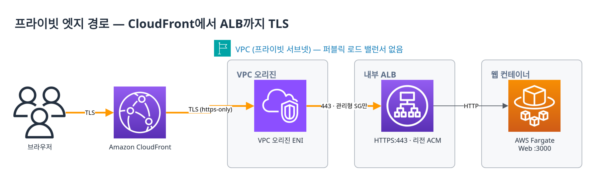
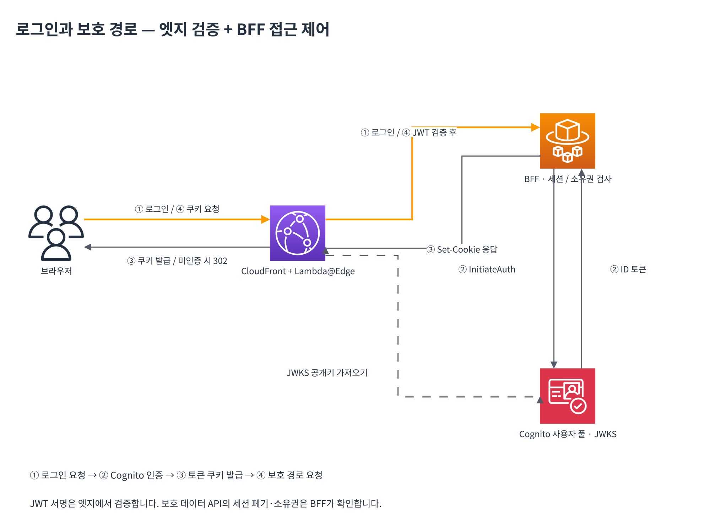
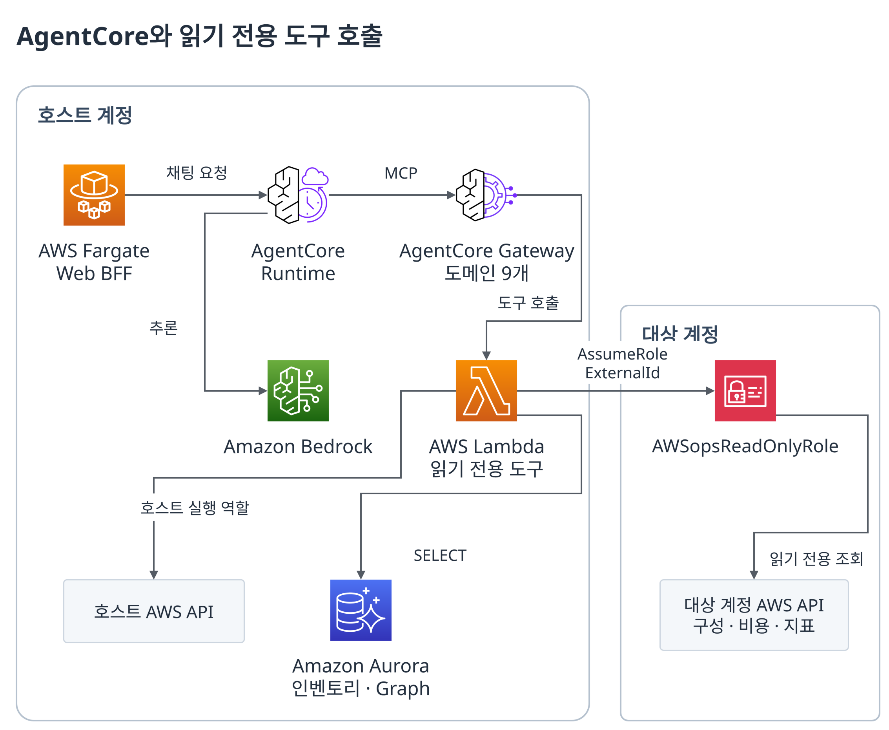
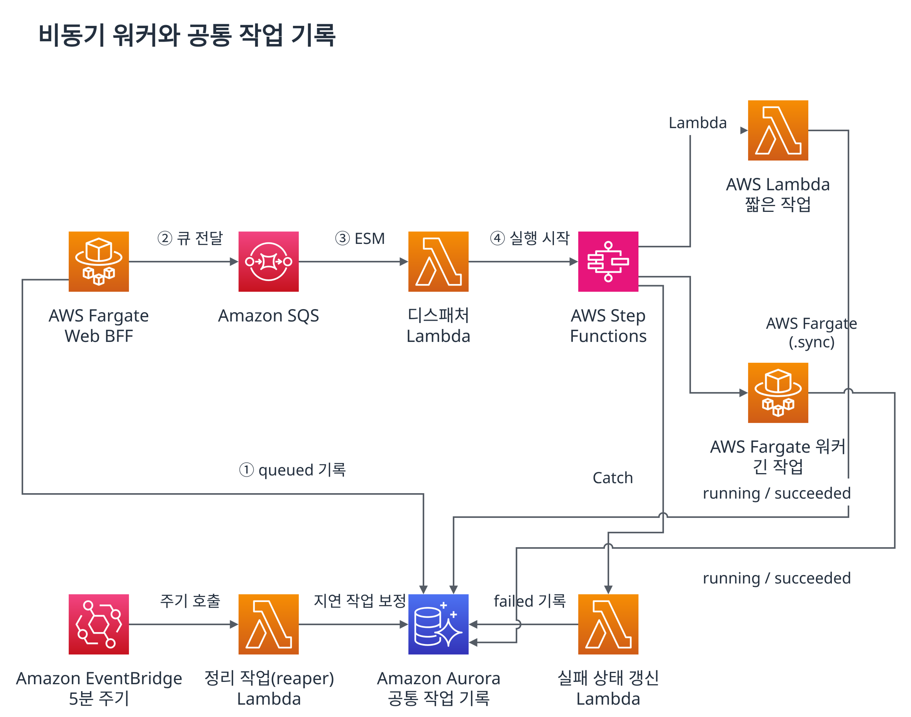

# AWSops 블로그 기술 노트

이 문서는 AWS Blog 원고의 편집·기술 검토를 위한 보조 자료입니다. 게시용 본문은 [draft-awsops-architecture.md](draft-awsops-architecture.md)입니다. 본문은 필요성 → 문제 분해 → 설계 선택 → 조사 흐름 → 운영 가치의 순서로 설명합니다. 전체 컴포넌트 목록과 게시 준비 사항은 이 노트에서 관리합니다.

2026-09-13 사용자 후속 지시에 따라 글자 수·어절 수 상한과 40% 강제 감축 기준을 해제했습니다. 현재 적용할 기준은 [EDITORIAL-SCOPE.md](EDITORIAL-SCOPE.md)입니다. 분량은 참고 값으로만 기록하고 설명의 충분성·정확성·흐름을 검토합니다.

후속 독자 관점 리뷰에서는 AgentCore의 역할, 실제 요청 흐름, 샘플 코드, 첫 실행과 성공 확인을 연결했습니다. 주 샘플 주소는 사용자가 선택한 공개 예정 저장소 `https://github.com/aws-samples/sample-awsops`입니다.

## 독자의 질문에 맞춘 이야기 구조

사용자가 제공한 [AWS Blog 샘플](https://aws.amazon.com/ko/blogs/tech/eks-gemma4-part1/)은 문제를 구간별로 나누고, 원인에 대응하는 기술과 구현, 결과, 적용 조건을 연결합니다. 이 편집에서는 문구나 실측 수치를 가져오지 않고 그 설명 구조를 참고했습니다.

| 독자가 궁금해할 것 | 본문에서 답하는 위치 | 편집 기준 |
|---|---|---|
| 왜 이 구성이 필요했는가? | 도입부·「운영 질문과 설계 요구」 | 알람·비용 화면이 있어도 서비스와 리소스의 맥락을 연결해야 하는 운영 문제 제시 |
| 구체적으로 어떤 문제였는가? | 「운영 질문과 설계 요구」의 4행 표 | 반복 조회, 관계 파악, 권한 있는 근거 조회, 반복 점검의 네 가지 문제로 분해 |
| 어떻게 해결했고 왜 그 기술을 선택했는가? | 「데이터 수집·관계·조회 경로」부터 「접근 통제와 실행 분리」까지 | 문제 → 설계 선택 → 동작 → 적용 조건을 연결. 대화형·정기 진단 그림과 조사 예시로 설명 |
| 운영팀은 어떻게 검증할 수 있는가? | 「검증 결과와 운영팀의 활용」·「결론」 | 발견 후보, 기존 워커 검증 기록, 파일럿 평가 방법을 나누어 설명. 정량적인 업무 개선 효과와 구분 |
| AgentCore가 무엇을 해결했고 어디서 따라 할 수 있는가? | 「AgentCore가 맡은 실행과 도구 연결」·「ENI 질문 하나가 실제 조회 결과로 돌아오는 과정」·「샘플로 첫 번째 AWS 조회 실행하기」 | Runtime·Gateway·Lambda의 역할을 한 요청으로 연결하고 코드·준비 조건·명령·성공 기준 제공 |

- Steampipe·Resource Graph·AgentCore Gateway·Lambda MCP·외부 관측 데이터·교차 계정 내용을 유지하되, 문제를 해결한 지점에 배치했습니다.
- 예전 원고의 사례 나열을 하나의 조사 흐름으로 연결했습니다. 알람에서 로그를 읽고, 연결 조건을 구체화하며, 같은 서비스의 비용 개선 후보를 검토합니다.
- 중복된 전후 비교 표는 삭제했습니다. 현장 MTTR, API 호출 감소율, 비용 절감액을 측정한 것처럼 쓰지 않습니다.
- 워커의 OOM 격리·멱등성·일시 중지 검증은 기존 기록에 근거합니다. 이번 원고 편집에서 실환경 검증을 새로 실행하지 않았습니다.

## SRE pain point와 자동 진단 보강

이번 보강은 다음 운영 부담을 중심으로 합니다.

- 동시에 들어오는 알람이 하나의 실패에서 파생된 증상인지 판단해야 하는 부담. 자동 알람 억제·자율 대응 기능을 주장하지 않습니다.
- 특정 담당자에게 집중되는 구성 지식과 교대 시 조사 맥락 재구성.
- 계정·권한·관측 제품의 경계 때문에 생기는 조회 실패와 데이터 범위 혼동.
- 장애 대응에 밀리는 보안·복구 준비·성능·비용의 평시 점검.
- 리뷰 자료를 매번 수작업으로 모으고, 발견 사항을 검증된 개선 작업으로 연결하는 반복 업무.

아키텍처는 `fig2a-interactive`의 운영자 접근·대화형 조사와 `fig2b-diagnosis`의 인벤토리·관계 정보·예약 진단으로 나누었습니다. 각 그림의 기준 원본은 `drawio/`의 `.drawio`이며 PNG·SVG는 `images/`에 제공합니다. 논리 흐름을 표현하는 그림으로 모든 서브넷과 호출을 나열하지 않습니다.

## 사용자가 제공한 실제 발견 성과

2026-09-11 대화에서 사용자가 다음 값을 제공했습니다. 이 날짜는 공유 시점이며 측정 시점으로 사용하지 않았습니다.

| 제공한 내용 | 본문 표현 | 해석 범위 |
|---|---|---|
| EBS 미암호화 6건 | 암호화되지 않은 Amazon EBS 볼륨 | 본문에서는 건수 제외. 보안·데이터 보호 검토 대상이며 침해 발생·조치 완료·전체 대비 비율을 뜻하지 않음 |
| 미사용 ENI (VPC endpoint) 28개 | 사용 경로를 추가 확인할 VPC 엔드포인트 관련 인터페이스 | 본문에서는 건수 제외. ENI를 엔드포인트 개수·과금 항목 수·삭제 완료·절감액으로 바꾸지 않음 |

- 계정 범위, 측정 기간, 발견에 사용한 구체적인 도구 경로, 조치 결과는 제공되지 않았습니다. 임의로 보완하지 않았습니다.
- 2026-09-13 편집에서는 리드와 수치 표를 삭제하고 「운영 점검에서 확인할 개선 후보」에서 질적으로 서술했습니다. 리뷰 브리프의 예시인 “단일 계정·단일 리전·1회”도 확인된 사실이 아니므로 사용하지 않았습니다.
- 이번 편집에서 AWS API로 이 수치를 재검증하지 않았습니다. 사용자 제공 운영 결과와 코드로 확인한 기능·기존 워커 시험을 구분합니다.
- 특히 기존 인벤토리 MCP의 `find_unused_resources`는 ENI 탐지 경로로 주장하지 않습니다. ENI 28개를 이 도구나 공식 Well-Architected 평가가 자동 산출했다고 연결하지 않았습니다.
- EBS 미암호화는 이전의 미사용 EBS 탐지 유형명 불일치와 다른 항목입니다. 두 결과를 혼동하지 않습니다.

## 여섯 가지 기둥 진단의 근거와 한계

| 설명 | 코드·문서 근거 | 게시 시 지킬 범위 |
|---|---|---|
| 여섯 가지 기둥의 보고서 구성 | `scripts/v2/workers/diagnosis/sections.py` | 운영 우수성·보안·신뢰성·성능 효율성·비용 최적화·지속 가능성에 대한 자체 진단 구성 |
| 지속 가능성 | 같은 파일의 pillar map·요약 프롬프트, `test_sections_wadd.py` | 탄소 원천 데이터 없음. 자원 효율·구성의 참고 지표와 데이터 부족을 구분. 배출량·감축량을 산출했다고 쓰지 않음 |
| 수집과 섹션별 분석 | `scripts/v2/workers/diagnosis/report.py`, `sources.py` | 워커가 자료를 수집하고 Bedrock을 직접 호출. AgentCore Runtime을 경유하는 채팅 경로와 구분 |
| 예약 진단 | `web/lib/diagnosis-schedule.ts`, `scripts/v2/workers/schedule_dispatcher.py`, `terraform/foundation/workers.tf` | workers + diagnosis_schedule 게이트와 사용자 활성화 필요. 주간·격주·월간 예약, 매시간 확인. 현재 UI는 기본 호스트 진단 |
| 인벤토리 수집 경로 | `scripts/v2/steampipe/sync_lambda.py`의 `QUERIES`, `SDK_SYNCS` | Steampipe SQL과 직접 boto3 호출을 구분. S3·공개 접근 등 다섯 SDK 유형은 Steampipe를 거치지 않음 |
| 인벤토리 속성 미확인 | 같은 파일의 `_run_steampipe_query`, `unknown_attribute_count`와 신선도 계약 | 최신 시각·succeeded만으로 완전성을 판단하지 않음. unknown 속성과 degraded 신선도를 확인하며 누락을 안전·부재로 해석하지 않음 |
| 보안 자료 | `diagnosis/sources.py`의 `collect_posture`, `collect_inventory` | Security Hub의 단일 리전 ACTIVE·NEW 상태 발견 사항 중 정렬·페이지 순회 없는 최대 100건 표본의 심각도 통계. 전체 분포나 모든 발견 사항·통제 항목의 완전 수집으로 주장하지 않음 |
| CIS 규칙 점검 | `scripts/v2/workers/compliance.py`, `handlers.py`의 `_compliance` | Powerpipe가 별도 워커에서 Steampipe를 조회. 규칙 결과와 LLM의 해석을 구분 |
| 변경 이벤트 표본 | `diagnosis/sources.py`의 `collect_what_changed` | 단일 리전의 최근 24시간, 최대 50건. 주간·월간 예약 간격 전체의 변경 이력이 아님 |
| 변화 비교 | `diagnosis/report.py`의 `_diff_summary`, 활성 불변 조건 평가 | 준비된 기준과 이전 보고서의 비교. 모든 AI 발견 사항의 의미적 차이·전체 환경 drift를 자동 검증하는 기능이 아님 |
| 알림 | `diagnosis_digest.py`, `notify.tf` | workers + diagnosis_notify 게이트와 관리자 관리·SNS 확인 수신자가 필요. 수동·예약의 성공/부분 완료 보고서를 15분 주기로 묶음 처리. 전달 보장·자동 조치로 표현하지 않음 |
| 진단 점수 | `diagnosis/sections.py`의 요약 프롬프트 | 제품 내부의 모델 기반 요약 지표. 데이터 부족 기둥과 조정된 가중치를 함께 해석. AWS 공식 리뷰·인증 점수로 쓰지 않음 |

AWS Well-Architected Tool을 호출해 워크로드를 등록하거나 공식 질문에 자동 답변을 기록하는 기능은 이번 원고의 주장이 아닙니다. 여섯 가지 기둥을 활용한 수집·분석·보고서 생성이 실제 리뷰의 자료 준비를 돕는다는 범위입니다. 복구 목표, 운영 절차, 실제 개선 효과는 관계자의 검토와 검증이 필요합니다.

light·mid는 기본 섹션과 불변 조건 평가, deep은 추가 분석 섹션을 사용합니다. 심층 분석을 선택했다고 자동 수집 범위가 모든 계정·리소스로 넓어지지 않습니다. 인벤토리 상세와 EC2 지표는 표본·개수·기간 제한이 있으며, 다른 계정 보고서의 일부 실시간 소스는 호스트 전용이라 미지원으로 표시합니다.

## 구현 범위와 근거

| 본문의 활동·설계 | 구현 근거 | 설명할 때 지킬 범위 |
|---|---|---|
| 알람·지표·로그 조사 | `agent/lambda/aws_cloudwatch_mcp.py`, `scripts/v2/agentcore/catalog.py` | 등록된 도구 스키마로 전달 가능한 인자와 실제 반환 범위에 한정 |
| 변경 이력 확인 | `agent/lambda/aws_cloudtrail_mcp.py` | 변경 시점과 증상의 상관관계가 곧 원인 확정은 아님 |
| 연결 문제 점검 | `agent/lambda/reachability_read_mcp.py` | 설정 기반 근사 분석. 실제 패킷 전달, 모든 TGW·반환 경로·DNS·호스트 방화벽을 검증하는 기능이 아님 |
| 서비스별 비용·추이 조회 | `agent/lambda/aws_cost_mcp.py` | 월별 비교는 현재 월 누적 대 전월 전체이므로 반환된 기간을 확인. `get_cost_and_usage`는 금액 상위 30행, `get_cost_and_usage_comparisons`는 차이 절댓값 상위 20행, `get_cost_comparison_drivers`는 영향 절댓값 상위 10행으로 제한되므로 동일 기간의 전체 비교는 Cost Explorer 콘솔에서 기간·집계 조건을 맞춰 별도로 확인 |
| 리소스 최적화 권고안 조회 | `agent/lambda/aws_finops_mcp.py` | 본문 사례는 EC2 권고안의 현재 유형·권장 유형·판정·성능 위험에 한정. Compute Optimizer 활성화·지표 축적·권한이 선행되어야 함 |
| 도구 연결 | `scripts/v2/agentcore/catalog.py`, `scripts/v2/agentcore/provision.py`, `agent/agent.py` | 기본 단일 도메인 경로와 조건부 다중 도메인 합성을 구분 |
| BFF 접근 제어 | `web/lib/auth.ts`, `web/app/api/diagnosis/route.ts` | 엣지 JWT 검사에 더해 BFF의 세션 폐기·소유권·관리자 권한 확인이 필요 |
| 비동기 작업 분리 | `scripts/v2/workers/`, `terraform/foundation/workers.tf` | 작업 원장 기록, 실패 보정, 디스패치 일시 중지와 인프라 삭제를 구분 |

위 사례는 현재 도구를 활용한 조사 예시이며 실측 절감 사례가 아닙니다. 배치 인벤토리 동기화와 달리 Steampipe 기반 웹 자동 수집기는 실행이 비활성화되어 있습니다. 이를 상시 자동 유휴 자원 스캔이나 자율 복구로 소개하지 않습니다.

## 리뷰 지적 반영

| 지적 | 수정 내용 |
|---|---|
| 플래그 OFF = 비용 0원·즉시 회수 | 본문에서 제거. 최초 미생성, ESM 일시 중지, 리소스 제거를 구분 |
| 엣지에서 모든 접근 제어 완료 | BFF의 토큰 검증·세션 폐기·소유권 검사 추가 |
| 쓰기 권한은 로그·ENI만 | 삭제. IAM, SQL 읽기 전용 역할, OpenSearch 코드 경로 제한을 구분 |
| Terraform이 AgentCore를 지원하지 않음 | 본문에서 프로비저닝 세부사항 제거. 아래에 현재 지원 상태 명시 |
| Lambda@Edge 함수 1MB 제한 | 본문에서 패키지 제한 설명 제거. 아래에 공식 제한표 근거 명시 |
| OpenSearch를 data 게이트웨이로 기재 | 아래 실제 도구 매핑에서 monitoring으로 수정 |
| Terraform 상태 조회 기능 | 아래 실제 범위를 provider 문서·모듈 검색으로 수정 |
| SSE 캐시·버퍼링 혼동 및 1초 결과 | 본문의 검증 사례에서 제거. 아래에 현재 15초 heartbeat와 60초 read timeout 명시 |
| 로그인 그림의 방향 혼동 | 보조 그림 B에서 로그인 응답·쿠키 요청과 JWKS 가져오기를 구분 |
| 워커 그림의 EventBridge 직접 원장 접근 | 그림 4에 EventBridge → reaper Lambda → Aurora 및 상태 갱신 경로 표시 |
| 컴포넌트·플래그 목록이 본문을 압도 | 세 가지 SRE 조사 사례에 구체적인 질문·도구 입력·해석·후속 판단을 보강. Steampipe·Resource Graph·Gateway·Lambda MCP·외부 데이터·Cross-account를 실제 조회 흐름으로 설명 |

## 사례 보강 시 확인한 사항

- 로그 예제는 `filter @message like /(?i)(timeout|connection refused)/`, `stats count(*) as matching_events by bin(5m)`, `sort matching_events desc`를 사용합니다. 현재 MCP 도구의 `minutes`는 현재 시각으로 끝나는 상대 조회 기간입니다. 알람 시각 앞뒤 30분 같은 절대 구간은 도구 인자로 표현할 수 없으며 콘솔 또는 시작·종료 시각을 지정하는 `StartQuery` API가 필요합니다. 로그 이벤트 수를 요청 오류율이나 고유 요청 수로 설명하지 않습니다.
- 실제 CloudWatch 도구는 `execute_log_insights_query`로 쿼리를 시작하고 `get_logs_insight_query_results`로 실행 상태와 결과를 확인합니다. 쿼리 접수를 분석 완료로 간주하지 않으며, 조회 범위·행 제한을 고려합니다.
- 네트워크 JSON은 `reachability_read_mcp.py:check_reachability`가 반환하는 본문의 발췌입니다. `reachable`, `checked`, `blocking_component`(`layer`, `resource`, `reason`), `disclaimer`를 사용하며, Lambda의 `statusCode`·문자열 `body` 외피와 `source`·`destination`은 생략합니다. 설명용 자리표시자와 줄인 `disclaimer`를 명시했으며 실제 장애 응답으로 제시하지 않습니다.
- `disclaimer`의 원문에는 Reachability Analyzer를 “definitive packet-level verdict”로 부르는 문장이 있지만, 공식 문서에 따른 구성 분석 범위를 넘는 표현이므로 본문에 복제하지 않았습니다. 이 편집에서는 애플리케이션 코드를 변경하지 않습니다.
- `get_cost_comparison_drivers`는 서비스와 `USAGE_TYPE`을 함께 묶어 조회합니다. 본문의 사용 유형별 비용 조사 설명은 이 구현에 근거하며, 임의 태그나 리소스별 청구액의 자동 귀속을 주장하지 않습니다.
- 원인 후보·비용 후보 표는 불릿으로 바꾸었습니다. 활용 방식의 예시이며 관측값·장애 사례·실측 절감액으로 제시하지 않습니다.

## 2026-09-13 편집의 기술 판단

| 리뷰 항목 | 대조 근거 | 반영 범위 |
|---|---|---|
| AWS Config·Resource Explorer와의 관계 | 각 서비스 공식 개요, `sync_lambda.py`, `graph-store.ts` | Config의 구성·관계·이력, Explorer의 검색·발견과 자체 인벤토리·그래프를 구분. 외부 관측을 모두 SQL로 통일했다는 설계 동기는 근거가 없어 추가하지 않음 |
| Reachability Analyzer와의 관계 | 공식 개요·동작 설명, `reachability_read_mcp.py` | 자체 도구는 별도 분석 리소스를 만들지 않는 제한된 정적 검사. AWS 서비스도 패킷을 전송하는 검사가 아닌 구성 분석임을 기준으로 표현 |
| 재현할 Gateway 등록 호출 | `scripts/v2/agentcore/provision.py:ensure_targets`, `catalog.py`의 `get_eni_details`, boto3 API 문서 | `mcp.lambda.lambdaArn`, `toolSchema.inlinePayload`, `GATEWAY_IAM_ROLE` 사용. 새 타깃 생성 예제이며 실제 프로비저너의 갱신·교차 계정 인자 주입은 생략 |
| 재현 환경 | 기존 Gateway·조회 Lambda·역할 권한, boto3·SDK 자격증명 | 예제 실행은 구축 단계의 타깃 생성. 진단 도구가 운영 중 리소스를 변경하는 경로로 연결하지 않음 |
| Gateway·Lambda 수 | `catalog.py`, `terraform/foundation/ai.tf` | 도메인 Gateway 9개는 코드 구성으로 서술. Lambda 27개/30개는 집계 범위가 달라 그림에서 숫자를 삭제 |
| SQL 예제 | `scripts/v2/steampipe/sync_lambda.py`의 EC2 수집 SQL | 실제 수집 컬럼 `vpc_id`, `subnet_id`, `security_groups`를 포함한 축약. 웹의 실시간 SQL 경로로 소개하지 않음 |
| 보존·용어 정리 | 원고 커밋 `3b11e396`, 제공된 편집 브리프 | 프롬프트 5개와 그림 1 내용·캡션 유지. 5단계 목록의 순서·역할은 유지하되 내부 플래그·서비스명·용어만 지시대로 정리 |

브리프의 구 절 번호·행 번호 대신 최종 절 제목을 근거 표에서 사용합니다. 비용 설명은 「같은 서비스의 비용 검토」에서 충분히 다루고, 발견·검증·파일럿 평가는 「검증 결과와 운영팀의 활용」로 분리했습니다. 점수 설명은 「점수와 변화 비교의 해석」에 복원했습니다. 본문의 표는 문제·그래프·기둥·검증의 네 개이며, 표의 수나 원고 길이를 맞추기 위한 삭제 기준은 적용하지 않습니다.

## 분량 제한 해제 후 복원한 설명

| 보강한 내용 | 최종 절 | 기존 근거와 유지한 경계 |
|---|---|---|
| 온콜 우선순위, 담당자 지식 집중, 평시 점검 부담 | 운영 질문과 설계 요구 | 최초 원고의 운영 문제 서술. 업무 개선율·도입 실적을 추가하지 않음 |
| 외부 관측 소스, 서비스 호출 관계, 공식 MCP 선택 경로 | 외부 관측 자료와 서비스 호출 관계 | 기존 커넥터·그래프·타깃 카탈로그 근거. 지원 소스와 별도 활성화·인증·도구 허용목록을 유지 |
| 웹 연결 확인과 실제 도구 역할, 계정별 데이터 범위 | 교차 계정의 호출 주체와 수집 범위 | `cross_account.py`와 온보딩 근거. 호스트 self-assume 생략·ExternalId 공통값·호스트 인벤토리 제약 유지 |
| 비용 비교 기간, 권고안이 없는 이유, 조사 인계 | 알람에서 원인 후보와 비용 검토까지 | 기존 원고의 시점·범위·권한 구분. 새 실측 사례나 비용 수치 없음 |
| 대화형·보고서 실행 차이, 표본·미지원 소스, 묶음 발행 | 예약에서 보고서까지·수집 범위와 묶음 알림 | `report.py`, `sources.py`, `diagnosis_digest.py`. 직접 Bedrock 호출·호스트 범위·부분 완료·별도 발행 상태 유지 |
| 점수와 가중치, 기준이 있는 구성 변화 비교 | 점수와 변화 비교의 해석 | `sections.py`, `_diff_summary`·불변 조건 평가. 공식 리뷰·탄소 측정·모든 발견의 의미적 비교로 확대하지 않음 |
| API 경로 검토, 작업 상태·중복·일시 중지·제거의 차이 | 접근 통제와 실행 분리 | `opensearch_mcp.py`의 검색 요청과 워커 구현·런북 근거. POST 허용만으로 읽기 전용을 입증하지 않으며, 실제 리소스 변경 경로를 활성화하지 않음 |
| 발견 후보의 후속 조사, 실행 기반 시험, 파일럿 평가 | 검증 결과와 운영팀의 활용 | 사용자 제공 관측과 W9 기존 기록, 최초 원고의 평가 방법. 실환경 시험 재실행·성과 측정 주장 없음 |

앞선 축약본의 리뷰는 `results/CONTENT-REVIEW-2026-09-13-condensed.md`에 보관합니다. 해당 문서의 분량 판정과 점수는 과거 원고에 대한 이력이며 현재 원고의 통과 조건으로 사용하지 않습니다.

## 독자의 첫 실행 경로와 샘플 근거

기존의 구조 설명과 단독 Gateway 타깃 등록 예제만으로는 처음 읽는 독자가 준비할 리소스와 실행 결과를 연결하기 어려웠습니다. Runtime의 실행 역할과 Gateway의 도구 연결 역할을 먼저 설명하고, ENI 질문 하나를 따라 실제 코드·실행·확인 기준으로 이어지도록 보강했습니다.

| 설명 | 확인한 샘플 근거 | 원고에서 지킬 범위 |
|---|---|---|
| 에이전트가 Gateway 도구를 읽어 모델에 전달 | `agent/agent.py`: `handler`, `get_all_tools`, `Agent(tools=...)`, `_stream_text` | Runtime의 에이전트 실행과 Gateway의 정의·호출 전달을 구분. 모델이 AWS 상태를 자동으로 안다고 하지 않음 |
| ENI 조회의 실제 반환 필드 | `agent/lambda/network_mcp.py`: `get_eni_details` 처리 | `eniId`, `privateIp`, `vpcId`, `subnetId`, `securityGroups`, `nacl`, `routes`는 실제 필드. 특정 리소스의 실제 응답을 새로 만들지 않음 |
| 첫 실습의 리전 | 같은 파일의 `args.get("region", "ap-northeast-2")` | 서울 리전의 호스트 ENI를 사용. 다른 리전으로의 확장은 입력·조회 설정을 먼저 확인 |
| 도구 정의와 Lambda 타깃 등록 | `scripts/v2/agentcore/catalog.py`, `provision.py:ensure_targets` | 등록된 정의를 실제 Lambda 구현과 연결하며, 임의 서버·변경 도구를 활성화하지 않음 |
| 구성 마법사의 선택 | `scripts/v2/configure.mjs` | 새 테스트 환경에서 AgentCore 기반과 하이브리드 라우팅을 선택. 기존 운영 기능을 끄도록 안내하지 않음 |
| 배포 순서와 선행 마이그레이션 | `Makefile`, `scripts/v2/agentcore.mjs`, `docs/onboarding.md`, `docs/runbooks/agent-sql-reader.md` | v2의 `terraform/foundation` 사용. 도메인·호스팅 영역·상태 버킷·권한·실행 도구를 준비하고 저장된 계획을 검토한 뒤 적용 |
| 명령 실행 환경의 DB 접근 | `scripts/v2/migrate.mjs`의 endpoint·5432 연결, `client.connect()` | `make deploy`의 마이그레이션도 직접 DB에 연결하므로 Aurora로의 네트워크 경로와 접근 허용을 준비. AWS CLI 권한만 있으면 임의의 로컬 환경에서 모두 실행된다고 하지 않음 |
| 간이 호출 확인의 범위 | `provision.py:smoke` | 보안 Gateway로 IAM 역할 목록 질문을 보내며 응답에 `role`이 있는지 검사하는 간이 점검. 이를 ENI 도구 실행의 증거로 사용하지 않음 |
| 실제 성공 기준 | `agent.py`의 Gateway 연결 실패 후 일반 모델 응답 경로, 네트워크 도구 구현 | 자연어 응답만으로 성공 판정하지 않고 실제 조회 호출·리소스 식별자·콘솔 근거를 대조 |

위 샘플 파일은 2026-09-13에 `aws-samples/sample-awsops`의 `dev` 브랜치에서 인증된 GitHub API로 확인했습니다. 현재 저장소는 **private**, 기본 브랜치는 **dev**이며, 비로그인 접근은 404입니다. 따라서 본문 링크는 사용자 요청에 따른 **공개 예정 링크**이지 현재 공개 접근 검증을 마친 링크가 아닙니다.

본문은 올바른 샘플 주소로 clone하도록 안내합니다. 확인 시점의 샘플 README clone 예시는 이전 `Atom-oh/awsops` 주소를 가리키므로 게시 전 정합성 확인 항목으로 남깁니다. `docs/guides/install.md`는 v1 레거시 표시가 있어 사용하지 않았으며 v2 온보딩 문서에 연결했습니다. 본문 코드 링크는 확인한 `dev` 경로를 사용하므로 공개 시 기본 브랜치·릴리스 변경 여부도 재확인해야 합니다.

공개된 AgentCore 공식 `00-getting-started` 예제는 Runtime 학습을 위한 보조 링크입니다. 해당 예제의 고객 지원·로컬 도구를 AWSops의 네트워크 Gateway 실습과 동일한 구현으로 소개하지 않습니다. 이번 편집에서는 실제 계정에 새 배포나 도구 호출을 실행하지 않았으며, 명령·정의·반환 형식은 소스와 대조한 결과입니다.

## 추가한 데이터·권한 경로의 근거

| 주제 | 구현 근거 | 본문에서 구분한 내용 |
|---|---|---|
| Steampipe 인벤토리 | `scripts/v2/steampipe/sync_lambda.py`, `spc_render.py`, `terraform/foundation/steampipe.tf` | SQL을 통한 수집과 Aurora 적재. 기본 스케줄 15분. 별도 Powerpipe 컴플라이언스 배치도 사용하며 BFF 실시간 SQL과 구분 |
| Resource Graph | `web/lib/graph-store.ts`, `flow-topology.ts`, `infra-topology.ts`, `web/app/api/graph/route.ts` | flow·infra·trace 관점, 저장 그래프와 원천 데이터의 시점·범위 |
| 그래프 재구성 | `web/instrumentation.ts`, `terraform/foundation/variables.tf`의 `graph_rebuild_interval_mins` | 인벤토리 동기화와 별도. 자동 실행 기본값 0 |
| AI의 인벤토리·그래프 조회 | `agent/lambda/inventory_read_mcp.py`, `scripts/v2/agentcore/catalog.py` | `get_topology`, `query_inventory`, `inventory_summary`, `find_unused_resources`. 현재 MCP는 `account_id='self'` |
| Gateway와 Lambda MCP | `scripts/v2/agentcore/provision.py`, `catalog.py`, `agent/lambda/cross_account.py` | Gateway의 MCP 인터페이스와 Lambda 도구 구현을 구분. 호출 권한과 AWS 조회 권한도 별개 |
| 외부 관측 데이터 | `agent/lambda/datasource_http.py`, `web/lib/graph-sources.ts`, `trace-source.ts` | 등록된 커넥터·시크릿·네트워크·지원 스키마 필요. 서비스 호출 그래프는 호스트 범위 |
| 공식 외부 MCP | `scripts/v2/agentcore/catalog.py`의 벤더 프리셋, `agent/agent.py`의 허용목록 | 별도 게이트·읽기 전용 확인·런타임 도구 제한. 임의 BYO-MCP로 일반화하지 않음 |
| Cross-account | `agent/lambda/cross_account.py`, `docs/runbooks/onboard-target-account.md`, `infra/cfn/awsops-target-account-role.yaml` | STS 임시 자격증명과 호스트 self-assume 생략. 웹 온보딩과 도구 Lambda 검증은 별개 |

두 가지 구현 제약을 본문에 반영했습니다.

- Steampipe에는 계정별 AssumeRole·aggregator 구성과 계정별 적재 코드가 있습니다. 런북·기본 온보딩은 모든 수집·MCP 실행 역할의 신뢰를 자동으로 준비하지 않으므로, “host-only 코드”나 “등록만 하면 모든 계정 수집”으로 단정하지 않습니다.
- MCP Cross-account 헬퍼는 공통 `AWSOPS_EXTERNAL_ID`를 사용합니다. 계정 DB의 ExternalId를 계정별로 자동 선택하지 않으며, 서로 다른 ExternalId를 사용하는 대상에 대해서는 현재 연결 범위를 별도로 검증해야 합니다.

미사용 EBS 탐지는 본문의 MCP 사례에서 제외했습니다. 현재 동기화는 `ebs_volume` 유형으로 저장하지만, `find_unused_resources`는 `ebs` 유형을 그대로 조회합니다. 해당 별칭 변환을 확인하지 못했으므로, 원고에서는 현재 근거가 확인된 대상 그룹 등의 구성 점검 사례로 한정했습니다. 이 편집에서 애플리케이션 코드를 수정한 것은 아닙니다.

대상 그룹의 health도 저장 시점의 정보와 실시간 확인을 구분했습니다. 현재 Gateway 카탈로그에는 `DescribeTargetHealth`를 호출하는 도구가 없으므로, 본문에서는 인벤토리의 백엔드 관계 확인 후 현재 health를 AWS 콘솔에서 별도로 확인하도록 설명합니다. 실시간 Lambda MCP 호출의 예시는 실제 등록된 `get_eni_details`로 구성했습니다.

## 엣지와 인증

CloudFront → VPC 오리진 → 내부 ALB HTTPS:443 → Fargate web HTTP:3000 경로입니다. CloudFront에서 ALB까지 별도의 TLS 연결을 사용합니다. ALB의 443 인바운드 소스는 CloudFront 관리형 보안 그룹입니다. 새 VPC의 부트스트랩에서는 관리형 SG가 생긴 뒤 후속 적용으로 해당 규칙을 추가합니다. CIDR로 ENI를 식별할 수 없다는 일반화 대신, 허용할 CloudFront 소스를 좁힌다는 목적을 설명합니다.

*보조 그림 A. 공개 웹 진입점은 CloudFront이고 오리진은 사설입니다.*

[PNG 원본](images/appendix-a-private-edge.png) · [SVG 원본](images/appendix-a-private-edge.svg)

로그인은 자체 폼과 BFF의 Cognito `InitiateAuth(USER_PASSWORD_AUTH)` 호출로 처리합니다. BFF는 ID 토큰을 보안 속성을 가진 쿠키로 발급합니다. 보호 경로의 요청은 엣지에서 JWT 서명을 검증하고, 데이터 API는 BFF에서 토큰·세션 폐기·소유권을 확인합니다. 예외 경로는 저장소의 공개 경로 허용목록과 별도 인증 규칙을 따릅니다.

*보조 그림 B. 번호는 로그인·후속 요청의 순서입니다. JWKS 가져오기는 공개키 조회이며 실제 서명 검증은 엣지에서 수행합니다. BFF의 인가·세션 검사는 보호 데이터 API에 적용됩니다.*

[PNG 원본](images/appendix-b-edge-auth.png) · [SVG 원본](images/appendix-b-edge-auth.svg)

Lambda@Edge의 함수·라이브러리를 포함한 압축 패키지 제한은 확인한 공식 제한표 기준 50MB입니다. 함수가 생성하는 응답 크기 제한(viewer 40KB, origin 1MB)과는 별개입니다. 본문에는 이 세부사항을 넣지 않았습니다.

SSE 구현은 `web/app/api/stream/route.ts`에서 최초 이벤트 후 15초 간격으로 전송합니다. `edge.tf`의 read timeout은 60초입니다. `CachingDisabled`는 캐싱과 request collapsing을 끄는 정책이며, 응답 청크 전달·heartbeat·timeout과 구분해야 합니다. 기존 1초 간격 검증에는 시험 날짜·배포 버전의 근거가 없어 게시 원고의 실측 주장으로 사용하지 않았습니다.

## AI 도구와 읽기 전용 경계

현재 Lambda 타깃 카탈로그의 섹션은 다음과 같습니다. 이는 코드 기준 매핑이며 실제 배포 수는 플래그·공식 MCP 전환 설정에 따라 달라집니다.

| 섹션 | 대표 조회·지원 범위 |
|---|---|
| network | 네트워크 설정, Flow Logs, 설정 기반 연결 점검 |
| security | IAM 사용자·역할·정책 조회와 정책 시뮬레이션 |
| container | EKS·ECS와 Kubernetes 리소스 조회 |
| data | 데이터베이스·캐시·스트리밍 리소스 조회 |
| cost | Cost Explorer, 최적화 권고안, 가격·예산 조회 |
| monitoring | CloudWatch, CloudTrail, OpenSearch, Loki·Tempo·Mimir |
| iac | CloudFormation·CDK 검토 지원, Terraform provider 문서·모듈 검색 |
| ops | Aurora에 동기화된 인벤토리 조회, AWS 문서와 CLI 제안 |
| external-obs | Prometheus·ClickHouse·Notion 조회 커넥터 |

*본문 그림 3 재수록. Runtime → Gateway → 호스트 계정의 조회 Lambda 경로이며, Lambda 개수와 본문에서 다루지 않는 Memory·Code Interpreter는 그림에서 제외했습니다.*

게이트웨이는 같은 IAM 역할을 공유하며, 도구 Lambda도 SQL 소비자 두 개를 제외하면 실행 역할을 공유합니다. 도구 집합 분리를 IAM 역할 분리와 동일시하지 않습니다.

SQL 소비자는 `sql_reader` 스키마의 명시적 읽기 전용 뷰만 허용하는 별도 PostgreSQL 역할을 사용합니다. OpenSearch의 `es:ESHttpPost`는 IAM만으로 읽기를 보장하지 않으므로 코드의 검색 경로 제한이 필요합니다.

운영 리소스 변경·자율 복구는 동결 상태입니다. ADR-015의 자기 웹 서비스 재시작은 소유자 승인된 별도 운영 예외이며, AI 진단이 실행하는 일반적인 변경 기능이 아닙니다. Aurora 시크릿 로테이션 성공 이벤트에 대한 `ecs:UpdateService(forceNewDeployment)` 한 경로만, 자기 서비스 하나에 한정하며 기본 비활성 상태입니다. 본문은 AI 진단 범위를 다루므로 이 운영 세부사항을 생략했습니다.

AgentCore 컨트롤 플레인은 이 프로젝트의 boto3 프로비저너로 관리합니다. 현재 저장소에 고정된 HashiCorp AWS provider 6.47.0에는 Gateway, Gateway Target, Memory, Code Interpreter, Agent Runtime 리소스가 있습니다. boto3 사용 사실을 provider 미지원의 증거로 설명하지 않습니다.

## 비동기 작업과 비용

*본문 그림 4 재수록. Aurora는 워커 플래그와 무관한 기반 리소스입니다. 워커는 running/succeeded를 기록하고, Catch 후 상태 보정 Lambda는 failed를 기록합니다. EventBridge는 정리 작업(reaper) Lambda를 주기적으로 호출합니다.*

`docs/reference/06-workers.md`의 W9 검증 기록에 Lambda·Fargate 실행, OOM 격리, ESM 일시 중지·재개, 멱등성의 5개 항목이 있습니다. 본문의 워커 검증 설명은 이 기록에 근거합니다. 이번 편집에서 실환경 시험을 재실행한 것은 아닙니다.

`workers_enabled=false` 적용은 `force_destroy=true`인 진단 산출물 버킷의 삭제를 포함할 수 있습니다. ESM 비활성화는 새로운 디스패치의 일시 중지이며 실행 중인 모든 작업을 즉시 중단하는 기능이 아닙니다. Terraform 밖에서 만든 AgentCore 리소스는 플래그 OFF만으로 제거되지 않습니다.

Cost Explorer 비용은 최신 장애 지표와 같은 실시간 정보가 아닙니다. 공식 문서는 최소 24시간마다 갱신하되 상위 청구 데이터에 따라 더 늦을 수 있다고 설명합니다. 본문에서는 갱신 주기와 추가 지연 가능성을 함께 설명하며 고정된 지연 보장처럼 쓰지 않았습니다.

## 게시 준비

아래 완료 표시는 2026-09-13 편집 이력이며, 당시 시험을 이번 복구에서 다시 실행했다는 뜻이 아닙니다. 현재 검증은 [복구 검증 기록](VALIDATION-2026-09-17.md)으로 한정합니다. 과거 증거 파일은 이력으로 복구했으며, 게시 전 재검증은 보류 상태입니다.

- [x] 분량 상한과 40% 강제 감축 기준을 해제하고, 설계·권한·수집 범위·점수·검증 설명을 복원했습니다.
- [x] 본문에서 미확인 발견 건수와 반복된 성과 부인 문장을 정리했습니다. 측정하지 않은 MTTR 개선율·응답 시간·절감액·도입 실적은 추가하지 않았습니다.
- [x] AWS Config·Resource Explorer·Reachability Analyzer와의 관계, 전제 조건, 구체적인 다음 단계를 추가했습니다.
- [x] 내부 플래그·환경 변수·테이블명을 본문에서 제거하고 서비스명·교차 계정·여섯 가지 기둥 용어를 통일했습니다.
- [x] Gateway 등록 예제는 AWS 호출 없이 SDK 요청 형식과 실제 카탈로그 스키마를 검증했습니다. 네트워크 응답은 EC2 구성을 모킹해 실제 함수의 반환 필드·검사 계층·차단 이유와 대조했습니다.
- [x] 절 번호를 제거하고 최종 절 제목으로 근거 추적을 갱신했습니다. 프롬프트 5개와 그림 1 캡션은 보존했습니다.
- [x] 프롬프트·예약 5단계·기존 코드 블록·그림·캡션을 보존했습니다. 새 shell 블록은 실행 없이 구문 검사하고, 명령·도구 반환 필드·문서 참조를 샘플 소스와 대조했습니다. 분량은 참고 값이며 길이 검사는 적용하지 않습니다.
- [x] `.drawio` 원본을 분할·수정하고 PNG·SVG를 내보냈습니다. 원본 XML 검증과 레이아웃 검사(99~100점), 그림 1의 원본 해시 보존을 확인했습니다.
- [ ] 새 그림 및 게시 템플릿 재검증 대기: 독자 실습 경로를 추가한 미리보기를 재생성하고 1,280·768·375px 폭에서 새 목차·코드 표·실습 명령·원본 보기 링크와 가로 넘침·오류를 확인했습니다. 당시 증거의 보관 위치는 `results/visual-reader-path/`입니다.
- [ ] 게시 전 링크 재확인 대기: 고유 링크 20개 중 공개 문서 13개는 HTTP 200, 공개 예정 샘플 7개는 비로그인 404·인증된 저장소/파일 확인으로 기록했습니다. 샘플의 공개 접근은 통과 처리하지 않았으며 `results/links-reader-path.json`과 게시 전 확인 항목에 남겼습니다.
- [x] 독립 리뷰의 약어 지적을 반영해 ALB·SSE·BFF·ESM을 각 그림 앞에서 정의했습니다. 미리보기에 높이 44px 이상의 ‘그림 원본 크게 보기’ 링크를 추가했습니다.
- [ ] 저자 이름·소속·소개와 AWS Blog 편집 양식의 메타데이터는 게시 담당자가 확정해야 합니다. 본문의 저자 소개 자리표시자를 유지합니다.
- [ ] **게시 전:** `aws-samples/sample-awsops` 공개 전환 후 비로그인 clone·README·온보딩·코드 링크 접근을 확인합니다. 기본 브랜치와 README clone 예시도 최종 공개 경로에 맞춥니다.

과거 독립 리뷰와 캡처는 `results/`와 `drawio/qa/`에 이력으로 보관하며, 현재 판정으로 취급하지 않습니다. 현재 소스 검증 범위는 [복구 검증 기록](VALIDATION-2026-09-17.md)에 기록합니다. 그림의 작은 계층·상태 라벨은 모바일 본문 폭에서 확대가 필요할 수 있습니다. 미리보기의 원본 보기 링크를 제공했으며, 게시 템플릿에서도 원본 이미지로 접근할 수 있게 유지합니다.

본문 이미지는 `fig1-sre-workflow`, `fig2a-interactive`, `fig2b-diagnosis`, `fig3-agentcore`, `fig4-workers`의 PNG입니다. 같은 이름의 SVG·`.drawio` 원본을 함께 제공하며 `appendix-a-private-edge`, `appendix-b-edge-auth`는 기술 노트용입니다. `.drawio`에 최종 배치를 저장하고 YAML은 구조 참고 자료로 관리합니다.

원고의 “참고 자료” 링크는 게시용입니다. 로컬 경로와 이 기술 노트는 게시 본문에 복사하지 않습니다. 기반 인프라·모델·도구 호출 비용은 실제 적용할 기능 조합으로 평가하며 동결된 기능까지 활성화하는 구성을 전제하지 않습니다.

## 공식 문서

- [CloudFront VPC 오리진](https://docs.aws.amazon.com/AmazonCloudFront/latest/DeveloperGuide/private-content-vpc-origins.html)
- [CloudFront·Lambda@Edge 제한표](https://docs.aws.amazon.com/AmazonCloudFront/latest/DeveloperGuide/cloudfront-limits.html)
- [CloudFront 관리형 캐시 정책](https://docs.aws.amazon.com/AmazonCloudFront/latest/DeveloperGuide/using-managed-cache-policies.html)
- [CloudFront 요청·응답 처리](https://docs.aws.amazon.com/AmazonCloudFront/latest/DeveloperGuide/RequestAndResponseBehaviorCustomOrigin.html)
- [Cost Explorer](https://docs.aws.amazon.com/cost-management/latest/userguide/ce-what-is.html)
- [Compute Optimizer](https://docs.aws.amazon.com/compute-optimizer/latest/ug/what-is-compute-optimizer.html)
- [CloudWatch Logs Insights stats](https://docs.aws.amazon.com/AmazonCloudWatch/latest/logs/CWL_QuerySyntax-Stats.html)
- [CloudWatch Logs Insights filter](https://docs.aws.amazon.com/AmazonCloudWatch/latest/logs/CWL_QuerySyntax-Filter.html)
- [Steampipe 공식 문서](https://steampipe.io/docs)
- [AgentCore Gateway Lambda 타깃](https://docs.aws.amazon.com/bedrock-agentcore/latest/devguide/gateway-add-target-lambda.html)
- [Cross-account 역할과 ExternalId](https://docs.aws.amazon.com/IAM/latest/UserGuide/id_roles_common-scenarios_third-party.html)
- [AWS Well-Architected의 여섯 가지 기둥](https://docs.aws.amazon.com/wellarchitected/latest/framework/the-pillars-of-the-framework.html)
- [AWS Well-Architected Tool 검토 절차](https://docs.aws.amazon.com/wellarchitected/latest/userguide/tutorial.html)
- [HashiCorp AWS provider 6.47.0의 AgentCore Gateway](https://github.com/hashicorp/terraform-provider-aws/blob/v6.47.0/website/docs/r/bedrockagentcore_gateway.html.markdown)
- [AWS Config 개요](https://docs.aws.amazon.com/config/latest/developerguide/WhatIsConfig.html)
- [AWS Resource Explorer 개요](https://docs.aws.amazon.com/resource-explorer/latest/userguide/welcome.html)
- [Amazon VPC Reachability Analyzer 개요](https://docs.aws.amazon.com/vpc/latest/reachability/what-is-reachability-analyzer.html)
- [Reachability Analyzer 동작 원리](https://docs.aws.amazon.com/vpc/latest/reachability/how-reachability-analyzer-works.html)
- [boto3 CreateGatewayTarget](https://docs.aws.amazon.com/boto3/latest/reference/services/bedrock-agentcore-control/client/create_gateway_target.html)
- [Strands Agents 공식 문서](https://strandsagents.com/docs/)
- [Model Context Protocol 사양](https://modelcontextprotocol.io/specification/latest)
- [Powerpipe 공식 문서](https://powerpipe.io/docs)

2026-09-13에 추가 서비스의 공식 개요와 API 형식, Cost Explorer 갱신 설명을 확인했습니다. Strands Agents의 이전 `/latest/documentation/docs/` 경로는 404여서 현재 `/docs/`로 바꾸었습니다.
