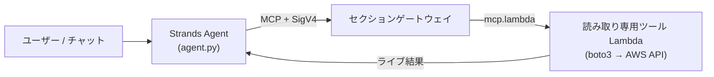
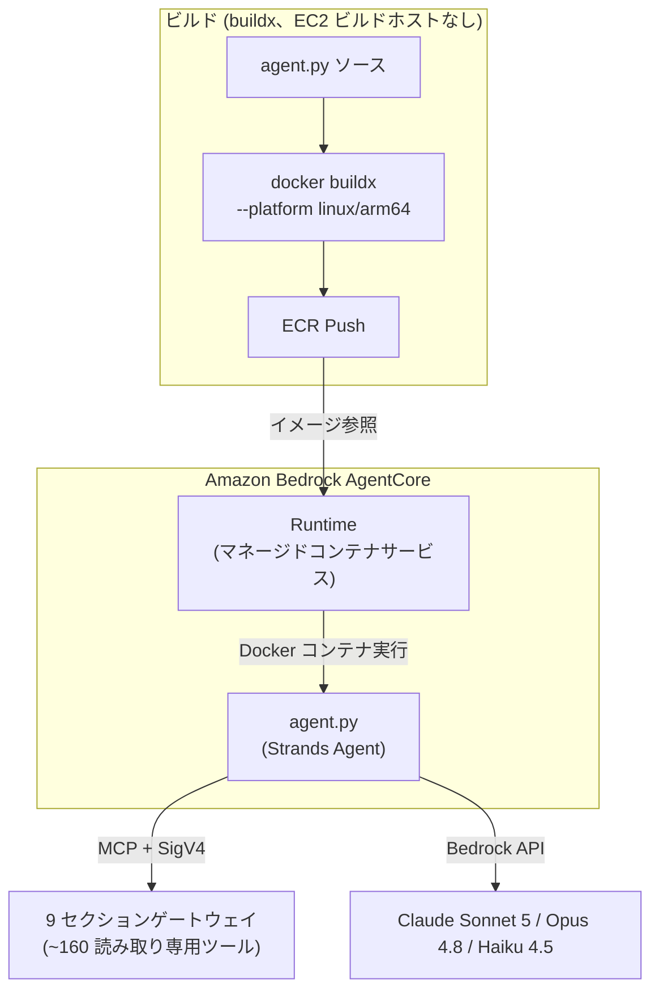
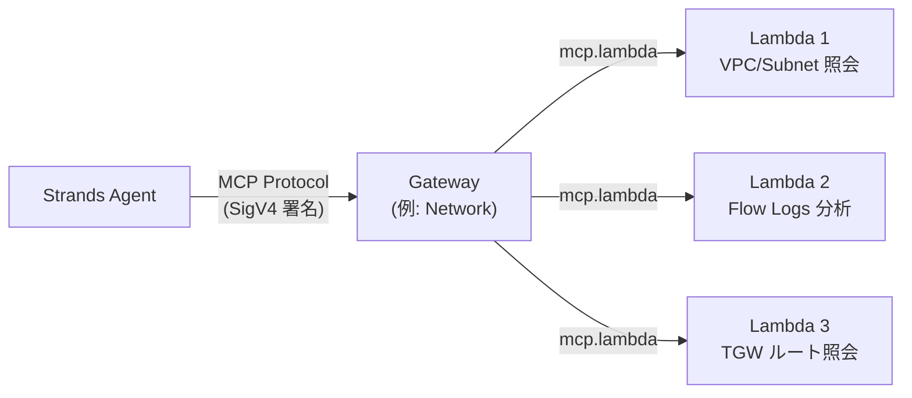
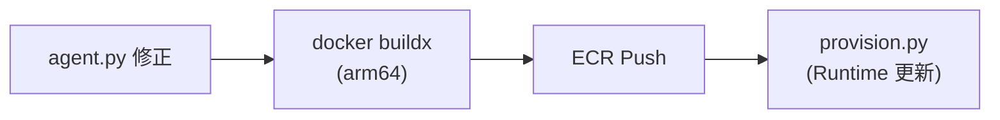
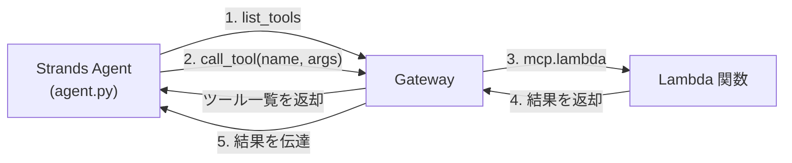
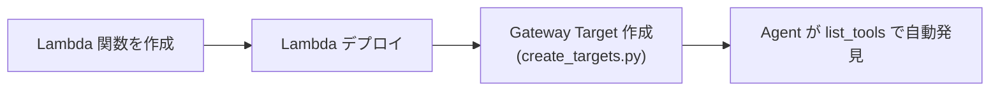
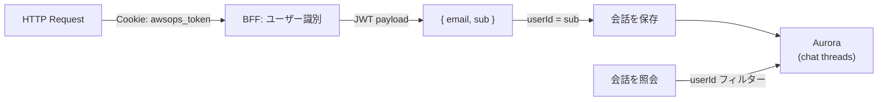

# AgentCore & メモリ技術 FAQ

AgentCore Runtime、Gateway、ライブ AWS 照会経路、Memory Store など、AI エンジンの内部動作に関する詳細な質問と回答です。

## AgentCore がライブ AWS 照会の基本（primary）経路である理由は？

AWSops の**ライブ AWS データは AgentCore MCP Lambda ツールを通じて照会**されます。かつてのレガシーアプリが組み込み Steampipe で直接クエリしていた方式を置き換えたものです。



### 主要ポイント

| 項目 | 内容 |
|------|------|
| **ライブ照会** | AgentCore MCP Lambda ツール（約 160 個、読み取り専用）が boto3 で AWS API を直接呼び出し |
| **Steampipe の役割** | ライブクエリエンジンでは**ない**。`steampipe_enabled` フラグでのみ有効化される**インベントリ sync**（デフォルト OFF）に過ぎない — ローカル 9193 サービス/pg Pool なし |
| **ゲート** | AgentCore 全体は `agentcore_enabled` Terraform フラグでゲート（デフォルト OFF → `plan` = No changes、$0） |
| **読み取り専用** | すべてのツールは read-only（ADR-041 / 2026-06-11 の撤回：AWS リソースの変更+自律は恒久凍結） |

:::info Steampipe はもはやライブエンジンではありません
ライブ AWS の状態は常に AgentCore ツールが回答します。Steampipe は有効化された場合に Fargate でウォームアップされ、インベントリを Aurora へ sync する補助経路に過ぎず、デフォルトは無効です。
:::

## AgentCore Runtime とは何で、Strands Agent との関係は？

AgentCore Runtime と Strands Agent は異なるレイヤーで動作します。



### AgentCore Runtime

- AWS が管理する**サーバーレスコンテナ実行環境**
- Docker イメージ（ECR）を指定すると自動的にコンテナを実行/スケーリング
- Cold Start 管理、ネットワーク設定、IAM Role などを処理
- `InvokeAgentRuntime` で呼び出し

### Strands Agent Framework

- **Python ベースの AI エージェントフレームワーク**（`agent/agent.py`）
- LLM（Bedrock）にツールを提供し、ツール呼び出しの結果を再び LLM に渡すループ
- MCP プロトコルでゲートウェイに接続してツールを使用

### 関係の整理

| 項目 | AgentCore Runtime | Strands Agent |
|------|------------------|---------------|
| 役割 | コンテナ実行環境 | AI エージェントロジック |
| レベル | インフラ | アプリケーション |
| 管理主体 | AWS | 開発者 |
| コードの場所 | AWS サービス | `agent/agent.py` |
| 設定 | Terraform / 冪等 provisioner | Python コード |

## Gateway と Lambda はどのような関係ですか？ゲートウェイはいくつありますか？

Gateway は **MCP プロトコルルーター**で、Lambda は**実際に AWS API を実行する読み取り専用バックエンド**です。



### セクションゲートウェイは 9 個です（ADR-004 改訂）

`network · container · data · security · cost · monitoring · iac · ops · external-obs` — 合計 **9 個**です（9 プロビジョニング / 9 ルーティング、external-obs 昇格 2026-06-24）。

| 項目 | 内容 |
|------|------|
| **ゲートウェイ数** | ADR-004 改訂（2026-06-24）に従い **9 個** |
| **ツール数** | 約 **160 個**、すべて読み取り専用 — フリートが拡張されれば変動（固定値ではない） |
| **外部オブザーバビリティ** | Prometheus·ClickHouse コネクタは **external-obs ゲートウェイ**（9 番目）としてルーティング（ADR-004 改訂）— その他の外部連携は独立した **Integrations 軸**（ADR-007/017） |
| **プロトコル** | MCP（Model Context Protocol）標準 |

- Agent が `list_tools` で利用可能なツール一覧を照会
- Agent がツールを選択すると Gateway が該当 Lambda を呼び出し
- Gateway Target 作成時に `mcp.lambda` プロトコルと `credentialProviderConfigurations` を指定

### なぜ Lambda を使用するのですか？

| 理由 | 説明 |
|------|------|
| **分離** | 各ツールが独立実行、1 つが失敗しても他のツールに影響なし |
| **権限の分離** | Lambda ごとに最小権限の IAM Role を付与可能 |
| **スケーリング** | 同時呼び出し時に自動スケーリング |
| **コスト** | 呼び出し時のみ課金、アイドルコストなし |

:::caution Gateway Target 作成時の注意
CLI の `--inline-payload` オプションには JSON パースの問題があります。**Python/boto3** で作成する必要があります。また、作成したばかりのゲートウェイが `READY` になる前だと、最初の Target 作成が `ValidationException` を投げることがありますが、provisioner は冪等なので再実行で解消されます。
:::

## 単一アカウントなのに「cross-account 遮断」エラーが出る理由は？

AWSops のライブ環境は**単一アカウント**（`123456789012`）です。ところが、チャットで**ホストアカウント自身**を対象アカウントとして選ぶと、かつてのツールがホストに存在しないクロスアカウントロールを self-assume しようとして `AccessDenied` が発生し、エージェントがこれを「cross-account 遮断」と**誤診**していました。

### 何が問題だったか

- `agent.py` が `target_account_id = <ホストアカウント>` を強制
- ツールが `arn:...:role/AWSopsReadOnlyRole` を self-assume しようと試行
- このロールは**オンボーディングされた*ターゲット*アカウントにのみ**存在し、ホストには存在しない → `AccessDenied`
- エージェントが原因を誤解 → 「cross-account 遮断」メッセージ

### 修正（defense-in-depth）

| 場所 | 動作 |
|------|------|
| `cross_account.get_role_arn()` | 対象 == ホストなら **`None` を返す** → AssumeRole なしで Lambda 実行ロールを直接使用 |
| `agent.py effective_account_id()` | ホストアカウントを `__all__` のように **blank** 扱い → 同一アカウントへのアクセスには prefix を付与しない |
| ホスト判定 | `AWSOPS_HOST_ACCOUNT_ID` env → なければ STS `GetCallerIdentity` フォールバック（ウォームコンテナでキャッシュ） |

本当に*別の*アカウントを assume する正常経路はそのまま維持されます。

:::tip 単一アカウントで「自分のアカウント」を選んだ場合
現在はホストアカウントの選択は self-assume なしで実行ロールを直接使うため、正常に動作します。別の（オンボーディングされた）アカウントを選択した場合のみ STS AssumeRole 経路を通ります。
:::

## AgentCore の設定値はどこに保存されますか？

**SSM Parameter Store が source of truth** です。冪等 provisioner（`scripts/v2/agentcore/provision.py`）が作成したリソース識別子を SSM に記録し、Web thin-BFF がランタイムに読み取ります。

### SSM パス（`/ops/awsops-v2/agentcore/...`）

| パラメータ | 値 |
|----------|-----|
| `/ops/awsops-v2/agentcore/runtime_arn` | AgentCore Runtime ARN |
| `/ops/awsops-v2/agentcore/interpreter_id` | Code Interpreter ID |
| `/ops/awsops-v2/agentcore/memory_id` | Memory Store ID |

### なぜ SSM なのか？（valueFrom レース回避）

- provisioner が **apply 後**にリソースを作成 → 識別子を SSM に記録
- Web BFF はランタイムに SSM から read（キャッシング）
- ECS task def の `secrets` `valueFrom` を使わない → provision 時点と task 起動時点の間の**レースコンディションを回避**

:::info SSM 予約 prefix に注意
`aws...` で始まる SSM パスは予約語として拒否されます。そのため `/ops/${project}/...` 形式を使用しています。
:::

## Docker arm64 ビルドが必須の理由は？（EC2 ビルドホストはありません）

AgentCore Runtime は **AWS Graviton（ARM64）** プロセッサ上で実行されます。

```bash
# 正しいビルドコマンド — buildx で arm64 クロスビルド
docker buildx build --platform linux/arm64 -t awsops-agent .

# ECR プッシュ
docker tag awsops-agent:latest $ECR_URI:latest
docker push $ECR_URI:latest
```

### x86（amd64）でビルドすると？

コンテナが起動しないか、`exec format error` が発生します。Runtime の状態が `FAILED` に遷移します。

### 専用の EC2 ビルドインスタンスはありません

レガシーアプリとは異なり、AWSops には**別途の t4g ビルドホストがありません。** web/agent/worker イメージはすべて `docker buildx --platform linux/arm64` でビルドします。Apple Silicon（M1/M2/M3）はネイティブ ARM64 ですが、Intel Mac などの amd64 環境でも `--platform linux/arm64` を明示するだけで同様に arm64 イメージを作成できます。

## agent.py を修正したらどのように再デプロイしますか？

`make agentcore` が arm64 イメージをビルド/プッシュし、冪等 provisioner を実行します。



### 手順

```bash
make agentcore          # arm64 agent イメージのビルド/プッシュ + 冪等 provisioner
make agentcore --smoke  # 追加で呼び出し検証
```

provisioner は冪等なので、安全に再実行できます（例：最初の Target 作成がゲートウェイ未準備で失敗した場合）。

:::tip ゲートウェイルーティングは環境変数で注入
`agent.py` はゲートウェイ URL をコードにハードコーディングせず、`GATEWAYS_JSON` 環境変数として注入を受けます。したがって、ゲートウェイルーティングの変更が直ちに Docker の再ビルドを要求するわけではありません。
:::

## MCP プロトコルとは？ツールディスカバリーはどのように動作しますか？

### MCP（Model Context Protocol）

MCP は、AI エージェントが外部ツールを**標準化された方式で呼び出す**ためのプロトコルです。AWSops では、Strands Agent が MCP を通じてゲートウェイの読み取り専用ツールにアクセスします。



### SigV4 署名通信

Gateway への接続には AWS SigV4 署名が必要です（`agent/streamable_http_sigv4.py`）。エージェントの認証情報で署名した MCP StreamableHTTP トランスポートを使用します。

### ツールディスカバリー（Tool Discovery）

Agent が Gateway に接続すると、**ページネーション**で全ツール一覧を照会し、それを LLM に提供します。LLM（Bedrock）がユーザーの質問を見て**どのツールを呼び出すかを自ら決定**するため、開発者がツール選択ロジックを書く必要はありません。

## Gateway に新しいツール（Lambda）を追加するには？

### 全体の流れ



### Step 1: Lambda 関数の作成

`agent/lambda/` ディレクトリに、MCP ハンドラーパターンに従う Python ファイルを作成します：

```python
# agent/lambda/my_new_mcp.py
import json
import boto3

def lambda_handler(event, context):
    params = event if isinstance(event, dict) else json.loads(event)
    t = params.get("tool_name", "")
    args = params.get("arguments", params)

    if t == "my_new_tool":
        client = boto3.client('ec2')
        result = client.describe_instances(**args)  # 読み取り専用
        return {"statusCode": 200, "body": json.dumps(result, default=str)}

    return {"statusCode": 400, "body": "Unknown tool"}
```

### Step 2: Gateway Target の作成

`agent/lambda/create_targets.py` にツールスキーマを追加し、boto3 で Target を作成します：

```python
client.create_gateway_target(
    gatewayIdentifier=gw_id,
    targetConfiguration={
        'mcp': {'lambda': {
            'lambdaArn': arn,
            'toolSchema': {'inlinePayload': tools}  # {name, description, inputSchema}
        }}
    },
    credentialProviderConfigurations=[
        {'credentialProviderType': 'GATEWAY_IAM_ROLE'}  # 必須
    ]
)
```

### Step 3: 自動発見

新しいツールが追加されると、Agent が `list_tools` で自動的に発見します。Docker の再ビルドは `agent.py` 自体を修正した場合にのみ必要です。

:::tip クロスアカウント対応
`create_targets.py` がすべてのツールに `target_account_id` パラメータを注入します。Lambda で `cross_account.py` の `get_client()` を使用すると、STS AssumeRole で*別の*アカウントのリソースにアクセスできます（対象がホストであれば self-assume なしで実行ロールを直接使用）。
:::

## Lambda ツール関数はどのような構造ですか？

すべてのツール Lambda は同一の MCP ハンドラーパターンに従います：

```python
# 共通パターン（例: agent/lambda/aws_cost_mcp.py）
def lambda_handler(event, context):
    # 1. イベントのパース + ツールルーティング
    params = event if isinstance(event, dict) else json.loads(event)
    t = params.get("tool_name", "")
    args = params.get("arguments", params)

    # 2. クロスアカウント対応（対象==ホストなら role_arn=None）
    target_account_id = args.pop('target_account_id', None)
    role_arn = get_role_arn(target_account_id) if target_account_id else None

    # 3. ツールごとの分岐
    if t == "get_cost_and_usage":
        ce = get_client('ce', 'us-east-1', role_arn)
        resp = ce.get_cost_and_usage(...)
        return ok(resp)
    else:
        return err("Unknown tool")
```

### 共有モジュール：`cross_account.py`

クロスアカウントアクセスのための STS AssumeRole ヘルパーです。認証情報を **50 分キャッシング**して繰り返し呼び出しを最適化し、対象がホストアカウントと同じであれば `None` を返して self-assume を防止します。

### ルール

- すべての Lambda は**読み取り専用**（到達性経路の作成など一部例外あり）
- VPC Lambda（Istio、Steampipe）は `psycopg2` の代わりに `pg8000` を使用
- ツールスキーマ形式：`{name, description, inputSchema: {type, properties, required}}`

## Code Interpreter や Memory の名前にハイフンを使ってはいけない理由は？

AgentCore API の**ネーミング規則の制約**のためです — 名前には**アンダースコアのみ**が許可されます。

### 影響を受けるリソース

| リソース | 誤った例 | 正しい例 |
|--------|----------|----------|
| Code Interpreter | `awsops-code-interpreter` | `awsops_code_interpreter` |
| Memory Store | `awsops-memory` | `awsops_memory` |

### 症状

ハイフンを含む名前で作成すると `ValidationException` が発生するか、作成はできても呼び出し時に失敗することがあり、エラーメッセージが不明瞭な場合があります。

### Memory Store の追加制約

- `eventExpiryDuration`：最大 **365 日**
- 期限切れのイベントは自動削除

AWS が付与する `-XXXXX` suffix は自動生成部分であり、ネーミング制約はユーザーが指定する名前部分（`awsops_code_interpreter`、`awsops_memory`）にのみ適用されます。

## AI の会話履歴はどこに保存され、ユーザーごとにどのように分離されますか？

会話履歴は **Aurora**（PostgreSQL 17）に永続化されます。レガシーのローカル JSON ファイル方式ではありません。



### 動作

| 項目 | 内容 |
|------|------|
| **ストレージ** | Aurora Serverless v2（PG 17）、node-pg プール（`web/lib/db.ts`） |
| **ユーザー識別** | Cognito JWT の `sub` |
| **UI** | Claude アプリスタイルのサイドバー — `/assistant` フルページとリサイズ可能なドロワーが同一履歴を共有 |
| **レンダリング** | ストリーミング + マークダウン |

### 認証フロー

1. **Lambda@Edge** が CloudFront で JWT を RS256 JWKS 署名検証
2. 検証を通過したリクエストが ECS Fargate の Web に到達
3. BFF が JWT payload の `sub` をユーザー識別子として使用
4. 未認証リクエストは BFF が 401 で拒否します（fail-closed）— 識別子は常に検証済みの Cognito `sub` です

## AgentCore Runtime の状態はどのようにモニタリングしますか？

Web BFF が Runtime / Gateway / Code Interpreter の状態を照会します。SSM から識別子を読み取った後、AgentCore API で状態を取得します。

### Runtime の状態

| 状態 | 意味 | 対処 |
|------|------|------|
| **READY** | 正常稼働 | - |
| **CREATING** | 初回作成中 | 数分待機 |
| **UPDATING** | 更新中（Docker イメージ変更など） | 数分待機 |
| **FAILED** | エラー — コンテナ起動失敗 | Docker イメージ（arm64）/IAM Role/ネットワークを確認 |

### アシスタントページ

AI アシスタントは `/assistant`（フルページ）と、どこからでも開けるリサイズ可能なドロワーで使用し、両者は同一の Aurora 会話履歴を共有します。

:::tip ルーティングはハイブリッド（ADR-038）
質問は正規表現 fast-path + Haiku 4.5 分類器 + プロンプトキャッシングで適切なセクションエージェントにルーティングされます（LIVE、キャッシュヒット ~59%）。レガシーの固定マルチルート Sonnet レジストリではありません。
:::
