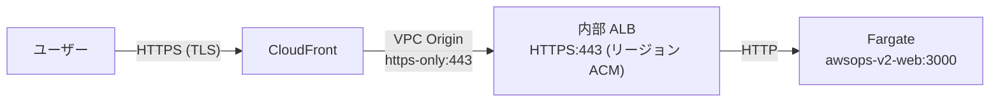
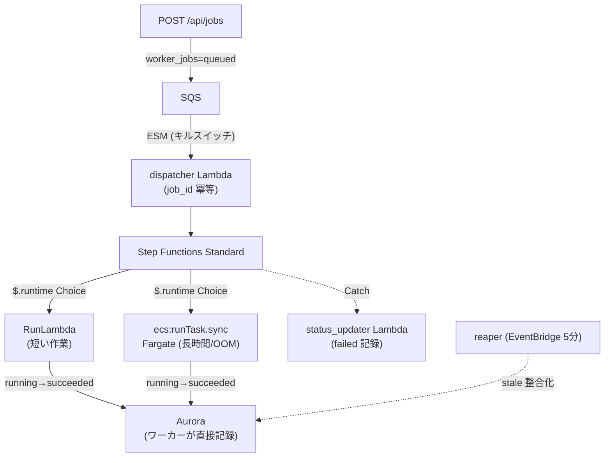
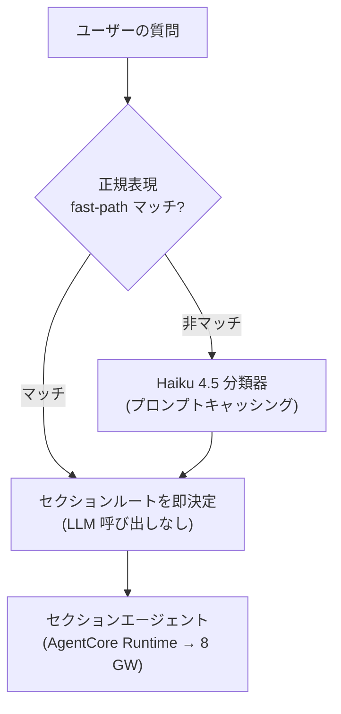
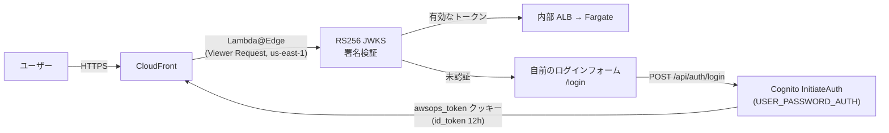

# アーキテクチャ詳細 FAQ

AWSops の内部動作原理に関する詳細な技術 FAQ です。SRE・アーキテクトの観点から、エッジ経路、非同期ワーカーバックボーン、データ層、AI ルーティング、認証、運用上の学びを扱います。

:::info 読み取り専用の運用ダッシュボード
AWSops は**読み取り専用（read-only）の運用ダッシュボード + AI 診断**ツールです。**AWS リソースの変更と自律実行（autonomy）は恒久的に凍結**されています。外部オブザーバビリティデータの読み取りと、ガバナンスされた外部記録/チケット/メッセージの書き込み（データレコード）は許可されますが、AWS リソースそのものを変更することはありません。
:::

## エッジ（CloudFront → VPC Origin → 内部 ALB → Fargate）はどのように構成されますか？

AWSops には**公開 ALB がありません。** すべてのトラフィックは CloudFront から出発し、VPC Origin を通じてプライベートサブネットの内部 ALB にのみ入ります。

### 経路の詳細

| 区間 | プロトコル | 備考 |
|------|----------|------|
| ユーザー → CloudFront | HTTPS (TLS) | パブリックエッジ |
| CloudFront → VPC Origin | `https-only` 443 | VPC 内部へ進入、公開露出なし |
| VPC Origin → 内部 ALB | HTTPS 443 | リージョン ACM 証明書 |
| 内部 ALB → Fargate | HTTP | プライベートネットワーク内部 |

### 504 → 200 の学び（TLS end-to-end + SG）

初期構成では、エッジが **504** を返す 2 つの落とし穴がありました：

1. **TLS end-to-end の不一致** — CloudFront → ALB 区間は TLS がエンドツーエンドで接続されている必要があります。VPC Origin は `https-only` のままにし、**origin domain を公開 FQDN で**指定して、SNI が ALB のリージョン ACM 証明書とマッチするようにしなければなりません。
2. **セキュリティグループ（SG）のソース** — ALB SG は VPC CIDR ではなく **CloudFront マネージド SG `CloudFront-VPCOrigins-Service-SG`** からの 443 を許可する必要があります。VPC-CIDR-only にすると 504 が発生します。

:::tip X-Custom-Secret / managed-prefix-list はありません
現在のエッジは、ヘッダーシークレット値（`X-Custom-Secret`）や managed-prefix-list ベースの遮断を使用していません。アクセス制御は **VPC Origin + CloudFront マネージド SG** の組み合わせのみで行われます。
:::

### VPC Origin のプロトコルは in-place で変更不可

VPC Origin のプロトコル（`https-only` など）は **in-place では変更されません。** Terraform で変更するには、`create_before_destroy` ライフサイクル + `-replace` で新しいオリジンを作成して置き換える必要があります。そのまま in-place 変更を試みると、適用が hang します。

## 非同期ワーカーバックボーンはどのように動作しますか？（OOM 安全）

Web は **thin-BFF** です。重い、長時間の、あるいは OOM リスクのある作業はインラインで実行せず、**ワーカーキューへ enqueue** します。診断レポート生成、DOCX/PDF エクスポート、インベントリ sync のような作業がこれに該当します。

### ステップごとの動作

1. **enqueue** — web の `POST /api/jobs` が `worker_jobs` に `queued` として行を書き、SQS にメッセージを入れます。
2. **ESM（キルスイッチ）** — Event Source Mapping が SQS → dispatcher Lambda を接続します。ESM は無効化することで即座に処理を停止できる**キルスイッチ**の役割を果たします。
3. **dispatcher（冪等）** — `job_id` を基準に冪等です。Step Functions の実行名を `job_id` に設定するため、重複 enqueue は同じ実行に収束します。
4. **Step Functions `$.runtime` Choice** — 入力の `runtime` 値で分岐します：
   - `lambda` → **RunLambda**（短い作業）
   - `fargate` → **`ecs:runTask.sync`**（長時間作業または OOM リスクのある作業）
5. **ワーカーが状態を直接記録** — ワーカーが `running` を claim し、完了時に `succeeded` を **Aurora に直接**書き込みます。
6. **失敗処理** — Catch 時に **status_updater Lambda** が `failed` として記録します。（Step Functions は VPC 内部の Aurora に直接書き込めないため、別途 Lambda が必要です。）
7. **reaper** — EventBridge 5 分周期で stale（例：ワーカーが死んで `running` のまま止まった）ジョブを整合化する遅い backstop です。

### なぜ OOM 安全なのか？

重くメモリ使用量の大きい作業（大容量レポートのレンダリング、chromium PDF 生成など）を web プロセスではなく**隔離された Fargate タスク**で実行します。ワーカーが OOM で死んでも web サービスは影響を受けず、`ecs:runTask.sync` の TimeoutSeconds が runaway タスクを終了させて Catch が `failed` を記録します。

:::tip Fargate ワーカーは CMD を使用する必要があります（ENTRYPOINT 禁止）
Fargate ワーカーの Dockerfile は必ず **`CMD`** を使用しなければなりません。Step Functions の `containerOverrides.command` は CMD を**置き換え**ますが、exec-form の **ENTRYPOINT には append** されます。ENTRYPOINT を使うと argv が重複して argparse が失敗します。
:::

## データ層とは何ですか？（Aurora Serverless v2）

アプリの状態は EC2 のローカル `data/*.json` ファイルではなく、**Aurora Serverless v2（PostgreSQL 17）** に保存されます。Web は **node-pg**（`web/lib/db.ts` の共有プール `getPool`）でアクセスします。

| 項目 | 値 |
|------|-----|
| エンジン | Aurora Serverless v2、**PostgreSQL 17**（正確なマイナーバージョンをピン留め、例：`17.9`） |
| キャパシティ | **0.5 – 4 ACU**（`aurora_min_acu` / `aurora_max_acu`） |
| 暗号化 | KMS CMK |
| シークレット | RDS マネージド master secret |
| マイグレーション | `schema_migrations` テーブル + ULID ベースのマイグレーションファイル |

### Aurora に保存されるもの

- `worker_jobs` — 非同期ジョブの状態
- チャットスレッド — 会話の永続化（Claude アプリスタイルのサイドバー）
- AI 診断レポート — タイトル・タグ・ソフト削除（`deleted_at`）を含む
- データソーススキーマキャッシュ — コネクタスキーマ

:::info node-pg 一本のパターン、v1 の Steampipe pg Pool ではありません
AWSops は（v1 の）Steampipe pg Pool（ポート 9193、node-cache、cache-warmer、batchQuery など）を使用しません。ライブ AWS 照会は下記の AgentCore MCP ツールが、永続状態は Aurora が担当します。
:::

## ライブ AWS 照会はどのように行いますか？（AgentCore vs Steampipe）

AWSops のライブ AWS データは **AgentCore MCP Lambda ツール**が担当します。約 **160 個の読み取り専用ツール**が **9 つのセクションゲートウェイ**（network / container / data / security / cost / monitoring / iac / ops / external-obs）にわたってデプロイされます。

| 区分 | 役割 |
|------|------|
| **AgentCore MCP ツール（ライブ）** | リアルタイム AWS API 照会 — チャット・診断・ページのライブデータソース |
| **Steampipe（flag-gated）** | `steampipe_enabled`（デフォルト OFF）のインベントリ sync **専用**。ライブクエリエンジンではなく、ローカル 9193 サービスでもありません |

:::info ゲートウェイ数は 9 つです（ADR-004 改訂、2026-06-24）
外部オブザーバビリティコネクタ（Prometheus·ClickHouse）は **external-obs ゲートウェイ**に昇格し、9 番目としてプロビジョニング・ルーティングされます（ADR-004 改訂 — 9 プロビジョニング / 9 ルーティング）。その他の外部連携は独立した **Integrations 軸**（ADR-007/017）です。
:::

## AI ルーティングはどのように動作しますか？（ADR-038 ハイブリッド）

AI ルーティングは **ADR-038 ハイブリッド**方式で LIVE です。v1 の Sonnet 単一分類器による 11/18-route レジストリを置き換えます。

### 3 つの中核メカニズム

1. **正規表現 fast-path** — 明確なキーワードパターンは LLM 呼び出しなしで即座にルーティング → レイテンシ削減。
2. **Haiku 4.5 分類器** — fast-path で捕捉できなかった質問のみ、軽量な Haiku モデルが分類。
3. **プロンプトキャッシング** — 分類プロンプトをキャッシュ（約 59% ヒット）してトークン・レイテンシを削減。

### AI アシスタントの動作

- **ストリーミング + ドメインルーティング + マークダウンレンダリング**
- 会話は **Aurora に永続化** — Claude アプリスタイルのサイドバー、`/assistant` フルページとリサイズ可能なドロワーが**一つの履歴**を共有。

:::tip 分類器タイムアウトの学び
グローバル cross-region 推論プロファイルでは、分類器のタイムアウトを **1 秒にしてはいけません** — cold/遅延時に失敗します。十分な余裕（例：3.5 秒）を持たせる必要があります。
:::

## 認証フローはどうなっていますか？（RS256 + アプリ内ログイン）

認証は **Cognito + Lambda@Edge** で、エッジで **RS256 JWKS 署名を完全検証**します（v1 の有効期限のみの検証とは異なります）。パスはルート（`/`）で、`/awsops` basePath は**ありません。**

### ステップごとの詳細

**1. Lambda@Edge（us-east-1、python3.12、Viewer Request）**
- すべてのリクエストで `awsops_token` クッキーの JWT を **RS256 JWKS で署名検証** + `iss`/`aud`/`token_use` を確認。
- 未認証であれば自前の **`/login`** フォームへ redirect。

**2. アプリ内ログイン（ADR-042）**
- ログイン = **自前の `/login` フォーム**。BFF の `POST /api/auth/login` が**無署名パブリック `InitiateAuth(USER_PASSWORD_AUTH)`** を呼び出し（SDK 不使用）→ `awsops_token` クッキーを発行（id_token 12 時間）。
- **Hosted UI PKCE フロー（`/_callback`）はダークフォールバック**としてのみ保持。
- signout はクッキー削除 → `/login`（Hosted UI `/logout` の往復なし）。

**3. 管理者（admin）ゲート（サーバーサイド、fail-closed）**
- admin = **Cognito `admins` グループ**または **SSM admin-email allowlist**（`web/lib/admin.ts`）。どちらか一方に該当すれば admin。
- 判定はサーバーサイドで、**fail-closed**（不確実なら拒否）で実行。

## 運用上知っておくべき Terraform/インフラの学びは？

SRE の観点から繰り返し足を引っ張られた 2 点です。

### Aurora メジャーアップグレード（15 → 17.x）

順序が重要です：

1. `variables.tf` に**正確なマイナーバージョン**（例：`17.9`）+ `allow_major_version_upgrade = true` + `apply_immediately = true` を設定し、**先に apply**（アップグレードを実行）。
2. **その後**、cluster と instance の**両方**に `lifecycle { ignore_changes = [engine_version] }` を追加 → 以後のマイナー自動アップグレード（17.x → 17.y）が Terraform のドリフトとして浮上しないよう吸収。

:::tip "17" だけをピン留めしてはいけません
マイナーなしでメジャーのみ（`"17"`）をピン留めすると `aws_rds_cluster` で誤動作します。常に検証済みの正確なマイナーバージョンを使用してください。
:::

### セキュリティグループ（SG）の description は不変

SG の `description` は**不変**として扱う必要があります。変更すると SG が replace されますが、ALB がその SG に依存しているため適用が hang します。ingress ルールは **in-place で**変更しつつ、description はそのまま維持してください。

:::info その他の繰り返しの学び
- **ECS `secrets` valueFrom**（Aurora secret）には**実行ロール（execution role）**の権限が必要です（task role ではありません）。さもなければ `ResourceInitializationError`。
- **`HOSTNAME=0.0.0.0` をランタイム env** として明示する必要があります（task def の `environment`）。イメージ ENV だけでは ECS が HOSTNAME を ENI IP で上書きし、healthCheck が UNHEALTHY になります。
- **arm64 必須** — web/agent/worker イメージすべて `buildx --platform linux/arm64`。
- コンテナ + ターゲットグループの health パスはアプリ（`/api/health`）と一致する必要があります。不一致の場合 circuit breaker がループします。
:::
