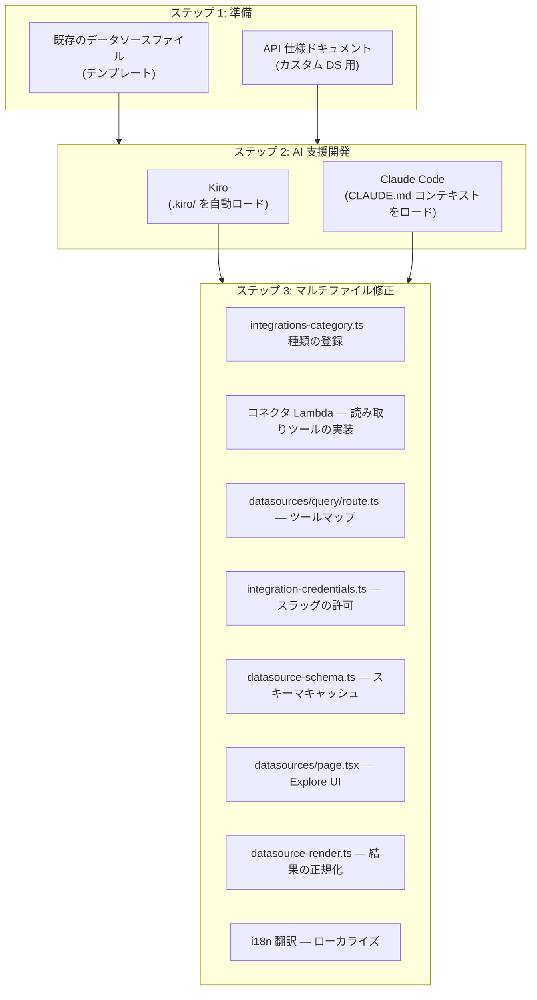

# データソース開発 FAQ

外部オブザーバビリティデータソース(コネクタ)の拡張に関する質問と回答です。

## データソースプラットフォームはどんな構造ですか?

AWSops のデータソースは**読み取り専用コネクタプラットフォーム**です。AWS リソースの照会(AgentCore MCP ツール)とは別の軸で、外部オブザーバビリティバックエンドを接続します。

構成要素:

- **コネクタ Lambda** — 各データソース種類(kind)ごとの読み取り専用ツールを提供する MCP スタイルの Lambda。SSRF・認証・読み取り専用の強制はコネクタが所有します。
- **スキーマキャッシュ(Aurora)** — イントロスペクションしたスキーマを Aurora テーブル(`datasource_schemas`)に永続保存。UI とチャットエージェントがこのキャッシュを読み、コンパクトなスキーマブロックを注入します(ライブイントロスペクションではありません)。
- **Explore ページ** — `web/app/datasources/page.tsx`。クエリ実行 + 自然言語→クエリ(NL→query)チャット注入を 1 画面で提供します。
- **クレデンシャル** — Secrets Manager の単一シークレット(スラッグキーのマップ)に保存。コネクタ Lambda が `map[INTEGRATION_SLUG]` を読みます。

現在クエリ可能な種類:

| 種類 | クエリ言語 | 用途 |
|------|-----------|------|
| Prometheus | PromQL | メトリクスモニタリング |
| Mimir | PromQL | 長期メトリクス |
| Loki | LogQL | ログ集約 |
| Tempo | TraceQL | 分散トレーシング |
| ClickHouse | SQL | 分析 DB |

:::info 読み取り専用姿勢(ADR-041)
データソースは**データ read**(+ ガバナンスされた外部 record/ticket/message write)のみを扱います。AWS リソースの変更・自律動作は恒久凍結(do-not-enable)です。`web/app/api/datasources/query/route.ts` のツールマップには**読み取りツールのみ**が存在し(mutate ツールには到達不可)、テストがこの不変条件を検証します。
:::

## 新しいデータソースタイプ(例: Elasticsearch、InfluxDB)を追加するには?

新しい種類は、複数ファイルにまたがる**一貫したマルチファイルパターン**で追加します。AI コーディングツール(Kiro または Claude Code)に既存の種類をテンプレートとして読み込ませ、新しい種類を生成させるワークフローを推奨します。



### 修正対象ファイル

| # | ファイル | 追加するもの | テンプレート参照 |
|---|------|-----------|-------------|
| 1 | `web/lib/integrations-category.ts` | `DATASOURCE_KINDS` 配列に種類の文字列を追加 | 既存の `'prometheus' \| 'mimir' \| ...` |
| 2 | コネクタ Lambda(`scripts/v2/workers/*` MCP ソース) | 読み取り専用ツール(`<kind>_query` など)の実装 + ヘルスチェック。**SSRF ガード必須**(下記参照) | 既存の prometheus コネクタを模倣 |
| 3 | `web/app/api/datasources/query/route.ts` | `TOOL` マップに `{ instant, range?, arg }` エントリを追加(読み取りツールのみ) | prometheus/clickhouse のエントリをコピー |
| 4 | `web/lib/integration-credentials.ts` | `KNOWN_CONNECTOR_SLUGS` にスラッグを追加(任意キー注入の遮断) | 既存のスラッグ配列 |
| 5 | `web/lib/datasource-schema.ts` | スキーマイントロスペクション → Aurora `datasource_schemas` への upsert(`upsertSchema`) | `getSchema`/`upsertSchema` パターン |
| 6 | `web/app/datasources/page.tsx` | タイプのアイコン/ラベル/プレースホルダー + 例示クエリのエントリを追加 | 既存の Record エントリをコピー |
| 7 | `web/lib/datasource-render.ts` | 応答を `QueryResult`(`columns`、`rows`、`metadata`)に正規化 | `normalizeResult` パターン |
| 8 | `web/lib/i18n/translations/{en,ko}.json` | 新しい UI 文字列の i18n キーを追加 | 既存の `datasources.*` キー |

:::info 中核パターン
すべてのクエリ関数/コネクタは、結果を `QueryResult` インターフェース(`columns`、`rows`、`metadata`)に正規化して返す必要があります。これが Explore UI と AI 分析が共有する標準形式です。
:::

## コネクタ入力はどのように保護すべきですか? (再利用の要点)

AWSops は in-VPC(mgmt-vpc、`169.254.169.254` メタデータ・内部 ALB に隣接)で動作するため、管理者が登録した egress エンドポイントが最大の SSRF リスクです。**新しいコネクタ入力には必ず SSRF ガード + サイズバウンド**を適用してください。

### サイズバウンド — パース前の `readJsonBounded`

リクエストボディは**パースする前に** `web/lib/http-body.ts` の `readJsonBounded` で読み取ってサイズを制限します。App Router にはデフォルトのボディ上限がないため、そのまま `request.json()` を呼び出すと DoS にさらされます。

```ts
import { readJsonBounded, BodyTooLargeError } from '@/lib/http-body';

let body: { slug?: unknown; query?: unknown };
try { body = (await readJsonBounded(request)) as typeof body; }
catch (e) { if (e instanceof BodyTooLargeError) return json({ error: 'body too large' }, 413); throw e; }
```

キャッシュされるスキーマもバウンドされます(`datasource-schema.ts` の `MAX_SCHEMA_BYTES`)。

### SSRF ガード — `web/lib/ssrf-guard.ts`

エンドポイントの登録・リクエスト時に `assertDatasourceEndpointAllowed()`(または外部 egress 用の `assertEgressEndpointAllowed()`)で検証します。遮断ルール:

- **メタデータ/IMDS は無条件遮断** — `169.254.169.254`(IPv4) + `fd00:ec2::254`(IPv6 IMDS)。
- **ループバック/リンクローカル/マルチキャスト/アンスペシファイドの遮断** — `::1`、`fe80::/10` など。
- **6to4・IPv4-mapped IPv6 迂回の遮断** — `2002:a9fe:a9fe::` のようなエンコードされたメタデータターゲットを IPv4 にデコードして検査。
- **https 強制 / スキーム制限** — egress ティアは https only。
- **private opt-in** — RFC1918/ULA(社内 in-cluster データソース)はデータソースティアでは許可されますが、外部 egress ティアはアカウント別の `allowPrivateDatasource` opt-in がないとプライベートアドレスを許可しません。
- **redirect: 'manual'** — リダイレクトを追跡して迂回できないよう手動処理。DNS 解決をリクエスト前に実行。

:::caution コネクタがセキュリティを所有します
SSRF・認証・読み取り専用強制の source of truth は**コネクタ Lambda** です。BFF ルート(`query/route.ts`)はツールの解決・転送・正規化のみを行います。新しいコネクタで SSRF ガードを欠くと、ルートレベルの検証だけでは防げません。
:::

## スキーマキャッシュと NL→クエリはどのように動作しますか?

Explore ページ(`/datasources`)は 2 つの経路を使います:

- **クエリ実行** — `POST /api/datasources/query` → コネクタ Lambda の読み取りツールを呼び出し → `QueryResult` に正規化。
- **自然言語→クエリ** — `POST /api/datasources/generate`。モニタリングエージェントに**クエリ専用プロンプト** + コネクタのキャッシュ済みスキーマブロックを注入し、正しい言語(PromQL/LogQL/SQL など)でクエリを生成します。エージェントはライブイントロスペクションではなく Aurora スキーマキャッシュを読みます(`getSchema`/`listConfiguredSchemas`)。

新しい種類を追加する際は、`datasource-schema.ts` にイントロスペクション→`upsertSchema` を実装しないと NL→クエリが正確になりません。

## AI コーディングツールで追加する

### Kiro で追加

[Kiro](https://kiro.dev) は `.kiro/` ディレクトリを自動的に読み、プロジェクトコンテキストを確保します:

- `.kiro/AGENT.md` — アーキテクチャ・ルール
- `.kiro/steering/project-structure.md` — ディレクトリ構造、データソースファイルの位置
- `.kiro/steering/coding-standards.md` — コーディング規約

**よく知られたデータソース**(Elasticsearch、InfluxDB、Graphite など)は、シンプルなプロンプトで十分です:

```
Elasticsearch を新しいデータソース種類として追加して。
既存の種類パターンに従って、コネクタ Lambda + query/route.ts の TOOL マップ +
スキーマキャッシュ + Explore UI + i18n をすべて修正して。
SSRF ガード(assertDatasourceEndpointAllowed)と readJsonBounded を必ず適用して。
```

### Claude Code で追加

Claude Code はディレクトリごとの `CLAUDE.md` でプロジェクトを理解します:

- ルート `CLAUDE.md` — 全体アーキテクチャ・必須ルール(読み取り専用姿勢、セキュリティの教訓を含む)
- `web/**` — ライブラリモジュール(`datasources.ts`、`datasource-schema.ts`、`ssrf-guard.ts` など)と API ルート/ページの詳細

**例示プロンプト:**

```
InfluxDB(InfluxQL)を新しいデータソース種類として追加して。
既存の種類パターンに従って、関連するすべてのファイルを修正して。
デフォルトポート 8086、ヘルスエンドポイント /ping。
コネクタ入力は readJsonBounded でバウンドし、SSRF ガードを適用して(読み取り専用ツールのみ)。
```

## 社内/カスタムデータソースはどのように追加しますか?

AI ツールが API を知らない**社内システム**や**ニッチなツール**は、プロンプトと一緒に **API 仕様ドキュメント**を提供する必要があります。

### 提供する情報

| 項目 | 説明 | 例 |
|------|------|------|
| **ヘルスエンドポイント** | 接続テストのパス | `GET /api/health` |
| **クエリ API** | データ照会の形式 | `POST /api/v1/query` |
| **リクエストボディ** | クエリパラメータの構造 | `{"query": "...", "from": "...", "to": "..."}` |
| **応答形式** | 返却データの構造 | `{"data": [{"timestamp": ..., "value": ...}]}` |
| **認証方式** | サポートする認証タイプ | Bearer token、API key、Basic auth |

### 例示プロンプト (API 仕様を含む)

```
"CustomMetrics" を新しいデータソース種類として追加して。
既存の種類パターンに従って、関連するすべてのファイルを修正して。

API ドキュメント:
- ヘルスチェック: GET /api/health → 200 OK
- クエリ: POST /api/v1/query
  Body: {"query": "metric_name", "from": "2024-01-01T00:00:00Z", "to": "2024-01-02T00:00:00Z", "step": "5m"}
  Response: {"status": "ok", "data": [{"timestamp": 1704067200, "value": 42.5, "labels": {"host": "web-1"}}]}
- 認証: Authorization ヘッダーに Bearer token
- デフォルトポート: 9090
- 読み取り専用(書き込み/変更ツールの公開禁止)、SSRF ガード + readJsonBounded を適用
```

:::tip OpenAPI 仕様ファイルの活用
OpenAPI(Swagger) YAML/JSON ファイルがあれば、より正確なコードを生成できます。Kiro は仕様ファイルをプロジェクトに置くと自動参照し、Claude Code はプロンプトにファイルパスを含めれば使えます。
:::

:::caution コネクタはキュレーション専用 (ADR-040/041)
外部コネクタは**ガバナンスされたキュレーションコネクタ**のみ許可されます — 任意形態の BYO-MCP は対象外です。新しい種類は SSRF ガード・Secrets Manager クレデンシャル・読み取り専用ツール・DLP/リダクション・`KNOWN_CONNECTOR_SLUGS` 許可リストの範囲内でのみ追加してください。詳細なガバナンスは `docs/decisions/ADR-040-governed-external-knowledge-comms-writes.md`、`ADR-041-read-only-means-resource-not-data.md` を参照してください。
:::

## 追加後の検証チェックリスト

新しいデータソース種類を追加した後、次を確認してください:

- [ ] TypeScript/プロダクションビルドの成功 (`npm run build`) — `*.test.ts` の型ノイズは非ブロッキング
- [ ] Explore ページのタイプドロップダウンに新しい種類が表示される
- [ ] 接続テストの成功(ヘルスエンドポイントの応答)
- [ ] クエリ実行が `QueryResult` 形式に正規化されて返却される
- [ ] NL→クエリが正しい言語で有効なクエリを生成(スキーマキャッシュ注入の確認)
- [ ] コネクタ入力に `readJsonBounded` + SSRF ガードを適用(メタデータ/IMDS/ループバック遮断のテスト)
- [ ] `KNOWN_CONNECTOR_SLUGS` にスラッグを登録(任意キーの拒否)
- [ ] 韓国語/英語の i18n 文字列が正常に表示される
