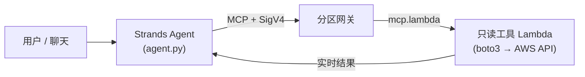
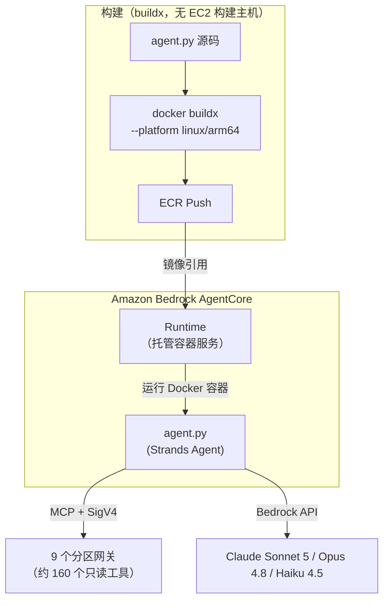
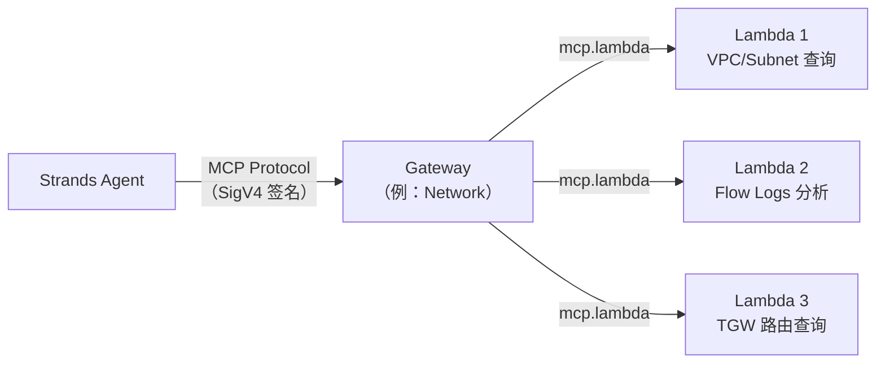
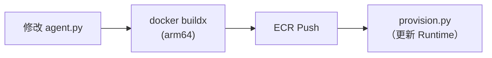
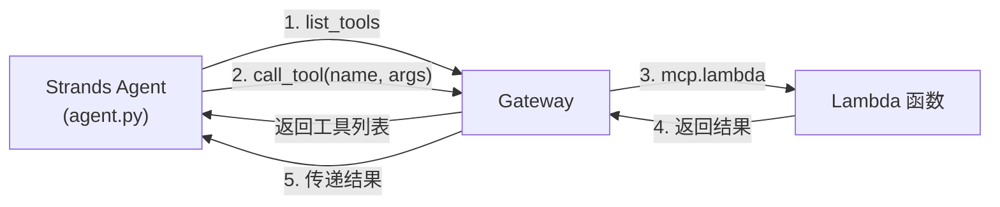
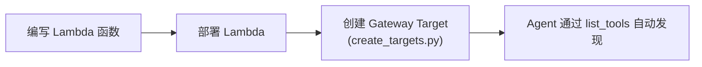
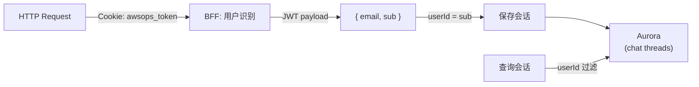

# AgentCore & 内存技术 FAQ

以下是关于 AgentCore Runtime、Gateway、实时 AWS 查询路径、Memory Store 等 AI 引擎内部工作原理的深入问答。

## 为什么 AgentCore 是实时 AWS 查询的默认（primary）路径？

AWSops 的**实时 AWS 数据通过 AgentCore MCP Lambda 工具查询**。这取代了过去旧版应用使用内嵌 Steampipe 直接查询的方式。



### 核心要点

| 项目 | 内容 |
|------|------|
| **实时查询** | AgentCore MCP Lambda 工具（约 160 个，只读）用 boto3 直接调用 AWS API |
| **Steampipe 的角色** | **不是**实时查询引擎。仅是通过 `steampipe_enabled` 标志开启的**清单同步**（默认 OFF）— 没有本地 9193 服务/pg Pool |
| **门禁** | AgentCore 整体由 `agentcore_enabled` Terraform 标志控制（默认 OFF → `plan` = No changes，$0） |
| **只读** | 所有工具都是 read-only（ADR-041 / 2026-06-11 撤销：AWS 资源变更+自主执行永久冻结） |

:::info Steampipe 不再是实时引擎
实时 AWS 状态始终由 AgentCore 工具回答。Steampipe 若被开启，只是一条在 Fargate 中预热后将清单同步到 Aurora 的辅助路径，默认为禁用。
:::

## AgentCore Runtime 是什么？它与 Strands Agent 的关系是？

AgentCore Runtime 与 Strands Agent 运行在不同的层。



### AgentCore Runtime

- 由 AWS 管理的**无服务器容器运行环境**
- 指定 Docker 镜像（ECR）后自动运行/扩缩容器
- 处理 Cold Start 管理、网络设置、IAM Role 等
- 通过 `InvokeAgentRuntime` 调用

### Strands Agent Framework

- **基于 Python 的 AI 代理框架**（`agent/agent.py`）
- 向 LLM（Bedrock）提供工具，并将工具调用结果回传给 LLM 的循环
- 通过 MCP 协议连接网关来使用工具

### 关系梳理

| 项目 | AgentCore Runtime | Strands Agent |
|------|------------------|---------------|
| 角色 | 容器运行环境 | AI 代理逻辑 |
| 层级 | 基础设施 | 应用程序 |
| 管理主体 | AWS | 开发者 |
| 代码位置 | AWS 服务 | `agent/agent.py` |
| 配置 | Terraform / 幂等 provisioner | Python 代码 |

## Gateway 与 Lambda 是什么关系？网关有几个？

Gateway 是 **MCP 协议路由器**，Lambda 是**实际执行 AWS API 的只读后端**。



### 分区网关有 9 个（ADR-004 修订）

`network · container · data · security · cost · monitoring · iac · ops · external-obs` — 共 **9 个**（9 配置 / 9 路由，external-obs 于 2026-06-24 提升）。

| 项目 | 内容 |
|------|------|
| **网关数量** | 依 ADR-004 修订（2026-06-24）为 **9 个** |
| **工具数量** | 约 **160 个**，全部只读 — 随工具集扩展而变动（不是固定数字） |
| **外部可观测性** | Prometheus·ClickHouse 连接器经由 **external-obs 网关**（第九个）参与路由（ADR-004 修订）— 其余外部集成属于独立的 **Integrations 轴**（ADR-007/017） |
| **协议** | MCP（Model Context Protocol）标准 |

- Agent 通过 `list_tools` 查询可用工具列表
- Agent 选定工具后，Gateway 调用相应的 Lambda
- 创建 Gateway Target 时指定 `mcp.lambda` 协议和 `credentialProviderConfigurations`

### 为什么使用 Lambda？

| 原因 | 说明 |
|------|------|
| **隔离** | 每个工具独立运行，一个失败不影响其他工具 |
| **权限分离** | 可为每个 Lambda 授予最小权限 IAM Role |
| **扩缩容** | 并发调用时自动扩缩 |
| **成本** | 仅在调用时计费，无闲置成本 |

:::caution 创建 Gateway Target 时的注意事项
CLI 的 `--inline-payload` 选项存在 JSON 解析问题。必须用 **Python/boto3** 创建。此外，刚创建的网关在进入 `READY` 之前，首次创建 Target 可能抛出 `ValidationException`，由于 provisioner 是幂等的，重新执行即可解决。
:::

## 明明是单账户，为什么会出现"cross-account 拦截"错误？

AWSops 线上环境是**单账户**（`123456789012`）。然而在聊天中将**宿主账户自身**选为目标账户时，过去的工具会尝试 self-assume 一个在宿主上不存在的跨账户角色，导致 `AccessDenied`，而代理将其**误诊**为"cross-account 拦截"。

### 问题出在哪里

- `agent.py` 强制设置 `target_account_id = <宿主账户>`
- 工具尝试 self-assume `arn:...:role/AWSopsReadOnlyRole`
- 该角色**仅存在于已接入的*目标*账户**，宿主上没有 → `AccessDenied`
- 代理误解了原因 → 输出"cross-account 拦截"消息

### 修复（defense-in-depth）

| 位置 | 行为 |
|------|------|
| `cross_account.get_role_arn()` | 目标 == 宿主时**返回 `None`** → 不进行 AssumeRole，直接使用 Lambda 执行角色 |
| `agent.py effective_account_id()` | 将宿主账户像 `__all__` 一样置为 **blank** → 同账户访问不附加 prefix |
| 宿主判定 | `AWSOPS_HOST_ACCOUNT_ID` env → 若无则回退到 STS `GetCallerIdentity`（暖容器缓存） |

真正 assume *其他*账户的正常路径保持不变。

:::tip 在单账户中选择"我的账户"时
现在选择宿主账户会直接使用执行角色而不进行 self-assume，可正常工作。只有选择其他（已接入的）账户时才走 STS AssumeRole 路径。
:::

## AgentCore 配置值保存在哪里？

**SSM Parameter Store 是 source of truth**。幂等 provisioner（`scripts/v2/agentcore/provision.py`）将创建的资源标识符记录到 SSM，Web thin-BFF 在运行时读取。

### SSM 路径（`/ops/awsops-v2/agentcore/...`）

| 参数 | 值 |
|----------|-----|
| `/ops/awsops-v2/agentcore/runtime_arn` | AgentCore Runtime ARN |
| `/ops/awsops-v2/agentcore/interpreter_id` | Code Interpreter ID |
| `/ops/awsops-v2/agentcore/memory_id` | Memory Store ID |

### 为什么用 SSM？（规避 valueFrom 竞态）

- provisioner 在 **apply 之后**创建资源 → 将标识符记录到 SSM
- Web BFF 在运行时从 SSM 读取（带缓存）
- 不使用 ECS task def 的 `secrets` `valueFrom` → **规避** provision 时点与 task 启动时点之间的**竞态条件**

:::info 注意 SSM 保留前缀
以 `aws...` 开头的 SSM 路径作为保留字会被拒绝。因此使用 `/ops/${project}/...` 的形式。
:::

## 为什么 Docker arm64 构建是必需的？（没有 EC2 构建主机）

AgentCore Runtime 运行在 **AWS Graviton（ARM64）**处理器上。

```bash
# 正确的构建命令 — 用 buildx 交叉构建 arm64
docker buildx build --platform linux/arm64 -t awsops-agent .

# ECR 推送
docker tag awsops-agent:latest $ECR_URI:latest
docker push $ECR_URI:latest
```

### 如果用 x86（amd64）构建？

容器无法启动，或出现 `exec format error`。Runtime 状态会转为 `FAILED`。

### 没有专用的 EC2 构建实例

与旧版应用不同，AWSops **没有独立的 t4g 构建主机**。web/agent/worker 镜像都用 `docker buildx --platform linux/arm64` 构建。Apple Silicon（M1/M2/M3）是原生 ARM64，而在 Intel Mac 等 amd64 环境中，只要显式指定 `--platform linux/arm64`，同样可以构建出 arm64 镜像。

## 修改 agent.py 后如何重新部署？

`make agentcore` 会构建/推送 arm64 镜像并运行幂等 provisioner。



### 步骤

```bash
make agentcore          # 构建/推送 arm64 agent 镜像 + 幂等 provisioner
make agentcore --smoke  # 额外进行调用验证
```

provisioner 是幂等的，可以安全地重复执行（例如首次创建 Target 因网关未就绪而失败时）。

:::tip 网关路由通过环境变量注入
`agent.py` 不在代码中硬编码网关 URL，而是通过 `GATEWAYS_JSON` 环境变量注入。因此网关路由的变更并不立即要求重新构建 Docker。
:::

## 什么是 MCP 协议？工具发现是如何工作的？

### MCP（Model Context Protocol）

MCP 是让 AI 代理以**标准化方式调用**外部工具的协议。在 AWSops 中，Strands Agent 通过 MCP 访问网关的只读工具。



### SigV4 签名通信

连接 Gateway 需要 AWS SigV4 签名（`agent/streamable_http_sigv4.py`）。使用以代理凭证签名的 MCP StreamableHTTP 传输。

### 工具发现（Tool Discovery）

Agent 连接 Gateway 后，通过**分页**获取完整工具列表，并将其提供给 LLM。LLM（Bedrock）根据用户问题**自行决定调用哪个工具**，因此开发者无需编写工具选择逻辑。

## 如何向 Gateway 添加新工具（Lambda）？

### 整体流程



### Step 1: 编写 Lambda 函数

在 `agent/lambda/` 目录下创建遵循 MCP handler 模式的 Python 文件：

```python
# agent/lambda/my_new_mcp.py
import json
import boto3

def lambda_handler(event, context):
    params = event if isinstance(event, dict) else json.loads(event)
    t = params.get("tool_name", "")
    args = params.get("arguments", params)

    if t == "my_new_tool":
        client = boto3.client('ec2')
        result = client.describe_instances(**args)  # 只读
        return {"statusCode": 200, "body": json.dumps(result, default=str)}

    return {"statusCode": 400, "body": "Unknown tool"}
```

### Step 2: 创建 Gateway Target

在 `agent/lambda/create_targets.py` 中添加工具 schema，并用 boto3 创建 Target：

```python
client.create_gateway_target(
    gatewayIdentifier=gw_id,
    targetConfiguration={
        'mcp': {'lambda': {
            'lambdaArn': arn,
            'toolSchema': {'inlinePayload': tools}  # {name, description, inputSchema}
        }}
    },
    credentialProviderConfigurations=[
        {'credentialProviderType': 'GATEWAY_IAM_ROLE'}  # 必需
    ]
)
```

### Step 3: 自动发现

新工具添加后，Agent 通过 `list_tools` 自动发现。仅在修改了 `agent.py` 本身时才需要重新构建 Docker。

:::tip 跨账户支持
`create_targets.py` 为所有工具注入 `target_account_id` 参数。在 Lambda 中使用 `cross_account.py` 的 `get_client()`，即可通过 STS AssumeRole 访问*其他*账户的资源（目标为宿主时不进行 self-assume，直接使用执行角色）。
:::

## Lambda 工具函数是什么结构？

所有工具 Lambda 都遵循相同的 MCP handler 模式：

```python
# 通用模式（例：agent/lambda/aws_cost_mcp.py）
def lambda_handler(event, context):
    # 1. 事件解析 + 工具路由
    params = event if isinstance(event, dict) else json.loads(event)
    t = params.get("tool_name", "")
    args = params.get("arguments", params)

    # 2. 跨账户支持（目标==宿主时 role_arn=None）
    target_account_id = args.pop('target_account_id', None)
    role_arn = get_role_arn(target_account_id) if target_account_id else None

    # 3. 按工具分支
    if t == "get_cost_and_usage":
        ce = get_client('ce', 'us-east-1', role_arn)
        resp = ce.get_cost_and_usage(...)
        return ok(resp)
    else:
        return err("Unknown tool")
```

### 共享模块：`cross_account.py`

这是用于跨账户访问的 STS AssumeRole 辅助模块。它将凭证**缓存 50 分钟**以优化重复调用；当目标与宿主账户相同时返回 `None`，防止 self-assume。

### 规则

- 所有 Lambda 都是**只读**的（可达性路径创建等少数例外）
- VPC Lambda（Istio、Steampipe）使用 `pg8000` 代替 `psycopg2`
- 工具 schema 格式：`{name, description, inputSchema: {type, properties, required}}`

## 为什么 Code Interpreter 或 Memory 的名称中不能使用连字符？

因为 AgentCore API 的**命名规则限制** — 名称中**仅允许下划线**。

### 受影响的资源

| 资源 | 错误示例 | 正确示例 |
|--------|----------|----------|
| Code Interpreter | `awsops-code-interpreter` | `awsops_code_interpreter` |
| Memory Store | `awsops-memory` | `awsops_memory` |

### 症状

使用包含连字符的名称创建时会出现 `ValidationException`，或虽然创建成功但调用时失败，且错误消息可能不明确。

### Memory Store 的额外限制

- `eventExpiryDuration`：最长 **365 天**
- 过期的事件会自动删除

AWS 附加的 `-XXXXX` 后缀是自动生成的部分，命名限制仅适用于用户指定的名称部分（`awsops_code_interpreter`、`awsops_memory`）。

## AI 会话历史保存在哪里？如何按用户分离？

会话历史持久化在 **Aurora**（PostgreSQL 17）中。不是旧版的本地 JSON 文件方式。



### 行为

| 项目 | 内容 |
|------|------|
| **存储** | Aurora Serverless v2（PG 17），node-pg 连接池（`web/lib/db.ts`） |
| **用户识别** | Cognito JWT 的 `sub` |
| **UI** | Claude 应用风格侧边栏 — `/assistant` 完整页面与可调整大小的抽屉共享同一历史记录 |
| **渲染** | 流式输出 + Markdown |

### 认证流程

1. **Lambda@Edge** 在 CloudFront 对 JWT 进行 RS256 JWKS 签名校验
2. 通过校验的请求到达 ECS Fargate Web
3. BFF 使用 JWT payload 中的 `sub` 作为用户标识符
4. 未认证请求被 BFF 以 401 拒绝（fail-closed）— 标识符始终是经过校验的 Cognito `sub`

## 如何监控 AgentCore Runtime 状态？

Web BFF 查询 Runtime / Gateway / Code Interpreter 的状态。先从 SSM 读取标识符，再通过 AgentCore API 获取状态。

### Runtime 状态

| 状态 | 含义 | 措施 |
|------|------|------|
| **READY** | 正常运行 | - |
| **CREATING** | 初次创建中 | 等待数分钟 |
| **UPDATING** | 更新中（Docker 镜像变更等） | 等待数分钟 |
| **FAILED** | 错误 — 容器启动失败 | 检查 Docker 镜像（arm64）/IAM Role/网络 |

### 助手页面

AI 助手可在 `/assistant`（完整页面）和随处可打开的可调整大小抽屉中使用，两处共享同一份 Aurora 会话历史。

:::tip 路由是混合方式（ADR-038）
问题通过正则 fast-path + Haiku 4.5 分类器 + 提示词缓存路由到合适的分区代理（LIVE，缓存命中率约 59%）。不是旧版的固定多路由 Sonnet 注册表。
:::
