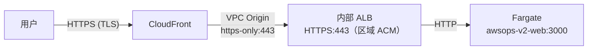
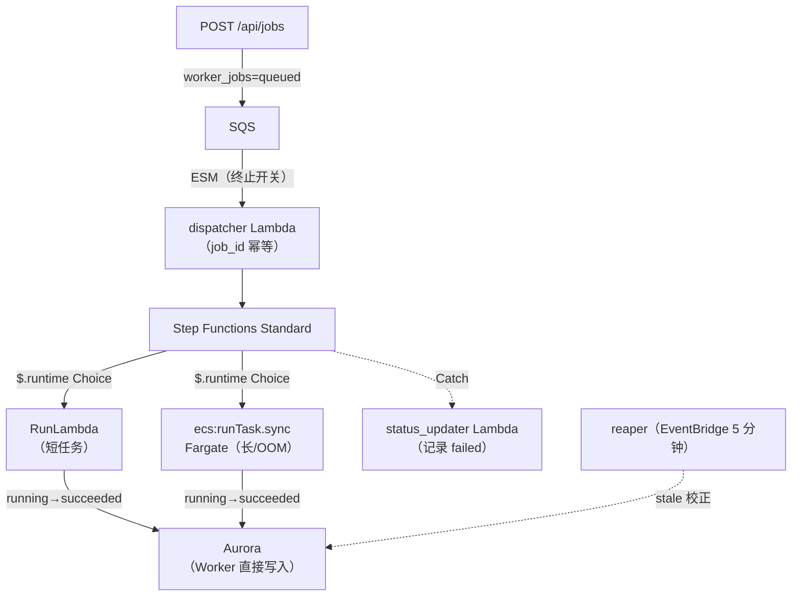
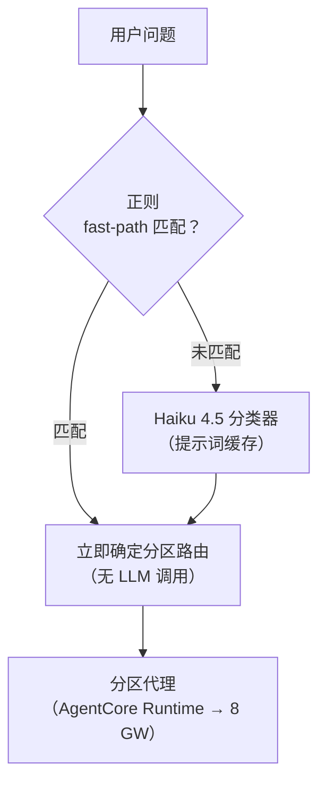
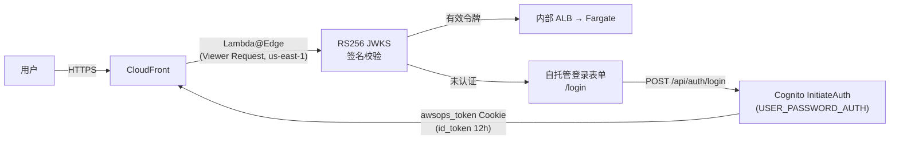

# 架构深入 FAQ

这是关于 AWSops 内部工作原理的深入技术 FAQ。从 SRE 和架构师的视角，涵盖边缘路径、异步 Worker 骨干、数据层、AI 路由、认证以及运维中的经验教训。

:::info 只读运维仪表盘
AWSops 是一个**只读（read-only）运维仪表盘 + AI 诊断**工具。**AWS 资源变更与自主执行（autonomy）已永久冻结。**允许读取外部可观测性数据，以及受治理约束的外部记录/工单/消息写入（数据记录），但不会更改 AWS 资源本身。
:::

## 边缘（CloudFront → VPC Origin → 内部 ALB → Fargate）是如何构成的？

AWSops **没有公开 ALB。**所有流量都从 CloudFront 出发，只能通过 VPC Origin 进入私有子网中的内部 ALB。

### 路径详情

| 区段 | 协议 | 备注 |
|------|----------|------|
| 用户 → CloudFront | HTTPS (TLS) | 公开边缘 |
| CloudFront → VPC Origin | `https-only` 443 | 进入 VPC 内部，无公开暴露 |
| VPC Origin → 内部 ALB | HTTPS 443 | 区域 ACM 证书 |
| 内部 ALB → Fargate | HTTP | 私有网络内部 |

### 504 → 200 的经验教训（TLS end-to-end + SG）

初始配置中有两个导致边缘返回 **504** 的陷阱：

1. **TLS end-to-end 不匹配** — CloudFront → ALB 区段必须全程使用 TLS 连接。VPC Origin 保持 `https-only`，并将 **origin domain 指定为公开 FQDN**，使 SNI 与 ALB 的区域 ACM 证书匹配。
2. **安全组（SG）来源** — ALB SG 必须允许来自 **CloudFront 托管 SG `CloudFront-VPCOrigins-Service-SG`** 的 443，而不是 VPC CIDR。若仅设置 VPC-CIDR-only，会产生 504。

:::tip 没有 X-Custom-Secret / managed-prefix-list
当前边缘不使用请求头密钥（`X-Custom-Secret`）或基于 managed-prefix-list 的拦截。访问控制仅通过 **VPC Origin + CloudFront 托管 SG** 的组合实现。
:::

### VPC Origin 协议无法 in-place 变更

VPC Origin 的协议（如 `https-only`）**无法 in-place 变更。**要在 Terraform 中修改，必须使用 `create_before_destroy` 生命周期 + `-replace` 创建新的 origin 并进行替换。若直接尝试 in-place 变更，apply 会挂起。

## 异步 Worker 骨干是如何工作的？（OOM 安全）

Web 是 **thin-BFF**。重型、长时间或有 OOM 风险的任务不会内联执行，而是**入队到 Worker 队列**。诊断报告生成、DOCX/PDF 导出、清单同步等任务都属于此类。

### 逐步动作

1. **入队（enqueue）** — web 的 `POST /api/jobs` 向 `worker_jobs` 写入 `queued` 状态的行，并向 SQS 发送消息。
2. **ESM（终止开关）** — Event Source Mapping 连接 SQS → dispatcher Lambda。ESM 可通过禁用立即停止处理，起到**终止开关**的作用。
3. **dispatcher（幂等）** — 以 `job_id` 为基准保持幂等。Step Functions 的执行名称设为 `job_id`，因此重复入队会收敛到同一次执行。
4. **Step Functions `$.runtime` Choice** — 按输入的 `runtime` 值分支：
   - `lambda` → **RunLambda**（短任务）
   - `fargate` → **`ecs:runTask.sync`**（长任务或有 OOM 风险的任务）
5. **Worker 直接记录状态** — Worker claim `running`，完成时将 `succeeded` **直接写入 Aurora**。
6. **失败处理** — Catch 时由 **status_updater Lambda** 记录 `failed`。（Step Functions 无法直接写入 VPC 内部的 Aurora，因此需要单独的 Lambda。）
7. **reaper** — EventBridge 每 5 分钟对 stale（例如 Worker 死亡后停留在 `running`）的作业进行校正，是一个慢速兜底机制。

### 为什么是 OOM 安全的？

重型且内存占用大的任务（大型报告渲染、chromium PDF 生成等）不在 web 进程中运行，而是在**隔离的 Fargate 任务**中执行。即使 Worker 因 OOM 死亡，web 服务也不受影响；`ecs:runTask.sync` 的 TimeoutSeconds 会终止失控任务，由 Catch 记录 `failed`。

:::tip Fargate Worker 必须使用 CMD（禁止 ENTRYPOINT）
Fargate Worker 的 Dockerfile 必须使用 **`CMD`**。Step Functions 的 `containerOverrides.command` 会**替换** CMD，但对 exec-form **ENTRYPOINT 是 append**。若使用 ENTRYPOINT，argv 会重复，导致 argparse 失败。
:::

## 数据层是什么？（Aurora Serverless v2）

应用状态不是保存在 EC2 的本地 `data/*.json` 文件中，而是保存在 **Aurora Serverless v2（PostgreSQL 17）**中。Web 通过 **node-pg**（`web/lib/db.ts` 中的共享连接池 `getPool`）访问。

| 项目 | 值 |
|------|-----|
| 引擎 | Aurora Serverless v2，**PostgreSQL 17**（精确次版本固定，如 `17.9`） |
| 容量 | **0.5 – 4 ACU**（`aurora_min_acu` / `aurora_max_acu`） |
| 加密 | KMS CMK |
| 密钥 | RDS 托管 master secret |
| 迁移 | `schema_migrations` 表 + 基于 ULID 的迁移文件 |

### 保存在 Aurora 中的内容

- `worker_jobs` — 异步作业状态
- 聊天线程 — 会话持久化（Claude-app 风格侧边栏）
- AI 诊断报告 — 包含标题、标签、软删除（`deleted_at`）
- 数据源 schema 缓存 — 连接器 schema

:::info node-pg 单一模式，不是 v1 的 Steampipe pg Pool
AWSops 不使用（v1 的）Steampipe pg Pool（端口 9193、node-cache、cache-warmer、batchQuery 等）。实时 AWS 查询由下面的 AgentCore MCP 工具负责，持久状态由 Aurora 负责。
:::

## 实时 AWS 查询如何进行？（AgentCore vs Steampipe）

AWSops 的实时 AWS 数据由 **AgentCore MCP Lambda 工具**负责。约 **160 个只读工具**部署在 **9 个分区网关**（network / container / data / security / cost / monitoring / iac / ops / external-obs）中。

| 类别 | 角色 |
|------|------|
| **AgentCore MCP 工具（实时）** | 实时 AWS API 查询 — 聊天、诊断、页面的实时数据来源 |
| **Steampipe（flag-gated）** | 仅用于 `steampipe_enabled`（默认 OFF）的清单同步。既不是实时查询引擎，也不是本地 9193 服务 |

:::info 网关数量是 9 个（ADR-004 修订，2026-06-24）
外部可观测性连接器（Prometheus·ClickHouse）已提升为 **external-obs 网关**，作为第九个被配置并参与路由（ADR-004 修订 — 9 配置 / 9 路由）。其余外部集成属于独立的 **Integrations 轴**（ADR-007/017）。
:::

## AI 路由是如何工作的？（ADR-038 混合方式）

AI 路由采用 **ADR-038 混合**方式，已 LIVE。它取代了 v1 的 Sonnet 单一分类器 11/18-route 注册表。

### 3 个核心机制

1. **正则 fast-path** — 明确的关键词模式无需 LLM 调用即可立即路由 → 降低延迟。
2. **Haiku 4.5 分类器** — 仅对 fast-path 未捕获的问题使用轻量的 Haiku 模型分类。
3. **提示词缓存** — 缓存分类提示词（命中率约 59%），减少 token 消耗与延迟。

### AI 助手行为

- **流式输出 + 领域路由 + Markdown 渲染**
- 会话**持久化在 Aurora 中** — Claude-app 风格侧边栏，`/assistant` 完整页面与可调整大小的抽屉共享**同一份历史记录**。

:::tip 分类器超时的经验教训
在全局 cross-region 推理配置文件中，分类器超时**不能设为 1 秒** — cold/高延迟时会失败。必须留出足够余量（例如 3.5 秒）。
:::

## 认证流程是怎样的？（RS256 + 应用内登录）

认证采用 **Cognito + Lambda@Edge**，在边缘进行 **RS256 JWKS 签名的完整校验**（不同于 v1 的仅过期校验）。路径为根（`/`），**没有** `/awsops` basePath。

### 逐步详情

**1. Lambda@Edge（us-east-1，python3.12，Viewer Request）**
- 对每个请求都通过 **RS256 JWKS 签名校验** `awsops_token` Cookie 中的 JWT，并检查 `iss`/`aud`/`token_use`。
- 未认证则重定向到自托管的 **`/login`** 表单。

**2. 应用内登录（ADR-042）**
- 登录 = **自托管 `/login` 表单**。BFF 的 `POST /api/auth/login` 调用**无签名的公开 `InitiateAuth(USER_PASSWORD_AUTH)`**（不使用 SDK）→ 签发 `awsops_token` Cookie（id_token 12 小时）。
- **Hosted UI PKCE 流程（`/_callback`）仅作为暗备份（dark fallback）**保留。
- signout 为删除 Cookie → `/login`（无 Hosted UI `/logout` 往返）。

**3. 管理员（admin）门禁（服务端，fail-closed）**
- admin = **Cognito `admins` 组**或 **SSM 管理员邮箱允许列表**（`web/lib/admin.ts`）。满足其中之一即为 admin。
- 判定在服务端进行，采用 **fail-closed**（不确定即拒绝）。

## 运维上需要了解的 Terraform/基础设施经验教训？

从 SRE 视角看，以下两点曾反复造成阻碍。

### Aurora 主版本升级（15 → 17.x）

顺序很重要：

1. 在 `variables.tf` 中设置**精确的次版本**（如 `17.9`）+ `allow_major_version_upgrade = true` + `apply_immediately = true`，并**先 apply**（执行升级）。
2. **然后**在 cluster 和 instance **两者**上都添加 `lifecycle { ignore_changes = [engine_version] }` → 吸收将来的次版本自动升级（17.x → 17.y），使其不会作为 Terraform 漂移浮现。

:::tip 不能只固定 "17"
只固定主版本（`"17"`）而不指定次版本，会在 `aws_rds_cluster` 上出现异常行为。请始终使用经过验证的精确次版本。
:::

### 安全组（SG）description 是不可变的

SG 的 `description` 必须视为**不可变**。修改会导致 SG 被 replace，而 ALB 依赖该 SG，因此 apply 会挂起。ingress 规则应**以 in-place 方式**修改，description 保持原样。

:::info 其他反复出现的经验教训
- **ECS `secrets` valueFrom**（Aurora secret）需要**执行角色（execution role）**权限（不是 task role）。否则出现 `ResourceInitializationError`。
- 必须将 **`HOSTNAME=0.0.0.0` 显式声明为运行时 env**（task def `environment`）。仅有镜像 ENV 时，ECS 会用 ENI IP 覆盖 HOSTNAME，导致 healthCheck 变为 UNHEALTHY。
- **arm64 必需** — web/agent/worker 镜像都要用 `buildx --platform linux/arm64` 构建。
- 容器 + 目标组的 health 路径必须与应用（`/api/health`）一致。不一致时 circuit breaker 会循环。
:::
