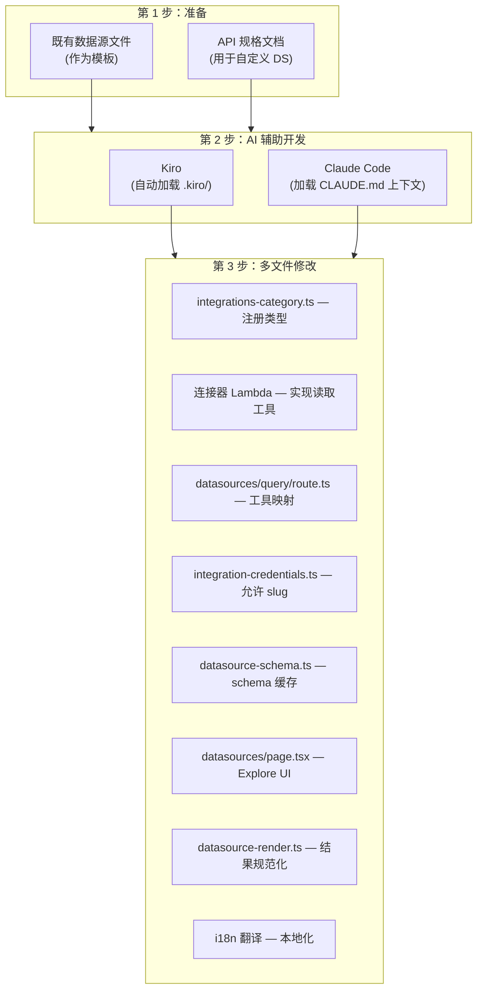

# 数据源开发 FAQ

关于扩展外部可观测性数据源（连接器）的问题与解答。

## 数据源平台是什么结构？

AWSops 的数据源是**只读连接器平台**。它是与 AWS 资源查询（AgentCore MCP 工具）相互独立的轴，用于连接外部可观测性后端。

组成要素：

- **连接器 Lambda** — 为每种数据源类型（kind）提供只读工具的 MCP 风格 Lambda。SSRF·认证·只读强制由连接器负责（own）。
- **schema 缓存（Aurora）** — 将内省（introspection）得到的 schema 持久存储在 Aurora 表（`datasource_schemas`）中。UI 和聊天 Agent 读取该缓存并注入紧凑的 schema 块（非实时内省）。
- **Explore 页面** — `web/app/datasources/page.tsx`。在同一页面提供查询执行 + 自然语言→查询（NL→query）聊天注入。
- **凭证** — 存储在 Secrets Manager 单一密钥（slug 键映射）中。连接器 Lambda 读取 `map[INTEGRATION_SLUG]`。

当前可查询的类型：

| 类型 | 查询语言 | 用途 |
|------|-----------|------|
| Prometheus | PromQL | 指标监控 |
| Mimir | PromQL | 长期指标 |
| Loki | LogQL | 日志聚合 |
| Tempo | TraceQL | 分布式链路追踪 |
| ClickHouse | SQL | 分析型数据库 |

:::info 只读姿态（ADR-041）
数据源仅处理**数据 read**（+ 受治理的外部 record/ticket/message write）。AWS 资源变更·自主行为已永久冻结（do-not-enable）。`web/app/api/datasources/query/route.ts` 的工具映射中**只存在读取工具**（mutate 工具不可达），并有测试验证该不变式。
:::

## 如何添加新的数据源类型（例如 Elasticsearch、InfluxDB）？

新类型通过跨多个文件的**一致的多文件模式**添加。推荐的工作流是让 AI 编码工具（Kiro 或 Claude Code）读取既有类型作为模板来生成新类型。



### 需要修改的文件

| # | 文件 | 需添加的内容 | 模板参考 |
|---|------|-----------|-------------|
| 1 | `web/lib/integrations-category.ts` | 向 `DATASOURCE_KINDS` 数组添加类型字符串 | 既有 `'prometheus' \| 'mimir' \| ...` |
| 2 | 连接器 Lambda（`scripts/v2/workers/*` MCP 源码） | 实现只读工具（`<kind>_query` 等）+ 健康检查。**必须加 SSRF 防护**（见下文） | 仿照既有 prometheus 连接器 |
| 3 | `web/app/api/datasources/query/route.ts` | 向 `TOOL` 映射添加 `{ instant, range?, arg }` 条目（仅读取工具） | 复制 prometheus/clickhouse 条目 |
| 4 | `web/lib/integration-credentials.ts` | 向 `KNOWN_CONNECTOR_SLUGS` 添加 slug（阻断任意键注入） | 既有 slug 数组 |
| 5 | `web/lib/datasource-schema.ts` | schema 内省 → Aurora `datasource_schemas` upsert（`upsertSchema`） | `getSchema`/`upsertSchema` 模式 |
| 6 | `web/app/datasources/page.tsx` | 添加类型图标/标签/占位符 + 示例查询条目 | 复制既有 Record 条目 |
| 7 | `web/lib/datasource-render.ts` | 将响应规范化为 `QueryResult`（`columns`、`rows`、`metadata`） | `normalizeResult` 模式 |
| 8 | `web/lib/i18n/translations/{en,ko}.json` | 添加新 UI 字符串的 i18n 键 | 既有 `datasources.*` 键 |

:::info 核心模式
所有查询函数/连接器都必须将结果规范化为 `QueryResult` 接口（`columns`、`rows`、`metadata`）后返回。这是 Explore UI 与 AI 分析共享的标准格式。
:::

## 连接器输入应如何保护？（复用-核心）

AWSops 运行在 in-VPC（mgmt-vpc，毗邻 `169.254.169.254` metadata·内部 ALB），因此管理员注册的 egress 端点是最大的 SSRF 风险。**新的连接器输入必须应用 SSRF 防护 + 大小限制**。

### 大小限制 — 解析前使用 `readJsonBounded`

请求体必须**在解析之前**用 `web/lib/http-body.ts` 的 `readJsonBounded` 读取以限制大小。App Router 没有默认的请求体上限，直接调用 `request.json()` 会暴露于 DoS 风险。

```ts
import { readJsonBounded, BodyTooLargeError } from '@/lib/http-body';

let body: { slug?: unknown; query?: unknown };
try { body = (await readJsonBounded(request)) as typeof body; }
catch (e) { if (e instanceof BodyTooLargeError) return json({ error: 'body too large' }, 413); throw e; }
```

被缓存的 schema 也有大小限制（`datasource-schema.ts` 的 `MAX_SCHEMA_BYTES`）。

### SSRF 防护 — `web/lib/ssrf-guard.ts`

在端点注册·请求时使用 `assertDatasourceEndpointAllowed()`（或用于外部 egress 的 `assertEgressEndpointAllowed()`）进行验证。阻断规则：

- **无条件阻断 metadata/IMDS** — `169.254.169.254`（IPv4）+ `fd00:ec2::254`（IPv6 IMDS）。
- **阻断环回/链路本地/组播/未指定地址** — `::1`、`fe80::/10` 等。
- **阻断 6to4·IPv4-mapped IPv6 绕过** — 将 `2002:a9fe:a9fe::` 这类编码后的 metadata 目标解码为 IPv4 后再检查。
- **强制 https / 限制 scheme** — egress 层级仅 https。
- **private opt-in** — RFC1918/ULA（公司内 in-cluster 数据源）在数据源层级被允许，但外部 egress 层级需按账户开启 `allowPrivateDatasource` opt-in 才允许私有地址。
- **redirect: 'manual'** — 手动处理重定向以防止跟随重定向绕过。在请求前执行 DNS 解析。

:::caution 连接器负责安全
SSRF·认证·只读强制的 source of truth 是**连接器 Lambda**。BFF 路由（`query/route.ts`）仅做工具解析·转发·规范化。若在新连接器中遗漏 SSRF 防护，仅靠路由层验证无法阻止。
:::

## schema 缓存与 NL→查询是如何运作的？

Explore 页面（`/datasources`）使用两条路径：

- **查询执行** — `POST /api/datasources/query` → 调用连接器 Lambda 读取工具 → 规范化为 `QueryResult`。
- **自然语言→查询** — `POST /api/datasources/generate`。向监控 Agent 注入**查询专用提示词** + 连接器缓存的 schema 块，以正确的语言（PromQL/LogQL/SQL 等）生成查询。Agent 读取的是 Aurora schema 缓存而非实时内省（`getSchema`/`listConfiguredSchemas`）。

添加新类型时需要在 `datasource-schema.ts` 中实现内省→`upsertSchema`，NL→查询才能准确。

## 用 AI 编码工具添加

### 用 Kiro 添加

[Kiro](https://kiro.dev) 会自动读取 `.kiro/` 目录以获取项目上下文：

- `.kiro/AGENT.md` — 架构·规则
- `.kiro/steering/project-structure.md` — 目录结构、数据源文件位置
- `.kiro/steering/coding-standards.md` — 编码规范

对于**知名数据源**（Elasticsearch、InfluxDB、Graphite 等），简单的提示词即可：

```
将 Elasticsearch 添加为新的数据源类型。
按照既有类型的模式，一并修改连接器 Lambda + query/route.ts TOOL 映射 +
schema 缓存 + Explore UI + i18n。
务必应用 SSRF 防护（assertDatasourceEndpointAllowed）和 readJsonBounded。
```

### 用 Claude Code 添加

Claude Code 通过各目录的 `CLAUDE.md` 理解项目：

- 根 `CLAUDE.md` — 整体架构·必守规则（含只读姿态、安全经验教训）
- `web/**` — 库模块（`datasources.ts`、`datasource-schema.ts`、`ssrf-guard.ts` 等）及 API 路由/页面详情

**示例提示词：**

```
将 InfluxDB（InfluxQL）添加为新的数据源类型。
按照既有类型的模式修改所有相关文件。
默认端口 8086，健康检查端点 /ping。
连接器输入用 readJsonBounded 限制大小并应用 SSRF 防护（仅读取工具）。
```

## 如何添加公司内部/自定义数据源？

对于 AI 工具不了解其 API 的**内部系统**或**小众工具**，需在提示词中同时提供 **API 规格文档**。

### 需提供的信息

| 项目 | 说明 | 示例 |
|------|------|------|
| **健康检查端点** | 连接测试路径 | `GET /api/health` |
| **查询 API** | 数据查询格式 | `POST /api/v1/query` |
| **请求体** | 查询参数结构 | `{"query": "...", "from": "...", "to": "..."}` |
| **响应格式** | 返回数据结构 | `{"data": [{"timestamp": ..., "value": ...}]}` |
| **认证方式** | 支持的认证类型 | Bearer token、API key、Basic auth |

### 示例提示词（含 API 规格）

```
将 "CustomMetrics" 添加为新的数据源类型。
按照既有类型的模式修改所有相关文件。

API 文档：
- 健康检查: GET /api/health → 200 OK
- 查询: POST /api/v1/query
  Body: {"query": "metric_name", "from": "2024-01-01T00:00:00Z", "to": "2024-01-02T00:00:00Z", "step": "5m"}
  Response: {"status": "ok", "data": [{"timestamp": 1704067200, "value": 42.5, "labels": {"host": "web-1"}}]}
- 认证: Authorization 头中的 Bearer token
- 默认端口: 9090
- 只读（禁止暴露写入/变更工具），应用 SSRF 防护 + readJsonBounded
```

:::tip 利用 OpenAPI 规格文件
如果有 OpenAPI（Swagger）YAML/JSON 文件，可以生成更准确的代码。Kiro 会自动引用放在项目中的规格文件，Claude Code 则在提示词中包含文件路径即可。
:::

:::caution 连接器仅限策划形态（ADR-040/041）
外部连接器仅允许**受治理的策划（curated）连接器**——不包含任意形态的 BYO-MCP。新类型只能在 SSRF 防护·Secrets Manager 凭证·只读工具·DLP/redaction·`KNOWN_CONNECTOR_SLUGS` 允许列表的范围内添加。详细治理请参阅 `docs/decisions/ADR-040-governed-external-knowledge-comms-writes.md`、`ADR-041-read-only-means-resource-not-data.md`。
:::

## 添加后的验证清单

添加新数据源类型后请确认以下各项：

- [ ] TypeScript/生产构建成功（`npm run build`）——`*.test.ts` 的类型噪音不阻断
- [ ] Explore 页面的类型下拉框中显示新类型
- [ ] 连接测试成功（健康检查端点有响应）
- [ ] 查询执行结果以 `QueryResult` 格式规范化返回
- [ ] NL→查询以正确的语言生成有效查询（确认 schema 缓存注入）
- [ ] 连接器输入已应用 `readJsonBounded` + SSRF 防护（测试 metadata/IMDS/环回阻断）
- [ ] slug 已注册到 `KNOWN_CONNECTOR_SLUGS`（拒绝任意键）
- [ ] 韩语/英语 i18n 字符串正常显示
