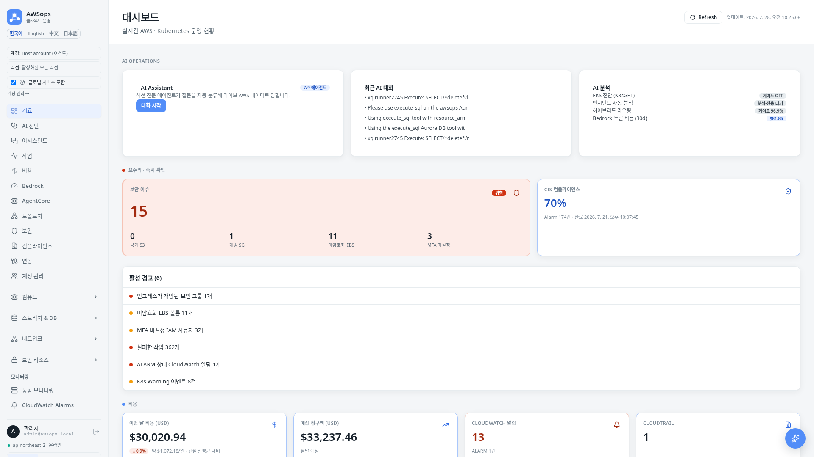
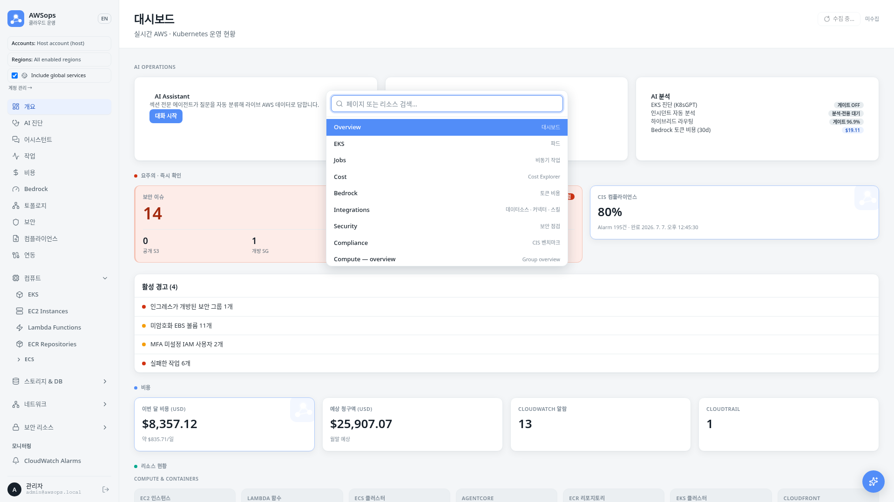

<!-- Slide 1: Session Cover -->

@type: cover
@transition: fade

# AWSops
## AI-Powered AWS Operations Dashboard

Junseok Oh | Solutions Architect | AWS

:::notes
{timing: 1min}
안녕하세요, AWS Solutions Architect 오준석입니다.
오늘은 AWSops라는 AI 기반 AWS 운영 대시보드를 소개해 드리겠습니다.
클라우드 운영의 복잡성을 어떻게 해결하고, AI가 어떤 역할을 할 수 있는지 함께 살펴보겠습니다.
{cue: transition}
먼저 왜 이런 도구가 필요한지부터 시작하겠습니다.
:::

---

<!-- Slide 2: Agenda -->

@type: agenda

# Agenda

1. **Why AWSops** — 클라우드 운영의 도전 과제
2. **Architecture Deep Dive** — 기술 스택과 AI 에이전트
3. **Demo & Diagnosis Report** — 실전 시나리오와 종합진단

:::notes
{timing: 1min}
총 65분 세션으로 3개 파트로 나누어 진행합니다.
첫 번째로 왜 이런 도구가 필요한지, 두 번째로 어떻게 만들었는지, 세 번째로 실제로 어떻게 쓰는지를 보여드리겠습니다.
:::

---

<!-- Slide 2b: The Five Goals -->

@type: content
@transition: slide

# 왜 만들었나 — 5가지 목표

:::html

  <button class="tab-btn" style="padding:.5rem .875rem;border:none;border-radius:6px;background:var(--accent);color:var(--accent-on);font-weight:bold;cursor:pointer;font-size:.8125rem;" onclick="(function(b,i){var p=b.closest('.slide-body')||b.parentNode.parentNode.parentNode;p.querySelectorAll('.tg').forEach(function(c,j){c.style.display=j===i?'block':'none'});var btns=b.parentNode.querySelectorAll('.tab-btn');btns.forEach(function(x){x.style.background='var(--bg-tertiary)';x.style.color='var(--text-muted)';x.classList.remove('active')});b.style.background='var(--accent)';b.style.color='var(--accent-on)';b.classList.add('active')})(this,0)">1. 가시성</button>
  <button class="tab-btn" style="padding:.5rem .875rem;border:none;border-radius:6px;background:var(--bg-tertiary);color:var(--text-muted);font-weight:bold;cursor:pointer;font-size:.8125rem;" onclick="(function(b,i){var p=b.closest('.slide-body')||b.parentNode.parentNode.parentNode;p.querySelectorAll('.tg').forEach(function(c,j){c.style.display=j===i?'block':'none'});var btns=b.parentNode.querySelectorAll('.tab-btn');btns.forEach(function(x){x.style.background='var(--bg-tertiary)';x.style.color='var(--text-muted)';x.classList.remove('active')});b.style.background='var(--accent)';b.style.color='var(--accent-on)';b.classList.add('active')})(this,1)">2. FinOps</button>
  <button class="tab-btn" style="padding:.5rem .875rem;border:none;border-radius:6px;background:var(--bg-tertiary);color:var(--text-muted);font-weight:bold;cursor:pointer;font-size:.8125rem;" onclick="(function(b,i){var p=b.closest('.slide-body')||b.parentNode.parentNode.parentNode;p.querySelectorAll('.tg').forEach(function(c,j){c.style.display=j===i?'block':'none'});var btns=b.parentNode.querySelectorAll('.tab-btn');btns.forEach(function(x){x.style.background='var(--bg-tertiary)';x.style.color='var(--text-muted)';x.classList.remove('active')});b.style.background='var(--accent)';b.style.color='var(--accent-on)';b.classList.add('active')})(this,2)">3. Well-Architected</button>
  <button class="tab-btn" style="padding:.5rem .875rem;border:none;border-radius:6px;background:var(--bg-tertiary);color:var(--text-muted);font-weight:bold;cursor:pointer;font-size:.8125rem;" onclick="(function(b,i){var p=b.closest('.slide-body')||b.parentNode.parentNode.parentNode;p.querySelectorAll('.tg').forEach(function(c,j){c.style.display=j===i?'block':'none'});var btns=b.parentNode.querySelectorAll('.tab-btn');btns.forEach(function(x){x.style.background='var(--bg-tertiary)';x.style.color='var(--text-muted)';x.classList.remove('active')});b.style.background='var(--accent)';b.style.color='var(--accent-on)';b.classList.add('active')})(this,3)">4. 보안성</button>
  <button class="tab-btn" style="padding:.5rem .875rem;border:none;border-radius:6px;background:var(--bg-tertiary);color:var(--text-muted);font-weight:bold;cursor:pointer;font-size:.8125rem;" onclick="(function(b,i){var p=b.closest('.slide-body')||b.parentNode.parentNode.parentNode;p.querySelectorAll('.tg').forEach(function(c,j){c.style.display=j===i?'block':'none'});var btns=b.parentNode.querySelectorAll('.tab-btn');btns.forEach(function(x){x.style.background='var(--bg-tertiary)';x.style.color='var(--text-muted)';x.classList.remove('active')});b.style.background='var(--accent)';b.style.color='var(--accent-on)';b.classList.add('active')})(this,4)">5. 장애 대응 AI</button>

  
DevOps·SRE 가시성 향상

  

  <b>고민:</b> EC2·CloudWatch·VPC·NFM·Direct Connect 콘솔을 오가며 트래픽·네트워크 상태를 따로 확인해야 했다. 
  <b>AWSops로 얻는 것:</b> Overview·Topology·Monitoring에 <b>NFM(트래픽 top-contributor·E2E hop path)</b>·<b>Direct Connect(피크 사용률·BGP 라우트·다운 감지)</b>·DNS 쿼리 로그·IP 인벤토리·VPC 엔드포인트·Network Firewall까지 <b>하나의 대시보드</b>에서 읽기 전용으로 확인.
  

  
FinOps 비용 최적화

  

  <b>고민:</b> 비용 리포트를 매달 수작업으로 만들고, rightsizing 판단은 감에 의존했다. 
  <b>AWSops로 얻는 것:</b> Cost 대시보드 + AgentCore 비용 도구로 <b>읽기 전용 비용 분석</b>과 rightsizing 인사이트를 상시 확인. OpenCost 읽기 전용 패널로 K8s 비용까지 같은 화면에서 본다 — 권고만 제시, 자동 변경은 없음.
  

  
Well-Architected 아키텍처 점검

  

  <b>고민:</b> Well-Architected Review는 수작업으로 2-3일 걸리고, 놓치는 항목이 생겼다. 
  <b>AWSops로 얻는 것:</b> <b>종합진단 리포트</b>(light·mid 9섹션 / deep 16섹션)가 6개 Pillar에 매핑되어 자동 생성되고, 비동기 워커가 만든 결과를 DOCX/PDF로 내보낸다.
  

  
보안성 향상

  

  <b>고민:</b> Public S3·오픈 SG·미암호화 EBS·MFA 미적용 같은 기본 보안 항목이 계정 전반에 흩어져 보이지 않았다. 
  <b>AWSops로 얻는 것:</b> Security 페이지가 인벤토리에서 파생한 <b>Findings</b>를 상시 노출하고, Compliance 페이지가 <b>CIS 벤치마크</b>를 실행·이력화한다 — 둘 다 읽기 전용.
  

  
장애 시 AI 기반 트래픽·원인 분석

  

  <b>고민:</b> 장애가 나면 메트릭·로그·트레이스·네트워크 경로를 사람이 일일이 교차 조회하며 원인을 좁혀야 했다. 
  <b>AWSops로 얻는 것:</b> AI Assistant/Diagnosis가 CloudWatch·Datasource(Prometheus·Loki·Tempo)·<b>NFM E2E hop path</b>를 자연어로 교차 분석하고, Incident 라이프사이클(로드맵)까지 같은 대시보드 안에서 연결된다.
  

:::

:::notes
{timing: 3min}
[요약]
• 이 프로젝트를 시작할 때 세운 5가지 목표를 먼저 공유합니다.

이 프로젝트를 시작할 때 5가지 목표를 세웠습니다.

첫째, DevOps·SRE의 가시성 향상입니다. 콘솔을 오가지 않고 NFM 트래픽 분석, Direct Connect 상태, DNS·IP·VPC 엔드포인트·Network Firewall까지 한 화면에서 봅니다.

{cue: pause}
둘째, FinOps로 비용을 최적화하는 것입니다. 읽기 전용 비용 분석과 rightsizing 인사이트, OpenCost 패널을 상시 확인합니다.

셋째, Well-Architected 기준으로 아키텍처를 점검하는 것입니다. 종합진단 리포트가 6개 Pillar에 매핑되어 자동 생성됩니다.

넷째, 보안성 향상입니다. Security Findings와 CIS Compliance 벤치마크를 상시 노출합니다.

다섯째, 장애가 났을 때 AI가 트래픽과 원인을 분석하는 것입니다. NFM의 E2E hop path까지 포함해 자연어로 교차 분석합니다.

{cue: transition}
이 5가지 목표가 앞으로 볼 모든 기능의 출발점입니다. 먼저 이걸 만들게 된 도전 과제부터 보겠습니다.
:::

---

<!-- Slide 3: The Challenge -->

@type: content
@transition: slide

# 클라우드 운영의 도전 과제

::: left

### Console Hopping

- EC2 확인 → CloudWatch → VPC → IAM → Cost Explorer
- **평균 5-7개 콘솔** 페이지를 오가며 문제 해결
- 멀티 어카운트 환경에서는 **로그인만 10번**

### 데이터 사일로

- CloudWatch 메트릭 ≠ Prometheus 메트릭 ≠ 로그 ≠ 트레이스
- **교차 분석 불가** → 근본 원인 파악 지연

:::

::: right

### 반복적 수작업

- "이 인스턴스 rightsizing 필요한가?"
- "미사용 리소스 정리해야 하는데..."
- **매번 같은 CLI 명령어** 반복 실행

### 보고서 작성 부담

- Well-Architected Review 수작업
- FinOps 리포트 매월 수동 작성
- **2-3일 소요** → 실시간성 부족

:::

:::notes
{timing: 3min}
클라우드 운영을 하다 보면 정말 많은 도전 과제에 직면합니다.

첫 번째는 Console Hopping입니다. 하나의 이슈를 해결하려면 EC2 콘솔에서 시작해서 CloudWatch로 메트릭 보고, VPC에서 네트워크 확인하고, IAM에서 권한 체크하고... 평균 5-7개 콘솔을 돌아다녀야 합니다. 멀티 어카운트면 로그인만 해도 지칩니다.

{cue: pause}

두 번째는 데이터 사일로입니다. CloudWatch 메트릭, Prometheus 메트릭, 로그, 트레이스가 각각 다른 시스템에 있어서 교차 분석이 어렵습니다. "CPU가 높아졌는데 어떤 서비스 때문이지?" 라는 질문에 답하려면 여러 도구를 동시에 봐야 합니다.

세 번째, 네 번째도 마찬가지로 반복 작업과 보고서 부담이 큽니다.

{cue: question}
여러분도 이런 경험 있으시죠? 특히 FinOps 리포트를 매달 수동으로 만들어 본 경험이 있으신 분?

{cue: transition}
AWSops는 이 4가지 문제를 동시에 해결합니다.
:::

---

<!-- Slide 4: AWSops Overview -->

@type: content
@transition: slide

# AWSops — Single Pane of Glass

:::html

  <button class="tab-btn" style="padding:.5rem 1rem;border:none;border-radius:6px;background:var(--accent);color:var(--accent-on);font-weight:bold;cursor:pointer;font-size:.875rem;" onclick="(function(b,i){var p=b.closest('.slide-body')||b.parentNode.parentNode.parentNode;p.querySelectorAll('.tc').forEach(function(c,j){c.style.display=j===i?'block':'none'});var btns=b.parentNode.querySelectorAll('.tab-btn');btns.forEach(function(x){x.style.background='var(--bg-tertiary)';x.style.color='var(--text-muted)';x.classList.remove('active')});b.style.background='var(--accent)';b.style.color='var(--accent-on)';b.classList.add('active')})(this,0)">Data Layer</button>
  <button class="tab-btn" style="padding:.5rem 1rem;border:none;border-radius:6px;background:var(--bg-tertiary);color:var(--text-muted);font-weight:bold;cursor:pointer;font-size:.875rem;" onclick="(function(b,i){var p=b.closest('.slide-body')||b.parentNode.parentNode.parentNode;p.querySelectorAll('.tc').forEach(function(c,j){c.style.display=j===i?'block':'none'});var btns=b.parentNode.querySelectorAll('.tab-btn');btns.forEach(function(x){x.style.background='var(--bg-tertiary)';x.style.color='var(--text-muted)';x.classList.remove('active')});b.style.background='var(--accent)';b.style.color='var(--accent-on)';b.classList.add('active')})(this,1)">AI Engine</button>
  <button class="tab-btn" style="padding:.5rem 1rem;border:none;border-radius:6px;background:var(--bg-tertiary);color:var(--text-muted);font-weight:bold;cursor:pointer;font-size:.875rem;" onclick="(function(b,i){var p=b.closest('.slide-body')||b.parentNode.parentNode.parentNode;p.querySelectorAll('.tc').forEach(function(c,j){c.style.display=j===i?'block':'none'});var btns=b.parentNode.querySelectorAll('.tab-btn');btns.forEach(function(x){x.style.background='var(--bg-tertiary)';x.style.color='var(--text-muted)';x.classList.remove('active')});b.style.background='var(--accent)';b.style.color='var(--accent-on)';b.classList.add('active')})(this,2)">Dashboard</button>

  

    
Aurora Serverless v2 — 영속 상태

    
PostgreSQL 17 · 0.5–4 ACU · KMS CMK worker jobs · chat threads · 진단 리포트 영속 저장

  

  

    

      
node-pg

      
Durable State

    

    

      
41

      
Inventory Types (Steampipe sync)

    

  

  

    
Bedrock AgentCore

    
Claude Opus 4.8 / Sonnet 5 / Haiku 4.5 AgentCore Runtime + 섹션 에이전트 ADR-003 하이브리드 라우팅

  

  

    

      
9

      
Section Gateways (설계 160+ 도구 · 30 슬라이스 전부 LIVE)

    

    

      
~160

      
Read-only Tools (30 슬라이스 전부 LIVE)

    

  

  

    
Overview

    
Dashboard

    
Cost · Bedrock · Inventory · Datasources · EKS

  

  

    
AI

    
Assistant · Diagnosis

    
스트리밍 챗 + 종합진단 리포트

  

  

    
Security · Compliance

    
Findings · CIS 벤치마크

    
read-only, Aurora 파생

  

  

    
Topology · Monitoring

    
EKS · 리소스 그래프

    
async worker tier가 무거운 작업 처리

  

  

    
Accounts

    
멀티 어카운트 전환

  

  

    
Integrations

    
에이전트 · 스킬 · 커넥터 · 데이터소스 허브

  

  

    
Jobs · Customization

    
비동기 작업 현황 · 테마/언어 설정

  

:::

:::notes
{timing: 3min}
AWSops는 3개 레이어로 구성됩니다.

{cue: pause}
Data Layer는 Aurora Serverless v2가 중심입니다. PostgreSQL 17 기반으로 worker 작업, chat 스레드, 진단 리포트 같은 영속 상태를 안전하게 저장합니다. 인벤토리는 flag로 켜는 Steampipe sync가 41종 리소스 타입을 Aurora로 동기화해 화면에 보여주는 보조 역할입니다. 라이브 조회 엔진이 아니라 인벤토리 캐시라는 점이 핵심입니다.

AI Engine은 Bedrock입니다. Opus 4.8, Sonnet 5, Haiku 4.5를 상황에 맞게 쓰고, AgentCore는 9개 섹션 게이트웨이(8개 AWS 도메인 + external-obs)로 설계되어 160개 이상의 읽기 전용 도구를 갖췄고, 함대 배포가 완료되어 30개 슬라이스 전부, 9개 게이트웨이 전부 READY MCP 타깃을 보유하고 있습니다. 라우팅은 ADR-003 하이브리드 방식으로 빠르고 정확합니다.

Dashboard는 Next.js 14 thin-BFF입니다. Overview, AI Diagnosis, Assistant, Security, Compliance, Topology, Monitoring, Accounts, Integrations, Jobs, Customization까지 하나의 대시보드로 통합되어 있고, 화면에 보이는 스크린샷처럼 실제 라이브 v2 환경입니다. 무거운 작업은 비동기 워커 티어로 넘깁니다.

{cue: transition}
구체적인 숫자를 보겠습니다.
:::

---

<!-- Slide 4b: Live Dashboard Screenshot -->

@type: content
@transition: fade

# 실제 화면 — Live v2 Dashboard

:::html

:::

:::notes
{timing: 1min}
[요약]
• 슬라이드웨어 목업이 아니라 실제 라이브 v2 환경 캡처

지금 보시는 건 mockup이 아니라 실제 운영 중인 v2 대시보드 화면입니다.

{cue: transition}
숫자로 다시 정리해 보겠습니다.
:::

---

<!-- Slide 5: By the Numbers -->

@type: content

# AWSops — By the Numbers

| 항목 | 내용 | 설명 |
|------|------|------|
| **Infra** | Terraform MSA | 비공개 엣지 — CloudFront VPC Origin → 내부 ALB → Fargate |
| **Compute** | ECS Fargate | web thin-BFF + OOM-safe 비동기 워커 티어 (arm64) |
| **Data** | Aurora Serverless v2 | PostgreSQL 17 영속 상태 + 41종 인벤토리 sync |
| **AI Tools** | 9 게이트웨이 설계 (160+ 도구) · 30개 슬라이스 전부 LIVE | AgentCore 섹션 에이전트 (모두 read-only; 9개 게이트웨이 전부 READY MCP 타깃) |
| **AI Routing** | ADR-003 하이브리드 | regex fast-path + Haiku 분류기, 게이트 96.9% |
| **Diagnosis** | light·mid 9 / deep 16 섹션 | Well-Architected 매핑, DOCX/PDF 내보내기 |
| **UX** | 3-테마 + 모바일 + 4개 언어 | 반응형 대시보드 + Cmd-K + 한/영/中/日 i18n |

:::notes
{timing: 2min}
숫자보다 구조로 보면 더 명확합니다.

인프라는 Terraform 기반 MSA입니다. 공개 ALB 없이 CloudFront VPC Origin이 내부 ALB를 거쳐 Fargate로 들어오는 비공개 엣지 구조입니다. 컴퓨트는 ECS Fargate로, 웹 thin-BFF와 OOM에 안전한 비동기 워커 티어가 분리되어 있습니다. 모두 arm64입니다.

데이터는 Aurora Serverless v2, PostgreSQL 17로 영속 상태를 보관하고, 인벤토리는 41종 리소스 타입을 sync합니다.

AI는 9개 섹션 게이트웨이(8개 AWS 도메인 + external-obs)에 160개 이상의 읽기 전용 도구가 설계되어 있고, 30개 슬라이스 전부 함대 배포되어 9개 게이트웨이 전부 READY 상태입니다. 라우팅은 ADR-003 하이브리드로 게이트 정확도 96.9%를 달성했습니다. 진단은 light·mid 티어가 9섹션(기본 8 + 의도-실제 드리프트 1), deep 티어가 16섹션이며 Well-Architected에 매핑되고 DOCX/PDF로 뽑을 수 있습니다. UX 쪽은 3-테마·모바일 대응에 더해 한국어/English/中文/日本語 4개 언어를 완전히 지원합니다 — 일본어는 최근 복원되어 전체 화면 번역 커버리지 점검까지 마쳤습니다.

{cue: transition}
이게 어떤 가치를 만드는지 보겠습니다.
:::

---

<!-- Slide 6: Value Proposition -->

@type: content
@transition: slide

# AWSops가 주는 가치

::: left

### For DevOps / SRE

- **Console Hopping 제거** — 한 화면에서 모든 리소스
- **자연어 트러블슈팅** — "VPC Flow Log 분석해줘" (읽기 전용, 스트리밍 챗)
- **Topology / EKS 읽기 전용 뷰** — CF→LB→TG→DB 리소스 그래프
- **Network 통합 뷰** — NFM(트래픽 top-contributor·E2E hop) · Direct Connect(피크 사용률·BGP) · DNS·IP·VPC 엔드포인트·Network Firewall까지 하나의 대시보드
- **Datasource Explore** — Prometheus · Loki · Tempo · ClickHouse 교차 조회
- **Cmd-K + 4개 언어** — 한/영/中/日 완전 지원, 어디서든 키보드로 이동

:::

::: right

### For FinOps / Management

- **읽기 전용 비용 분석** — Cost 대시보드 + AgentCore 비용 도구
- **Rightsizing 인사이트** — 권고만 제시, 자동 적용 없음
- **종합진단 리포트** — light·mid 9 / deep 16 섹션, Well-Architected 매핑
- **DOCX / PDF 내보내기** — 비동기 워커가 생성, 수작업 대체

:::

:::notes
{timing: 3min}
두 가지 관점에서 가치를 드립니다.

DevOps나 SRE 분들에게는 콘솔 호핑 없이 한 화면에서 모든 리소스를 보고, AI에게 자연어로 질문하면 됩니다. "이 EC2 인스턴스가 왜 느려?"라고 물으면 CloudWatch 메트릭을 확인하고, 네트워크 경로를 분석하고, 관련 로그를 찾아줍니다. 모두 읽기 전용이고, 응답은 스트리밍으로 흐릅니다. Topology와 EKS 읽기 전용 뷰에 더해, NFM 트래픽 top-contributor와 E2E hop path, Direct Connect 피크 사용률·BGP 라우트, DNS·IP·VPC 엔드포인트·Network Firewall까지 네트워크 6종 메뉴가 같은 대시보드에 통합되어 있습니다. Prometheus·Loki·Tempo 같은 데이터소스 Explore도 함께 제공합니다.

{cue: pause}

FinOps나 Management 분들에게는 읽기 전용 비용 분석과 rightsizing 인사이트를 드립니다. 중요한 건 권고만 제시하고 자동으로 바꾸지 않는다는 점입니다. 그리고 종합진단 리포트를 light·mid 티어 9섹션, deep 티어 16섹션으로 만들고, Well-Architected에 매핑해 DOCX와 PDF로 내보냅니다. 무거운 생성 작업은 비동기 워커가 처리하므로 수작업 2-3일이 사라집니다.

{cue: transition}
가장 중요한 차별점을 보겠습니다.
:::

---

<!-- Slide 6b: UX & i18n Screenshot -->

@type: content
@transition: fade

# UX — Cmd-K + 4개 언어

:::html

:::

- **Cmd-K 커맨드 팔레트** — 콘솔 호핑 없이 키보드로 전체 화면 이동
- **4개 언어 완전 지원** — 한국어 / English / 中文 / 日本語 (2026-07-21 일본어 복원 + 전체 화면 번역 커버리지 점검 완료)

:::notes
{timing: 1min}
[요약]
• Cmd-K로 어디서든 키보드 이동
• 한/영/中/日 4개 언어, 최근 일본어 복원 + 전체 커버리지 점검

Cmd-K 커맨드 팔레트로 마우스 없이 전체 화면을 이동할 수 있고, 한국어·English·中文·日本語 4개 언어를 완전히 지원합니다. 일본어는 최근 복원되면서 전체 화면 번역 커버리지 점검도 함께 마쳤습니다.

{cue: transition}
가장 중요한 차별점을 보겠습니다.
:::

---

<!-- Slide 7: Key Differentiator -->

@type: content
@transition: fade

# 핵심 차별점

:::html

  

    
🧠

    
In-Account Bedrock AI

    
고객 계정 안에서 Bedrock 호출 외부 AI SaaS API 불필요 — 데이터가 밖으로 안 나감

  

  

    
🔒

    
Read-Only Posture

    
AWS 리소스 변경·자율 실행 동결 ADR-005 (FROZEN) / ADR-007 — 설계상 안전

  

  

    
📊

    
AI Diagnosis Report

    
Well-Architected · light·mid 9 / deep 16 섹션 비동기 워커 생성 → DOCX / PDF

  

:::

:::notes
{timing: 3min}
AWSops의 차별점은 세 가지로 압축됩니다.

첫째, In-Account Bedrock AI입니다. AI 추론을 고객 AWS 계정 안의 Bedrock에서 직접 호출합니다. OpenAI 같은 외부 AI SaaS API를 쓰지 않으므로 데이터가 계정 밖으로 나가지 않습니다. 금융, 공공, 의료처럼 데이터 주권이 중요한 환경에 적합합니다.

둘째, 읽기 전용 운영 태세입니다. ADR-005 기준으로 AWS 리소스 변경과 자율 실행은 동결(FROZEN, 새 명시적 결정 전까지)되어 있습니다. AI가 진단하고 권고할 뿐 직접 바꾸지 않으므로, 설계 단계에서부터 안전합니다. "read-only"는 AWS 리소스에 한정된 정의이고, 외부 관측성 데이터소스의 읽기/쓰기는 ADR-007 거버넌스 하에 별도로 허용됩니다.

셋째, AI 종합진단 리포트입니다. Well-Architected에 매핑된 light·mid 9섹션, deep 16섹션 리포트를 비동기 워커가 생성하고 DOCX와 PDF로 내보냅니다.

{cue: question}
외부 AI SaaS에 운영 데이터를 보내는 게 부담스러웠던 분 계시죠? AWSops는 그 경로 자체가 없습니다.

{cue: transition}
이제 아키텍처를 자세히 살펴보겠습니다.
:::

---

<!-- Slide 8: Block 1 Key Takeaways -->

@type: content
@transition: fade

# Key Takeaways — 5가지 목표, 하나의 대시보드

- **① 가시성** → Overview·Topology·Monitoring + NFM·Direct Connect까지 통합된 Network 6종 메뉴
- **② FinOps** → 읽기 전용 비용 분석 + Rightsizing 인사이트 + OpenCost 패널
- **③ Well-Architected** → 종합진단 리포트 자동 생성 (light·mid/deep, DOCX/PDF)
- **④ 보안성** → Security Findings + CIS Compliance 벤치마크, 둘 다 읽기 전용
- **⑤ 장애 대응 AI** → AI Assistant/Diagnosis가 메트릭·로그·트레이스·NFM 경로를 자연어로 교차 분석
- **핵심 차별점** → In-account Bedrock AI + 읽기 전용 태세 (ADR-005 FROZEN) + 4개 언어 UX

:::notes
{timing: 2min}
첫 번째 파트를 정리하겠습니다.

AWSops는 처음 세운 5가지 목표를 하나의 대시보드 안에서 동시에 해결합니다.
가시성은 Overview·Topology·Monitoring에 NFM·Direct Connect를 포함한 네트워크 6종 메뉴까지 통합해서, FinOps는 읽기 전용 비용 분석과 Rightsizing으로, Well-Architected 점검은 자동 생성되는 종합진단 리포트로, 보안성은 Security Findings와 CIS Compliance로, 장애 대응은 AI가 메트릭·로그·트레이스·NFM 경로를 함께 교차 분석하는 것으로 풀었습니다.

그리고 가장 중요한 것은, AI 추론을 고객 계정 안 Bedrock에서 돌리고, AWS 리소스 변경과 자율 실행은 동결한 읽기 전용 태세라는 점입니다. 설계상 안전합니다.

{cue: transition}
5분 쉬고 아키텍처를 자세히 보겠습니다.
:::

