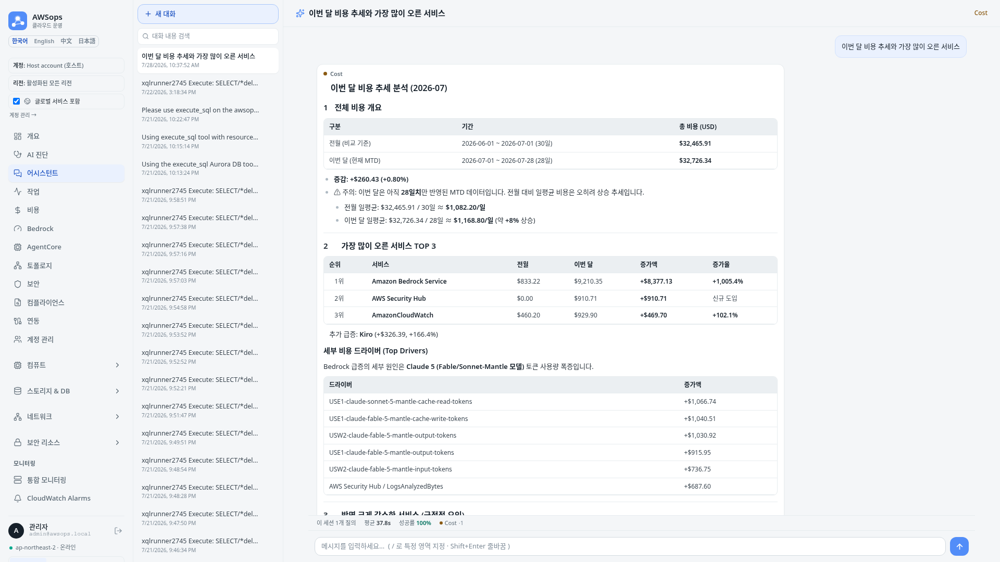
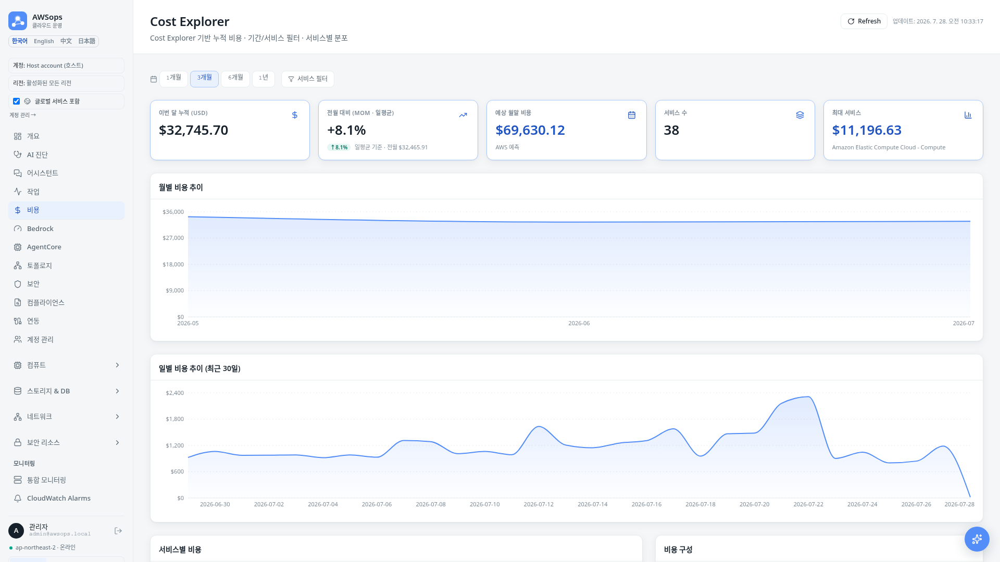
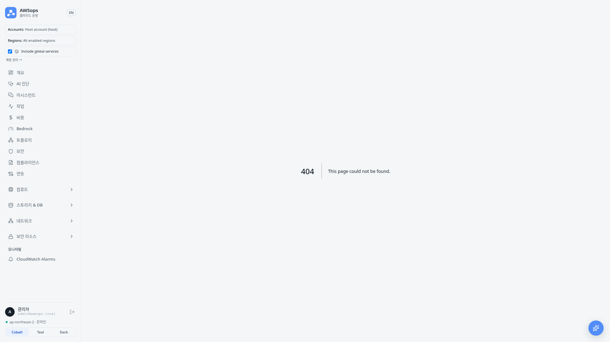
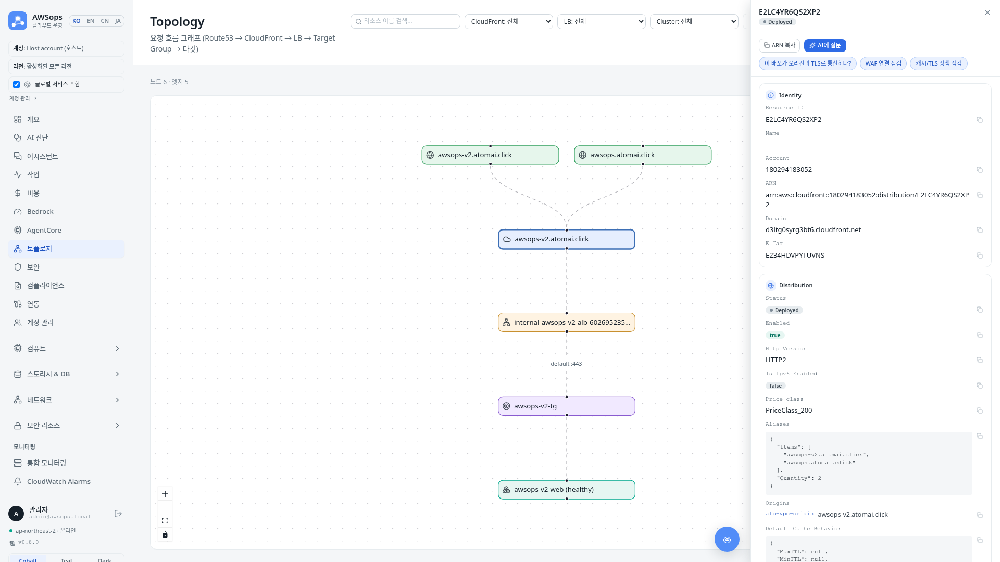
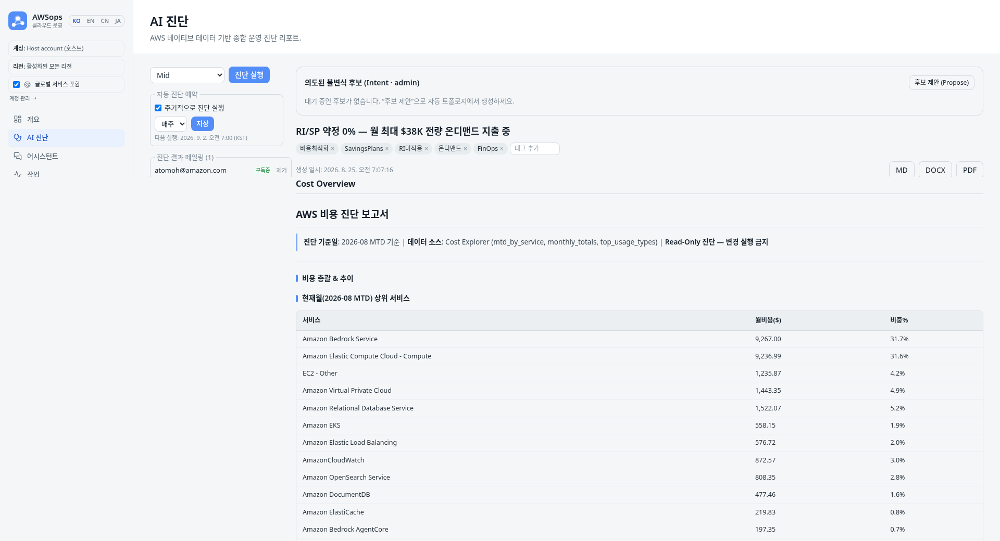
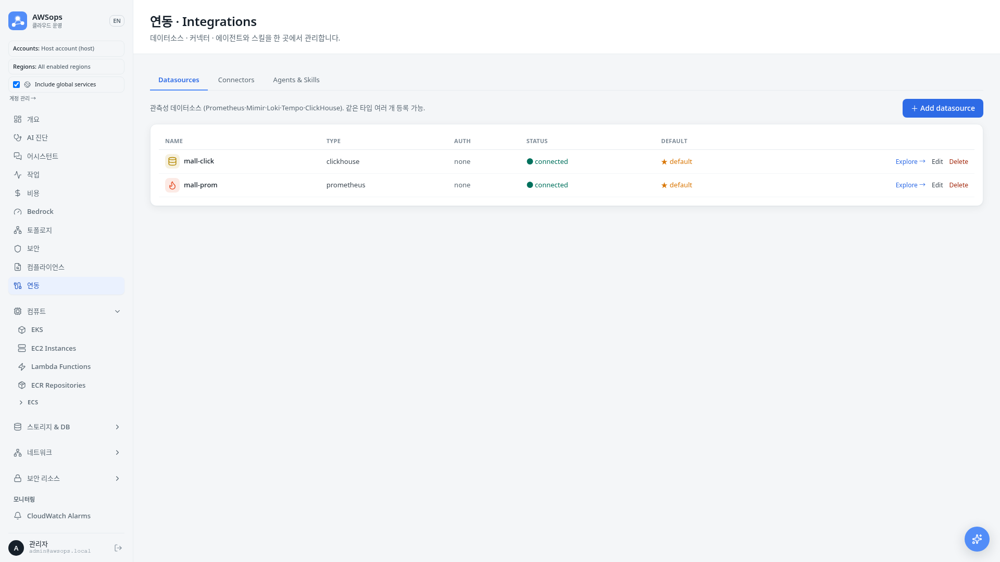
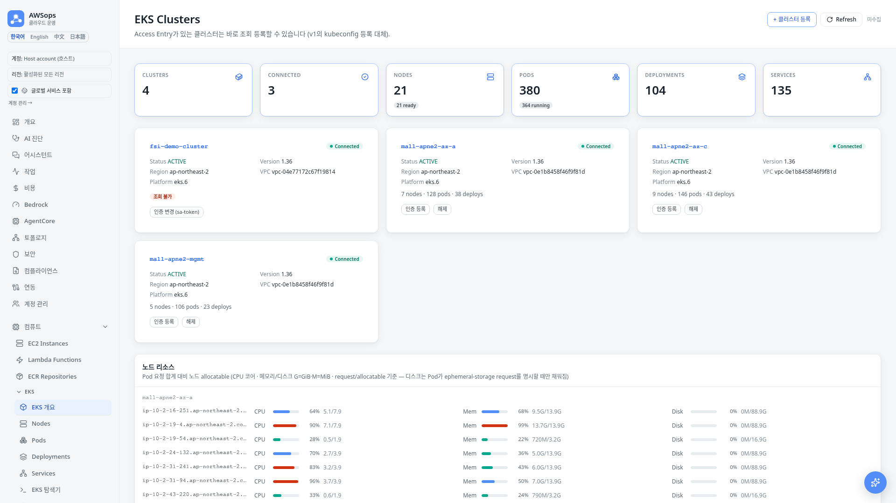
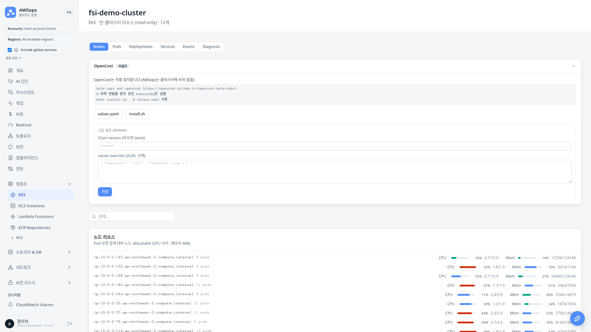
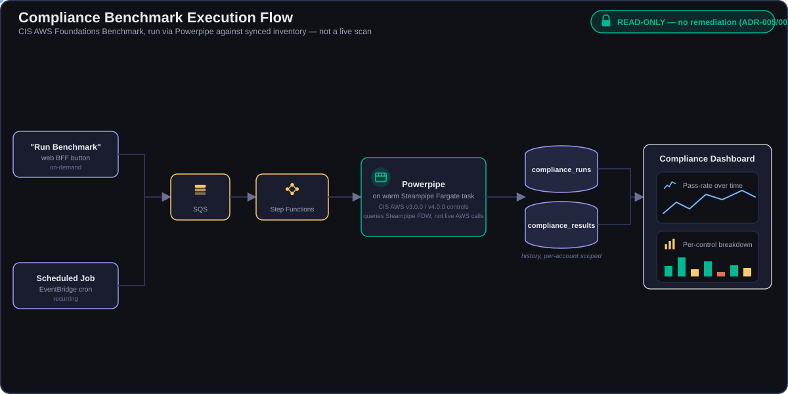

<!-- Slide 1: Block 3 Intro -->

@type: section
@transition: fade

# Demo & Diagnosis Report
## 실전 시나리오와 종합진단

:::notes
{timing: 1min}
마지막 파트입니다. 지금까지 왜 필요한지, 어떻게 만들었는지를 봤고, 이제 실제로 어떻게 쓰는지를 데모로 보여드리겠습니다.
AI 어시스턴트, 비용/인벤토리/토폴로지 시나리오, 그리고 종합진단 리포트까지 순서대로 보겠습니다.
{cue: emphasis}
한 가지 먼저 짚고 갈 점은, 오늘 보여드리는 모든 데모는 read-only라는 것입니다. 조회와 진단만 하고, AWS 리소스를 변경하지 않습니다.
{cue: transition}
먼저 AI 어시스턴트 데모입니다.
:::

---

<!-- Slide 2a: AI Assistant Demo Flow (1/2) -->

@type: content
@transition: slide

# AI Assistant Demo (1/2) — 라우팅 & 스트리밍

:::html

  

  

    <input type="text" id="queryInput" value="EKS 비용 개선점 찾아줘" placeholder="AI에게 질문하세요...">
    <button id="askButton">Ask</button>
  

  

    

      1
      2
      3
    

    

      

        
🔍 하이브리드 라우팅 (regex + Haiku)...

        
Gateway: cost · 프롬프트 캐싱 hit

      

      

        
📊 AgentCore 섹션 에이전트 · 라이브 read-only 조회...

        
MCP Tools ✅ Cost Explorer ✅ EKS Metrics ✅

      

      

        
🤖 Bedrock 분석 · SSE 스트리밍...

      

    

  

  

    <pre id="responseText"></pre>
     <!-- Initially hidden -->
    

  

  <button id="resetButton" class="hidden">Reset</button>

  

:::

:::notes
{timing: 2min}
AI 어시스턴트의 동작 흐름을 보겠습니다. 자연어 질문 하나가 답변으로 이어지는 과정입니다.

사용자가 "EKS 비용 개선점 찾아줘"라고 질문합니다. 첫 단계는 ADR-003 하이브리드 라우팅입니다. regex fast-path가 먼저 매칭을 시도하고, 애매하면 Haiku 분류기가 판단합니다. 프롬프트 캐싱으로 약 59% 히트율을 내고, 이 질문은 cost 섹션 게이트웨이로 라우팅됩니다.

{cue: pause}

선택된 AgentCore 섹션 에이전트가 MCP 도구로 라이브 read-only AWS 조회를 수행합니다. Cost Explorer, EKS 메트릭 등 필요한 도구만 호출합니다. 그리고 in-account Bedrock이 결과를 분석합니다.

{cue: transition}
같은 질문이 실제 화면에서 어떻게 보이는지 이어서 보겠습니다.
:::

---

<!-- Slide 2b: AI Assistant Demo — 실제 응답 화면 (2/2) -->

@type: content
@transition: slide

# AI Assistant Demo (2/2) — 실제 응답 화면

:::html

:::

> 답변과 함께 **라우트·도구 사용 내역** 표시 · 대화는 **Aurora thread**로 영속 저장 (resizable drawer와 `/assistant` 전체 화면이 같은 thread 공유)

:::notes
{timing: 1min}
응답은 SSE 스트리밍으로 실시간 전달되고, 어떤 라우트와 도구가 쓰였는지 UI에 함께 표시됩니다. 대화는 Aurora에 thread로 영속 저장되어, 사이드바에서 이어보기가 가능합니다. resizable drawer나 /assistant 전체 화면 어디서든 같은 thread를 씁니다.

{cue: demo}
(데모) 어시스턴트에서 질문을 입력하고, 라우트 분류와 도구 호출, 그리고 스트리밍 답변을 보여줍니다.

{cue: transition}
다음은 비용 분석 시나리오입니다.
:::

---

<!-- Slide 3a: Cost Analysis & Rightsizing Insight (1/2) -->

@type: content
@transition: slide

# Scenario 1: Cost Analysis & Rightsizing (1/2)

::: left

### 사용자 질문

> "비용 개선점 찾아줘"

### 동작 흐름 (read-only)

- **cost 섹션 에이전트** — Cost Explorer / Forecast 조회
- **Cost 대시보드** — 서비스별 비용·추이 시각화
- **EKS 메트릭** — request 대비 실사용량 (read-only)
- regex + Haiku 라우팅 → cost gateway

:::

::: right

### 분석 결과 예시 (권장만)

- "**payment** Pod: CPU request 500m, 실사용 50m → **90% 과할당** (rightsizing 권장)"
- "**frontend** Deployment: Memory limit 2Gi, 사용량 200Mi → **다운사이징 권장**"
- "Node 3대 중 **2대 활용률 15% 미만** → 통합 검토"
- "예상 월 절감 **$1,200** — 권장사항"

### Read-Only 원칙

> 권장사항만 제시 · **자동 적용 없음**
> (mutating 설치 버튼은 **ADR-005**로 동결 — do-not-enable)

:::

:::notes
{timing: 2min}
첫 번째 시나리오는 비용 분석과 rightsizing 인사이트입니다.

"비용 개선점 찾아줘"라고 입력하면 cost 섹션 게이트웨이로 라우팅됩니다. cost 에이전트가 Cost Explorer와 Forecast를 read-only로 조회하고, Cost 대시보드가 서비스별 비용과 추이를 시각화합니다.

{cue: pause}

EKS 워크로드는 read-only 메트릭으로 request 대비 실사용량을 비교합니다. 과할당된 파드와 다운사이징 후보, 통합 가능한 노드를 식별합니다. 결과는 구체적인 절감 추정치와 함께 제시됩니다.

{cue: transition}
실제 Cost 대시보드 화면을 보겠습니다.
:::

---

<!-- Slide 3b: Cost 대시보드 화면 (2/2) -->

@type: content
@transition: slide

# Scenario 1: Cost Analysis & Rightsizing (2/2) — Cost 대시보드

:::html

:::

> 서비스별 비용·추이 시각화 → rightsizing 후보 도출 · **권장만 제시, 자동 적용 없음**

:::notes
{timing: 1min}
{cue: emphasis}

여기서 중요한 점은, AWSops는 권장사항만 제시한다는 것입니다. 어떤 변경도 자동으로 적용하지 않습니다. 과거 설계에 있던 OpenCost mutating 설치 버튼은 **ADR-005**(AWS 리소스 변경·자율 조치 = FROZEN)로 동결됐습니다. 진단과 권고까지가 AWSops의 역할이고, 적용 결정과 실행은 운영자의 몫입니다.

{cue: transition}
다음은 인벤토리와 유휴 리소스 점검입니다.
:::

---

<!-- Slide 4a: Inventory & Idle Review (1/2) -->

@type: content
@transition: slide

# Scenario 2: Inventory & Idle Review (1/2)

::: left

### 사용자 흐름

> `/inventory/[type]` 페이지 → AgentCore 질의

### Inventory 플랫폼

- **41종 resource types** — `/inventory/[type]` 제네릭 페이지
- flag-gated **Steampipe sync** (warm Fargate) → **Aurora** 적재
- registry 기반 내비게이션 · fan-out sync
- 페이지별 **mini-dashboard** (KPI / donut / filters)

:::

::: right

### 점검 예시 (read-only)

- "미연결 EBS 볼륨 · 미사용 Elastic IP 후보 식별"
- "오래된 스냅샷 · 중지된 EC2 검토"
- "ENI 참조 없는 Security Group"
- AgentCore 라이브 조회로 현황 보강

### 라이브 vs 인벤토리

> Steampipe = **인벤토리 sync 전용** (Aurora 적재)
> 라이브 조회는 **AgentCore MCP 도구**가 담당

:::

:::notes
{timing: 1min}
두 번째 시나리오는 인벤토리와 유휴 리소스 점검입니다.

AWSops는 41가지 리소스 타입을 제네릭 `/inventory/[type]` 페이지로 제공합니다. 이 데이터는 flag-gated Steampipe sync가 warm Fargate에서 돌면서 Aurora로 적재한 것입니다. registry 기반으로 내비게이션이 자동 구성되고, 페이지마다 KPI, donut, 필터로 구성된 mini-dashboard가 붙습니다.

{cue: pause}

여기서 분명히 할 점은, Steampipe는 인벤토리 sync 전용이라는 것입니다. 라이브 쿼리 엔진이 아닙니다. 실시간 조회와 분석은 AgentCore MCP 도구가 담당합니다. 인벤토리 화면에서 후보를 좁히고, 에이전트로 라이브 현황을 보강하는 방식입니다.

{cue: transition}
실제 인벤토리 화면을 보겠습니다.
:::

---

<!-- Slide 4b: 인벤토리 화면 (2/2) -->

@type: content
@transition: slide

# Scenario 2: Inventory & Idle Review (2/2) — 인벤토리 화면

:::html

:::

> 페이지별 **mini-dashboard**에서 후보를 좁히고 → **AgentCore 라이브 조회**로 현황 보강

:::notes
{timing: 1min}
미연결 EBS, 미사용 Elastic IP, 오래된 스냅샷, 중지된 EC2, 참조 없는 Security Group 같은 후보를 read-only로 점검합니다. 변경은 하지 않고, 검토 대상만 정리합니다.

{cue: transition}
세 번째 시나리오, 토폴로지입니다.
:::

---

<!-- Slide 5a: Topology & Dependency Visualization (1/2) -->

@type: content
@transition: slide

# Scenario 3: Topology & Dependencies (1/2)

:::html

  

    
CloudFront

    
배포 / 도메인

    
VPC Origin

  

  
&rarr;

  

    
Load Balancer

    
내부 ALB

    
Listener / Rule

  

  
&rarr;

  

    
Target Group

    
ECS / EKS Target

    
Health Status

  

  
&rarr;

  

    
Database

    
Aurora / RDS

    
의존 리소스

  

:::

### Flow + Infra 그래프 · `/topology/resource/[id]` 상세 · blast radius 진단

- **계정별 스코프 토폴로지** — 멀티 계정 그래프를 계정 단위로 필터링해 조회
- **VPC Resource Map** — VPC 상세 패널에서 여는 풀스크린 VPC→Subnet→RouteTable→IGW/NAT/TGW 맵

:::notes
{timing: 2min}
세 번째 시나리오는 토폴로지와 의존성 시각화입니다.

AWSops는 flow 그래프와 infra 리소스 그래프 두 가지를 제공합니다. CloudFront에서 시작해 Load Balancer, Target Group, Database로 이어지는 CF → LB → TG → DB 체인을 한눈에 보여줍니다.

{cue: pause}

리소스 노드를 클릭하면 `/topology/resource/[id]` 상세 페이지로 이동합니다. 해당 리소스가 무엇에 연결되어 있고 무엇이 그것에 의존하는지를 추적할 수 있습니다. 최근에는 그래프 자체가 **계정별로 스코핑**되어, 멀티 계정 환경에서 계정 단위로 필터링해 볼 수 있습니다.

{cue: transition}
실제 토폴로지 그래프 화면을 보겠습니다.
:::

---

<!-- Slide 5b: 토폴로지 그래프 화면 (2/2) -->

@type: content
@transition: slide

# Scenario 3: Topology & Dependencies (2/2) — 그래프 화면

:::html

:::

> 노드 클릭 → `/topology/resource/[id]` 상세 · **blast radius**(영향 범위) 추적 — 사람이 그래프를 보며 진단하는 read-only 방식

:::notes
{timing: 1min}
이것이 진단에 중요한 이유는 blast radius, 즉 영향 범위 분석 때문입니다. 어떤 리소스에 문제가 생겼을 때 그 영향이 어디까지 전파되는지, 어떤 의존 관계를 끊어야 하는지를 그래프로 따라갈 수 있습니다. VPC 상세 패널에서는 풀스크린 **VPC Resource Map**을 열 수 있는데, VPC → Subnet(AZ별) → Route Table → IGW/NAT/TGW까지 라우팅 구조를 한 화면에서 클릭으로 하이라이트하며 추적합니다. 과거의 자율 인시던트 수집 루프 대신, 사람이 그래프를 보며 의존 관계를 진단하는 read-only 방식입니다.

{cue: transition}
이제 플래그십 기능인 종합진단 리포트를 보겠습니다.
:::

---

<!-- Slide 6a: AI Diagnosis Report (1/2) -->

@type: content
@transition: slide

# AI Diagnosis Report (1/2) — 16 섹션 진행

:::html

  <h3>AI 종합진단 리포트 (deep · 16 sections)</h3>
  

  
진행률: 0%경과: 00:00

  

    <button class="db db1" id="dSt2">진단 시작</button>
    <button class="db db2" id="dDl2" disabled>&#x2193; DOCX / PDF</button>
    <button class="db db3" id="dRs2" disabled>재설정</button>
  

  

:::

:::notes
{timing: 2min}
AI 종합진단 리포트는 AWSops의 플래그십 기능입니다. 전부 read-only로 동작합니다.

리포트는 두 등급입니다. light·mid는 9개 섹션, deep는 16개 섹션이고 Well-Architected Framework에 매핑됩니다. deep 등급은 기본 Sonnet으로 동작하고, 필요하면 cost-gate를 거쳐 Opus를 선택할 수 있습니다.

{cue: pause}

실행은 비동기 워커 티어에서 일어납니다. 웹은 thin-BFF라 무거운 작업을 직접 돌리지 않고 워커 큐에 넣는데, 진단 잡은 범용 `POST /api/jobs`가 아니라 소유권을 검사하는 전용 라우트 `/api/diagnosis`로 제출합니다(ADR-009, IDOR 방지 — 범용 라우트는 `noop` 계열만 허용). SQS, Step Functions, Lambda 또는 Fargate 워커가 받아서 섹션을 분석합니다. 진행 상황은 SSE로 실시간 표시됩니다. "3/16 Security Posture 분석 중" 같은 상태가 클라이언트에 흐릅니다.

{cue: transition}
완성된 리포트 화면을 보겠습니다.
:::

---

<!-- Slide 6b: AI Diagnosis Report — 리포트 화면 (2/2) -->

@type: content
@transition: slide

# AI Diagnosis Report (2/2) — 리포트 화면

:::html

:::

> 자동 제목 · 태그 · **소프트 삭제** 지원 — 리포트 목록과 상세 화면에서 열람

:::notes
{timing: 1min}
완성된 리포트는 자동 제목과 태그가 붙고, 소프트 삭제를 지원합니다. 리포트 목록과 상세 화면에서 열람할 수 있습니다.

{cue: transition}
이 리포트를 어떻게 내보내는지 보겠습니다.
:::

---

<!-- Slide 7: Report Export & Lifecycle -->

@type: content
@transition: slide

# Report Export & Lifecycle

::: left

### 워커 기반 Export

- **DOCX** — python-docx
- **PDF** — chromium / playwright 렌더
- **Noto CJK** 폰트 (한글 깨짐 방지)
- 워커 티어에서 생성 · **실패 격리**

### 저장 / 다운로드

- S3 → `diagnosis/{id}.docx` · `diagnosis/{id}.pdf`
- **BFF 프록시 다운로드** 라우트 + UI 메뉴
- 생성 일시 **KST** 표기

:::

::: right

### 리포트 라이프사이클

- 자동 제목 (워커 LLM 1회, 격리)
- 태그 자동 제안 + 수동 편집
- 제목 수정 · **소프트 삭제** (`deleted_at`)
- 읽기 경로 = `deleted_at IS NULL`
- PATCH / DELETE = **fail-closed** (owner | admin)

### XSS 안전

> title / tags는 React-escape 렌더
> (raw HTML 주입 없음)

:::

:::notes
{timing: 2min}
완성된 리포트는 워커가 직접 문서로 내보냅니다.

DOCX는 python-docx로, PDF는 chromium과 playwright로 렌더링합니다. 한글이 깨지지 않도록 Noto CJK 폰트를 워커 이미지에 포함했습니다. 내보내기는 워커 티어에서 실행되고, 실패해도 본 리포트 생성과 격리되어 영향을 주지 않습니다. 과거의 브라우저 Print-to-PDF 방식을 대체한 것입니다.

{cue: pause}

생성된 파일은 S3의 `diagnosis/{id}.docx`와 `.pdf` 경로에 저장되고, BFF 프록시 라우트로 다운로드합니다. 생성 일시는 KST로 표기됩니다.

라이프사이클 측면에서는 자동 제목과 태그 제안, 제목 수정, 소프트 삭제를 지원합니다. 읽기 경로는 `deleted_at IS NULL`을 전제로 하고, 수정과 삭제는 owner 또는 admin만 가능한 fail-closed입니다. 제목과 태그는 React-escape로 렌더해 XSS 위험을 차단합니다.

{cue: transition}
다음은 스케줄 진단과 알림 다이제스트입니다.
:::

---

<!-- Slide 8: Scheduled Diagnosis & Notification Digest -->

@type: content
@transition: slide

# Scheduled Diagnosis & Notification Digest

::: left

### 스케줄 진단 (`diagnosis_schedule_enabled`)

- `report_schedules` 테이블 — 주간 / 격주 / 월간 (`next_run_at` 기준)
- hourly **`schedule_dispatcher`** — 스캔 후 `report` job enqueue
- v1 `report-scheduler.ts` 패턴 승계

:::

::: right

### 알림 다이제스트 (병합·배포 완료)

- **`diagnosis_digest.py`** — `notified_at IS NULL` 리포트를 ~15분 배치로 묶어 SNS 1건 발송 (`workers_enabled && diagnosis_notify_enabled` 게이트로 이미 main 병합·라이브 배포됨; ADR-13이 승인한 건 스케줄 요약뿐이라 수동 실행분까지 묶는 현재 범위는 ADR 정리 대상)
- 완료 즉시 개별 발송(per-report) 방식 폐기 — 폭주 방지(하루 44건 → 1건)
- **PII 스크러빙** — Bedrock 호출 전 ARN·계정ID·이메일·IP·액세스키를 결정론적으로 마스킹 (현재 라이브)

:::

:::notes
{timing: 2min}
[요약]
• 스케줄 진단은 `report_schedules` 테이블 + hourly `schedule_dispatcher`로 자동 실행
• 알림은 개별 발송에서 ~15분 배치 다이제스트로 전환됨(폭주 방지, 이미 라이브)
• Bedrock 호출 전 PII를 결정론적으로 스크러빙 — "왜 안전한가"의 핵심 근거

리포트는 수동 실행뿐 아니라 스케줄로도 돌 수 있습니다. `report_schedules` 테이블에 사용자별로 주간, 격주, 월간 주기를 등록하면, hourly로 도는 `schedule_dispatcher`가 `next_run_at`을 스캔해서 리포트 job을 큐에 넣습니다. v1 `report-scheduler.ts`의 패턴을 그대로 승계했습니다.

{cue: pause}

완료된 리포트의 알림 방식도 이미 개선됐습니다. 예전에는 리포트가 끝날 때마다 SNS 이메일을 즉시 발송해서 하루에 44건이 몰리면 이메일이 44통 날아가는 문제가 있었는데, `diagnosis_digest.py`가 ~15분 주기로 `notified_at IS NULL`인 리포트를 모아 SNS 한 건으로 묶어 보내도록 이미 main에 병합·배포되어 라이브에서 동작 중입니다.

{cue: emphasis}

그리고 이 파이프라인 전체에서 중요한 보안 포인트가 하나 있습니다. Bedrock을 호출하기 전에 ARN, 계정 ID, 이메일, IP, 액세스 키 같은 정보를 결정론적으로 스크러빙합니다. 진단 데이터가 LLM에 들어가기 전에 이미 민감 정보가 지워진다는 뜻입니다.

{cue: transition}
이제 Datasources 화면을 보겠습니다.
:::

---

<!-- Slide 9a: Datasources (1/2) -->

@type: content
@transition: slide

# Datasources — 8종 Read-Only 커넥터 (1/2)

::: left

### Explore (`/datasources`)

- **read-only 커넥터 플랫폼 (8종)**
- ClickHouse · Prometheus · Loki · Tempo · Mimir
- **+ Jaeger · Dynatrace · Datadog** (신규 3종)
- 커넥터 Lambda + **Aurora schema cache**

:::

::: right

### 기능

- **NL → query** 변환 + 챗 주입(injection)
- 스키마는 Aurora에 캐시되어 빠른 재조회
- 전 커넥터 **READ만** — 변경·자율 없음

:::

:::notes
{timing: 1min}
[요약]
• Datasources는 8종 외부 관측성 백엔드를 read-only로 통합
• ClickHouse/Prometheus/Loki/Tempo/Mimir 5종에 Jaeger/Dynatrace/Datadog 3종 추가
• NL-to-query로 자연어 질문을 커넥터 쿼리로 변환, 챗에 주입 가능

`/datasources` Explore 페이지는 외부 관측성 백엔드를 read-only 커넥터 플랫폼으로 통합합니다. 기존 ClickHouse, Prometheus, Loki, Tempo, Mimir 5종에 이어 최근 Jaeger, Dynatrace, Datadog까지 8종으로 늘었습니다.

{cue: transition}
Explore 화면을 보겠습니다.
:::

---

<!-- Slide 9b: Datasources — Explore 화면 (2/2) -->

@type: content
@transition: slide

# Datasources (2/2) — Explore 화면

:::html

:::

> **NL → query** 변환 + 챗 주입 · 스키마는 **Aurora 캐시** · 전 커넥터 **READ만**

:::notes
{timing: 1min}
각 커넥터 Lambda가 데이터를 가져오고 스키마는 Aurora에 캐시됩니다. 자연어를 쿼리로 변환하는 NL-to-query를 지원하고, 결과를 챗에 주입해 분석에 활용할 수 있습니다. 원칙은 동일합니다 — 전부 READ만 합니다.

{cue: transition}
다음은 EKS입니다.
:::

---

<!-- Slide 10a: EKS (1/2) -->

@type: content
@transition: slide

# EKS — 전체 메뉴 패밀리 (read-only) (1/2)

::: left

### 조회 화면

- fleet-wide **nodes / pods / deployments / services** 개별 페이지
- **explorer** — K9s 스타일, 11개 리소스 종류 탭
- **container cost** 뷰

:::

::: right

### 인증 & 온보딩

- 3가지 클러스터 인증 모드: **sa-token** / **assume-role** / **task-role**(Access Entry)
- task role **Access Entry + AmazonEKSAdminViewPolicy**
- **LIVE 즉시 조회 등록** — Access Entry 보유 클러스터는 바로 등록

:::

:::notes
{timing: 1min}
[요약]
• EKS는 nodes/pods/deployments/services 개별 페이지 + K9s 스타일 explorer(11탭) + container cost로 확장
• 인증은 sa-token / assume-role / task-role(Access Entry) 3가지 모드
• Access Entry 보유 클러스터는 즉시(LIVE) 조회 등록 가능

EKS 화면도 read-only지만 이제 완전한 메뉴 패밀리입니다. fleet 전체의 nodes, pods, deployments, services를 각각의 페이지로 보고, K9s 스타일 explorer에서는 11개 리소스 종류를 탭으로 오갈 수 있습니다. container cost 뷰도 붙었습니다.

{cue: transition}
실제 EKS 화면 두 장을 보겠습니다.
:::

---

<!-- Slide 10b: EKS — 화면 (2/2) -->

@type: content
@transition: slide

# EKS (2/2) — fleet 조회 & 클러스터 상세

:::html

  

    
    
fleet 조회 — nodes / pods / deployments / services

  

  

    
    
클러스터 상세 — 인증 모드 · LIVE 등록

  

:::

:::notes
{timing: 1min}
인증은 세 가지 모드를 지원합니다. 읽기 전용 ServiceAccount 토큰을 붙이는 sa-token, Access Entry가 있는 IAM Role을 assume하는 assume-role, 그리고 web task role 자체의 Access Entry를 쓰는 task-role입니다. task role은 **AmazonEKSAdminViewPolicy**(View가 아니라 AdminView — View는 클러스터 스코프 리소스가 없어 nodes 조회가 403남) 권한을 클러스터 스코프로 가지고, BFF의 kind allow-list가 secrets 등 민감 kind를 차단합니다. Access Entry가 이미 있는 클러스터는 별도 자격 증명 없이 LIVE로 즉시 등록할 수 있습니다.

{cue: transition}
지금까지 안 다룬 두 가지를 더 보겠습니다. 서비스별 진단 계층과 멀티 계정 보안입니다.
:::

---

<!-- Slide 11: Feature Tour — Per-Service Diagnostic Tiers -->

@type: content
@transition: slide

# Feature Tour: Per-Service 진단 계층

> 표면적으로는 콘솔이지만, 각 서비스마다 **왜 문제인지 설명하는 진단 가이드**가 붙어있다.

- **11개 AWS 서비스**에 전용 진단 계층 — RDS · DynamoDB · ElastiCache · MSK · OpenSearch · ALB/NLB · S3/EBS · EC2 · Lambda
- 접기/펼치기 **"owner 가이드"** — 지표를 어떻게 읽어야 하는지 서비스별로 설명
- **range-picker**(구간 선택) + **정렬 가능한 메트릭 테이블**
- 데이터 기반 `GuideSpec` — 서비스 추가는 컴포넌트가 아니라 **데이터** 추가

:::notes
{timing: 2min}
[요약]
• 11개 서비스 각각에 전용 진단 UI + 접이식 "owner 가이드" 설명이 붙음
• 콘솔처럼 지표만 보여주는 게 아니라 "왜" 문제인지까지 설명하는 것이 차별점
• 새 서비스 추가는 GuideSpec 데이터 하나만 늘리면 됨 (컴포넌트 재사용)

여기서부터는 지금까지 데모에서 못 짚은 부분을 훑어보겠습니다. 먼저 서비스별 진단 계층입니다. RDS, DynamoDB, ElastiCache, MSK, OpenSearch, ALB/NLB, S3/EBS, EC2, Lambda까지 11개 서비스 각각에 전용 진단 화면이 있습니다.

{cue: pause}

각 화면에는 접었다 펼 수 있는 "owner 가이드"가 붙어있어서, 이 지표가 왜 중요한지, 어떤 값이 정상이고 어떤 값이 위험한지를 설명합니다. 표면적으로는 그냥 콘솔처럼 보이지만, 실제로는 각 서비스마다 문제의 원인을 설명해주는 진단 가이드가 함께 붙어있다는 점이 차별점입니다. 지표 테이블은 range-picker로 기간을 바꾸고 정렬도 가능합니다.

{cue: emphasis}
구현 관점에서도 재사용성이 좋습니다. 컴포넌트 하나가 `GuideSpec` 데이터를 받아 렌더링하기 때문에, 서비스를 하나 추가하는 건 새 컴포넌트가 아니라 데이터 하나를 추가하는 일입니다.

{cue: transition}
다음은 멀티 계정 보안과 컴플라이언스입니다.
:::

---

<!-- Slide 12: Feature Tour — Multi-Account Security & Compliance -->

@type: content
@transition: slide

# Feature Tour: 멀티 계정 Security & Compliance

**ADR-011** — STS AssumeRole read-only fan-out (ExternalId: 1st-party 옵션 · 3rd-party 필수) · 계정별 보안/컴플라이언스 스코핑 · CVE Severity Distribution donut(ECR 스캔 집계).

:::html

  

    <h3>Security Findings Pipeline</h3>
    
  

  

    <h3>Compliance Benchmark Flow</h3>
    
  

:::

:::notes
{timing: 2min}
[요약]
• ADR-011 — 멀티 계정은 STS AssumeRole read-only fan-out, ExternalId는 1st-party 옵션·3rd-party 필수
• Security 페이지에 CVE Severity Distribution donut(ECR 스캔 집계)이 추가됨
• Compliance 벤치마크도 계정 단위로 스코핑되어 실행/이력 관리

멀티 계정 지원은 ADR-011을 기준으로 합니다. 각 대상 계정에 STS AssumeRole로 read-only fan-out하고, ExternalId는 host ARN이 고정되는 1st-party 계정은 옵션, 신뢰 관계가 약한 3rd-party 계정은 필수입니다.

{cue: pause}

이 화면의 왼쪽은 Security findings 파이프라인입니다. Public S3, Open SG, Unencrypted EBS, IAM MFA 같은 항목에 더해 ECR 스캔 결과를 집계한 CVE Severity Distribution donut이 추가됐습니다. 오른쪽은 Compliance 벤치마크 실행 흐름인데, Powerpipe 워커가 계정 단위로 스코핑되어 실행되고 이력이 `compliance_runs`/`compliance_results`에 쌓입니다.

{cue: transition}
배포 방법을 보겠습니다.
:::

---

<!-- Slide 13: Deployment -->

@type: content
@transition: slide

# Deployment

:::html

  

    
1. Configure

    

      
make configure (TUI)

      
tfvars + backend.hcl

    

  

  
→

  

    
2. Terraform

    

      
init (S3 backend)

      
plan -out tfplan

      
controller apply tfplan

    

  

  
→

  

    
3. make deploy

    

      
migrate (ULID)

      
buildx arm64 → ECR

      
ECS rolling

      
smoke /api/health

    

  

  
→

  

    
4. Flag-Gated

    

      
make agentcore

      
make workers

      
default off = $0

    

  

:::

:::notes
{timing: 2min}
배포는 Terraform 기반이고, 네 단계로 정리됩니다.

먼저 `make configure`로 대화형 TUI를 돌려 VPC, 도메인, 버킷, EKS를 고르면 terraform.tfvars와 backend.hcl이 생성됩니다.

{cue: pause}

다음으로 Terraform을 init하고 plan을 tfplan으로 저장합니다. 공유 인프라에는 auto-approve를 쓰지 않고, 저장된 tfplan을 컨트롤러가 apply합니다. CloudFront나 Security Group처럼 오래 걸리는 apply는 서브에이전트 타임아웃 때문에 컨트롤러가 직접 실행합니다.

세 번째로 `make deploy`는 먼저 ULID 마이그레이션을 돌리고, arm64 이미지를 빌드해 ECR에 푸시한 뒤 ECS 롤링 배포를 하고, 마지막으로 `/api/health` 스모크로 검증합니다.

마지막으로 AgentCore와 워커는 flag-gated입니다. `make agentcore`, `make workers`로 활성화하며, 기본은 꺼져 있어 비용이 0입니다. 라이브 환경은 단일 계정 123456789012, 도메인 awsops-v2.example.com입니다.

{cue: transition}
마무리하겠습니다.
:::

---

<!-- Slide 14: Conclusion & Differentiators -->

@type: content
@transition: slide

# Conclusion & Differentiators

::: left

### AWSops가 제공하는 것

- **Read-only AWS 운영 대시보드** + AI 진단
- 자연어 챗 → 라이브 read-only 조회 (AgentCore MCP)
- 종합진단 리포트 (light·mid 9 / deep 16 · Well-Architected)
- 인벤토리 · 토폴로지 · Datasources · EKS

### 핵심 차별점

- **in-account Bedrock** (외부 AI SaaS API 없음)
- **private edge** (공개 ALB 없음, CloudFront VPC Origin)
- OOM-safe 비동기 워커 티어

:::

::: right

### Read-Only 자세 (ADR-005/007)

- **AWS-리소스 변경 + 자율 = 동결** (ADR-005, do-not-enable)
- 외부 관측성 **READ** 허용
- 외부 기록 / 티켓 / 메시지 **WRITE** 는 거버넌스 하 허용
  - SSRF · Secrets · DLP · human-gate · flag-OFF
- 변경되는 것은 **DATA**, AWS 리소스가 아님

### 시작하기

1. `make configure` → Terraform apply
2. `make deploy`
3. Cognito 사용자 추가 · `/login`
4. 어시스턴트에서 질문 시작

:::

:::notes
{timing: 2min}
AWSops를 정리하면, read-only AWS 운영 대시보드에 AI 진단을 결합한 제품입니다.

자연어로 물으면 AgentCore MCP 도구가 라이브 read-only 조회를 하고, 종합진단 리포트가 light·mid 9섹션과 deep 16섹션으로 Well-Architected 관점의 진단을 제공합니다. 인벤토리, 토폴로지, Datasources, EKS 화면이 이를 뒷받침합니다.

{cue: pause}

차별점은 세 가지입니다. AI는 계정 안의 Bedrock으로 동작해 외부 AI SaaS API를 쓰지 않습니다. 엣지는 private edge라 공개 ALB가 없고 CloudFront VPC Origin으로만 들어옵니다. 무거운 작업은 OOM-safe 비동기 워커 티어가 처리합니다.

{cue: emphasis}

가장 중요한 원칙은 read-only 자세입니다. ADR-007(keystone) 기준으로 read-only는 AWS **리소스**에 한정되고, AWS 리소스 변경과 자율 실행은 ADR-005로 동결(새 명시적 결정 전까지, 영구 아님)입니다. 다만 외부 관측성 데이터를 읽고, 외부 기록이나 티켓, 메시지를 쓰는 것은 SSRF 방어, Secrets 관리, DLP, human-gate, flag-OFF 같은 거버넌스 아래에서 허용됩니다. 변경되는 것은 데이터일 뿐, AWS 리소스가 아닙니다.

시작은 간단합니다. configure하고 Terraform을 apply한 뒤 deploy하고, Cognito 사용자를 추가해 `/login`으로 들어오면 됩니다.

{cue: transition}
마지막 슬라이드입니다.
:::

---

<!-- Slide 15: Thank You -->

@type: cover
@transition: fade

# Thank You

## AWSops — AI-Powered AWS Operations Dashboard

Junseok Oh | Solutions Architect | AWS

:::notes
{timing: 1min}
감사합니다. 질문이 있으시면 지금 받겠습니다.

발표 후 추가 질문이 있으시면 언제든 연락 주세요. AWSops는 내부에서 계속 발전하고 있고, 새로운 기능이 지속적으로 추가되고 있습니다.

{cue: emphasis}
오늘 보여드린 하이브리드 라우팅, thin-BFF + 비동기 워커, read-only 진단 자세는 여러분의 프로젝트에도 적용할 수 있는 범용 아키텍처 패턴입니다.

감사합니다.
:::
