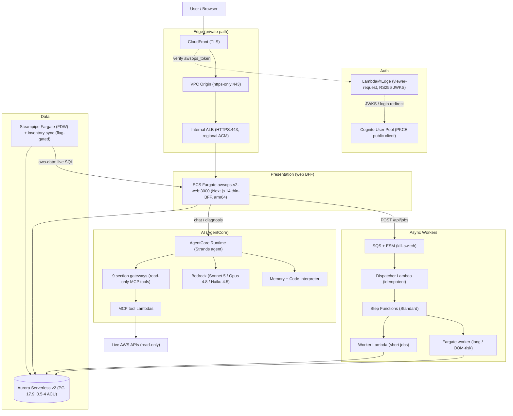
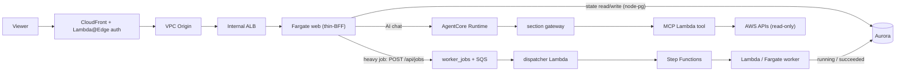
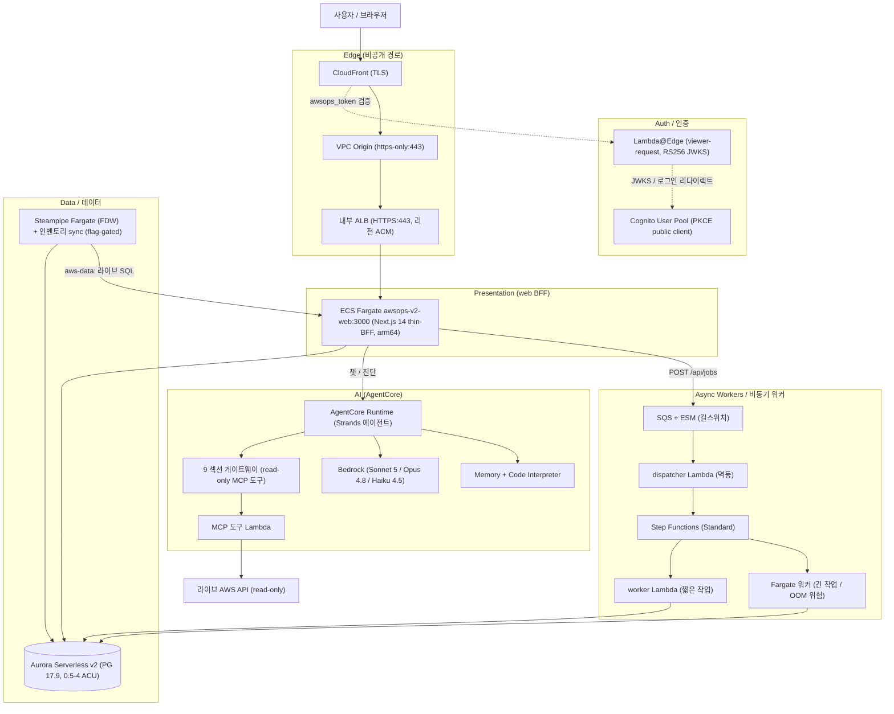
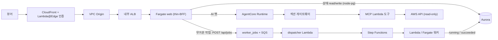

# English

## System Overview

AWSops v2 is a read-only AWS/Kubernetes operations dashboard with AI diagnosis, rebuilt from the v1 single-EC2 monolith into a Terraform-based MSA. Every viewer request travels a fully private edge (CloudFront VPC Origin → internal ALB → ECS Fargate web — no internet-facing load balancer), with Cognito + Lambda@Edge RS256 auth terminating at the edge, Aurora Serverless v2 holding durable state, AgentCore section agents answering per-domain questions over live AWS data, and an OOM-safe async worker tier lifting heavy work off the request path. AWS-resource mutation and autonomous action are FROZEN by design (ADR-005).

## Components by Layer

| Layer | Component | Role | Key files |
|---|---|---|---|
| Edge | CloudFront (TLS) → VPC Origin `https-only:443` → internal ALB HTTPS:443 (regional ACM) | Private request path; no public ALB. ALB SG allows 443 only from `CloudFront-VPCOrigins-Service-SG` | `terraform/foundation/edge.tf`, `network.tf` |
| Auth | Cognito User Pool (PKCE public client) + Lambda@Edge (`us-east-1`, python3.12, viewer-request) | RS256 JWKS verification + iss/aud/token_use at the edge; self-hosted `/login` form (BFF `InitiateAuth`) mints `awsops_token`; Hosted UI PKCE kept as dark fallback | `auth.tf`, `edge-lambda/cognito_edge.py.tftpl`, `web/app/login/` |
| Presentation (web BFF) | Next.js 14 thin-BFF on ECS Fargate `awsops-v2-web:3000` (standalone arm64, root path — no basePath) | Serves UI + light `/api/*` (`health`, `stream`, `db`, `jobs`, security/compliance); 6 Network menus (`/network-flow` live NFM top-contributors + E2E hop path, `/dns-query` Resolver/CoreDNS Logs Insights aggregation, `/ip-addresses` ENI-based IP inventory, `/vpc-endpoints` idle/policy/coverage analysis, `/direct-connect` connection/VIF down-detection + BGP route visibility, `/network-firewall` protection/logging/capacity + traffic-drop analysis) and the EKS drill-down (`/eks` cluster list → `[cluster]` tabs + nodes/pods/deployments/services/explorer/cost); heavy work is enqueued via `POST /api/jobs`, never run inline | `web/`, `workload.tf`, `scripts/v2/deploy.mjs` |
| Data | Aurora Serverless v2 (`awsops-v2-aurora`, PG 17.9, 0.5–4 ACU, KMS CMK, RDS-managed secret) via node-pg; flag-gated Steampipe inventory sync (`steampipe_enabled`) | Durable app state (`data/schema.sql` + `schema_migrations`, ULID migrations) — replaces v1 `data/*.json`, not live Steampipe | `data.tf`, `data/schema.sql`, `web/lib/db.ts`, `steampipe.tf` |
| AI | AgentCore Runtime (Strands `agent/agent.py`) + 9 section gateways (8 AWS domains + external-obs; ADR-004: 9 provisioned / 9 routed) + Memory + Code Interpreter; Bedrock Sonnet 5 / Opus 4.8 / Haiku 4.5; BFF-local chat routes — `aws-data` (LLM-generated Steampipe SQL executed live on the Steampipe Fargate, SELECT-only guard + row cap) + 6 auto-collect collectors (`web/lib/collectors/`) — web-local handlers, not AgentCore gateways | Read-only MCP tool agents over live AWS data; idempotent boto3 provisioner; config source of truth = SSM `/ops/awsops-v2/agentcore/*`. Design: 9 section agents + 1 incident orchestrator. All 16 chat section keys active (container/iac included): 9 gateway-routed + aws-data + 6 local collectors | `ai.tf`, `scripts/v2/agentcore/`, `agent/`, `web/lib/aws-data.ts`, `web/lib/collectors/` |
| Async Workers | SQS + ESM (kill-switch) → dispatcher Lambda (idempotent on job_id) → Step Functions Standard `$.runtime` Choice → worker Lambda (short) or `ecs:runTask.sync` Fargate (long/OOM); status_updater + reaper (5 min) | Ledger-first `worker_jobs`; a worker can OOM/crash without touching web availability. All gated on `workers_enabled` | `workers.tf`, `scripts/v2/workers/` |
| Observability | monitoring gateway (CloudWatch/CloudTrail + Loki/Tempo/Mimir), external-obs gateway (Prometheus/ClickHouse connectors), SNS diagnosis notification, incident webhook ingest, K8sGPT diagnosis (all flag-gated) | External-metric and alert/diagnosis surfaces on top of the read-only posture | `notify.tf`, `incidents.tf`, `k8sgpt.tf` |
| Security | ADR-005 freeze (remediation substrate do-not-enable), ADR-015 secret-rotation self-healing (single scoped exception), security findings + CIS compliance pages, EKS Access Entry + AdminView policy (read-only) | Read-only enforcement, governed exceptions, compliance history | `remediation.tf`, `secret-rotation.tf`, `eks.tf`, `web/app/security/`, `web/app/compliance/` |

## Architecture Diagram

## Data Flow

## Infrastructure

Single Terraform root `terraform/foundation/` — partial S3 backend (`backend.hcl`, bucket `awsops-v2-tfstate`, `use_lockfile`, no DynamoDB), TF >= 1.15, provider `~>6.0`. Large features are count/flag-gated (default false → `plan` = No changes, $0).

| File | Owns |
|---|---|
| `network.tf` | VPC new-or-reuse (`create_network` flag), subnets, NAT/IGW |
| `edge.tf` | CloudFront + VPC Origin + internal ALB + regional ACM |
| `auth.tf` + `edge-lambda/` | Cognito User Pool/client/domain + Lambda@Edge (RS256, templated Python) |
| `data.tf` + `data/schema.sql` + `migrations/` | Aurora Serverless v2 + baseline schema + ULID migrations |
| `workload.tf` | ECS cluster/service/task definition (web) |
| `ecr.tf` | Dual-tier ECR (dev-private + prod-public) |
| `ai.tf` | AgentCore ECR + IAM + agent Lambda slices + SSM (21 gated on `agentcore_enabled`, 6 on `integrations_enabled`) |
| `workers.tf` | SQS + ESM + dispatcher/worker/status_updater/reaper Lambda + Step Functions + Fargate worker (`workers_enabled`) |
| `eks.tf` | `for_each onboard_eks_clusters` Access Entry + AdminView policy + endpoint/CA outputs |
| `steampipe.tf` | Warm Steampipe Fargate (FDW) + sync Lambda → Aurora inventory (`steampipe_enabled`) |
| `notify.tf` | Diagnosis-completion SNS topic + subscription IAM (`diagnosis_notify_enabled`) |
| `incidents.tf` | Incident-lifecycle webhook/status (`incident_lifecycle_enabled`, ADR-006) |
| `k8sgpt.tf` | K8sGPT diagnosis layer Bedrock budget/resources (`k8sgpt_enabled`) |
| `writeback.tf` | RCA result write-back path (`rca_writeback_enabled`) |
| `remediation.tf` | Remediation substrate — **ADR-005 FROZEN, do-not-enable** |
| `secret-rotation.tf` | ADR-015 self-healing: EventBridge (secret RotationSucceeded) → Lambda → `ecs:UpdateService force-new-deployment` on own web service (`secret_rotation_redeploy_enabled`) |
| `variables.tf` / `outputs.tf` / `providers.tf` / `backend.tf` | Inputs, outputs, providers, partial S3 backend |

## Key Design Decisions

Current decision baseline: [decisions/BASELINE.md](decisions/BASELINE.md) (north star + invariants + FROZEN/GATED register + index of the consolidated ADRs).

| ADR | Decision | Why |
|---|---|---|
| [ADR-001](decisions/001-v2-foundation.md) | v2 Foundation — Terraform + thin-BFF + async workers (CDK→Terraform) | v1's single-host build+run coupling caused web latency spikes and non-durable `data/*.json` state |
| [ADR-002](decisions/002-auth-and-login.md) | Auth — Cognito + Lambda@Edge RS256 + in-app `/login` | No request may reach the backend unauthenticated; terminate auth as far upstream as possible |
| [ADR-003](decisions/003-ai-agent-routing.md) | AI routing — regex fast-path + Haiku classifier + cross-domain auto-synthesis | Deterministic speed for clear queries, LLM classification for ambiguous/multi-domain ones |
| [ADR-004](decisions/004-agentcore-gateways-runtime.md) | AgentCore — 9 section gateways + shared Runtime + Memory + Code Interpreter | Per-domain read-only MCP tools, idempotently provisioned, config delivered via SSM |
| [ADR-005](decisions/005-aws-mutation-autonomy-frozen.md) | AWS-resource mutation + autonomy = FROZEN (do-not-enable) | Read-only by design; unfreezing requires a new ADR + multi-AI panel + dated owner-override |
| [ADR-007](decisions/007-external-data-integration-governance.md) | External data integration governance (keystone) | "Read-only" scopes AWS resources; external DATA read+write is allowed only under governance |
| [ADR-009](decisions/009-async-worker-backbone.md) | Async worker backbone — SQS + Step Functions + Lambda/Fargate | Heavy/OOM-risk work must never affect web availability; ledger-first + idempotent dispatch |
| [ADR-016](decisions/016-v1-decommission.md) | v1 legacy decommission | v2 fully replaces v1; staged human-directed teardown, not autonomous action |

## Operations

Operational runbooks live in [runbooks/](runbooks/):

| Runbook | Topic |
|---|---|
| [deploy-new-version.md](runbooks/deploy-new-version.md) | Deploy a new version |
| [start-services.md](runbooks/start-services.md) | Start services |
| [add-new-page.md](runbooks/add-new-page.md) | Add a new dashboard page |
| [cognito-auth-issues.md](runbooks/cognito-auth-issues.md) | Cognito authentication issues |
| [alert-pipeline-troubleshoot.md](runbooks/alert-pipeline-troubleshoot.md) | Alert pipeline troubleshooting |
| [cache-warmer-issues.md](runbooks/cache-warmer-issues.md) | Cache warmer troubleshooting |
| [multi-account-setup.md](runbooks/multi-account-setup.md) | Multi-account setup |
| [onboard-target-account.md](runbooks/onboard-target-account.md) | Onboard a target account |
| [istio-agent-eks-access.md](runbooks/istio-agent-eks-access.md) | Grant istio-read MCP access to an EKS cluster |
| [k8sgpt-operator-install.md](runbooks/k8sgpt-operator-install.md) | K8sGPT operator install (out-of-band) |
| [v1-decommission.md](runbooks/v1-decommission.md) | v1 legacy decommission |
| [v1-to-v2-aurora-backfill.md](runbooks/v1-to-v2-aurora-backfill.md) | v1 → v2 Aurora history backfill |

---

# 한국어

## System Overview

AWSops v2는 읽기 전용 AWS/Kubernetes 운영 대시보드 + AI 진단으로, v1 단일 EC2 모놀리식을 Terraform 기반 MSA로 재구축한 것이다. 모든 요청은 완전 비공개 엣지(CloudFront VPC Origin → 내부 ALB → ECS Fargate web — 인터넷 노출 LB 없음)를 거치고, Cognito + Lambda@Edge RS256 인증이 엣지에서 종료되며, Aurora Serverless v2가 영속 상태를 보관하고, AgentCore 섹션 에이전트가 라이브 AWS 데이터로 도메인별 질의에 답하며, OOM-안전 비동기 워커 티어가 무거운 작업을 요청 경로에서 떼어낸다. AWS 리소스 변경·자율 조치는 설계상 FROZEN이다(ADR-005).

## Components by Layer

| 레이어 | 컴포넌트 | 역할 | 주요 파일 |
|---|---|---|---|
| Edge | CloudFront(TLS) → VPC Origin `https-only:443` → 내부 ALB HTTPS:443(리전 ACM) | 비공개 요청 경로 — 공개 ALB 없음. ALB SG는 `CloudFront-VPCOrigins-Service-SG`에서만 443 허용 | `terraform/foundation/edge.tf`, `network.tf` |
| Auth | Cognito User Pool(PKCE public client) + Lambda@Edge(`us-east-1`, python3.12, viewer-request) | 엣지에서 RS256 JWKS 검증 + iss/aud/token_use; 자체 `/login` 폼(BFF `InitiateAuth`)이 `awsops_token` 발급, Hosted UI PKCE는 다크 폴백 | `auth.tf`, `edge-lambda/cognito_edge.py.tftpl`, `web/app/login/` |
| Presentation (web BFF) | ECS Fargate `awsops-v2-web:3000`의 Next.js 14 thin-BFF(standalone arm64, 루트 경로 — basePath 없음) | UI + 가벼운 `/api/*`(`health`, `stream`, `db`, `jobs`, security/compliance)만 담당; 네트워크 메뉴 6종(`/network-flow` 라이브 NFM top-contributor + E2E 홉 경로, `/dns-query` Resolver/CoreDNS Logs Insights 집계, `/ip-addresses` ENI 기반 IP 인벤토리, `/vpc-endpoints` 유휴/정책/커버리지 분석, `/direct-connect` 커넥션/VIF 다운 감지 + BGP 라우트 가시성, `/network-firewall` 보호/로깅/용량 + 트래픽·드롭 분석)과 EKS 드릴다운(`/eks` 클러스터 목록 → `[cluster]` 탭 + nodes/pods/deployments/services/explorer/cost); 무거운 작업은 `POST /api/jobs`로 큐잉, 인라인 실행 금지 | `web/`, `workload.tf`, `scripts/v2/deploy.mjs` |
| Data | Aurora Serverless v2(`awsops-v2-aurora`, PG 17.9, 0.5–4 ACU, KMS CMK, RDS-관리 시크릿) — node-pg 접근; flag-gated Steampipe 인벤토리 sync(`steampipe_enabled`) | 영속 앱 상태(`data/schema.sql` + `schema_migrations`, ULID 마이그레이션) — v1 `data/*.json`의 대체이지 라이브 Steampipe 대체가 아님 | `data.tf`, `data/schema.sql`, `web/lib/db.ts`, `steampipe.tf` |
| AI | AgentCore Runtime(Strands `agent/agent.py`) + 9 섹션 게이트웨이(8 AWS 도메인 + external-obs; ADR-004: 9 프로비저닝 / 9 라우트) + Memory + Code Interpreter; Bedrock Sonnet 5 / Opus 4.8 / Haiku 4.5; BFF-로컬 챗 라우트 — `aws-data`(LLM 생성 Steampipe SQL을 Steampipe Fargate에 라이브 실행, SELECT-only 가드 + 행 캡) + auto-collect 콜렉터 6종(`web/lib/collectors/`) — web 로컬 핸들러, AgentCore 게이트웨이 경유 아님 | 라이브 AWS 데이터 위의 read-only MCP 도구 에이전트; 멱등 boto3 provisioner; 설정 source of truth = SSM `/ops/awsops-v2/agentcore/*`. 설계: 9 섹션 에이전트 + 1 인시던트 오케스트레이터. 챗 섹션 16키 전부 활성(container/iac 포함): 9 게이트웨이 라우트 + aws-data + 콜렉터 6 로컬 | `ai.tf`, `scripts/v2/agentcore/`, `agent/`, `web/lib/aws-data.ts`, `web/lib/collectors/` |
| Async Workers | SQS + ESM(킬스위치) → dispatcher Lambda(job_id 멱등) → Step Functions Standard `$.runtime` Choice → worker Lambda(짧음) 또는 `ecs:runTask.sync` Fargate(긺/OOM); status_updater + reaper(5분) | ledger-first `worker_jobs`; 워커가 OOM/크래시해도 web 가용성 무영향. 전부 `workers_enabled` 게이트 | `workers.tf`, `scripts/v2/workers/` |
| Observability | monitoring 게이트웨이(CloudWatch/CloudTrail + Loki/Tempo/Mimir), external-obs 게이트웨이(Prometheus/ClickHouse 커넥터), SNS 진단 알림, 인시던트 웹훅 수신, K8sGPT 진단(모두 flag-gated) | read-only 원칙 위의 외부 메트릭·알림·진단 표면 | `notify.tf`, `incidents.tf`, `k8sgpt.tf` |
| Security | ADR-005 동결(리메디에이션 substrate do-not-enable), ADR-015 시크릿 회전 자가치유(단일 범위 예외), 보안 findings + CIS 컴플라이언스 페이지, EKS Access Entry + AdminView 정책(read-only) | read-only 강제, 거버넌스된 예외, 컴플라이언스 이력 | `remediation.tf`, `secret-rotation.tf`, `eks.tf`, `web/app/security/`, `web/app/compliance/` |

## Architecture Diagram

## Data Flow

## Infrastructure

단일 Terraform 루트 `terraform/foundation/` — partial S3 backend(`backend.hcl`, 버킷 `awsops-v2-tfstate`, `use_lockfile`, DynamoDB 없음), TF >= 1.15, provider `~>6.0`. 대형 기능은 count/flag 게이트(기본 false → `plan` = No changes, $0).

| 파일 | 담당 |
|---|---|
| `network.tf` | VPC 신규생성 or 기존 재사용(`create_network` 플래그), 서브넷, NAT/IGW |
| `edge.tf` | CloudFront + VPC Origin + 내부 ALB + 리전 ACM |
| `auth.tf` + `edge-lambda/` | Cognito User Pool/클라이언트/도메인 + Lambda@Edge(RS256, 템플릿 Python) |
| `data.tf` + `data/schema.sql` + `migrations/` | Aurora Serverless v2 + 베이스라인 스키마 + ULID 마이그레이션 |
| `workload.tf` | ECS 클러스터/서비스/태스크 정의(web) |
| `ecr.tf` | 듀얼 티어 ECR(dev-private + prod-public) |
| `ai.tf` | AgentCore ECR + IAM + 에이전트 Lambda 슬라이스 + SSM(21개 `agentcore_enabled`, 6개 `integrations_enabled` 게이트) |
| `workers.tf` | SQS + ESM + dispatcher/worker/status_updater/reaper Lambda + Step Functions + Fargate 워커(`workers_enabled`) |
| `eks.tf` | `for_each onboard_eks_clusters` Access Entry + AdminView 정책 + endpoint/CA output |
| `steampipe.tf` | warm Steampipe Fargate(FDW) + sync Lambda → Aurora 인벤토리(`steampipe_enabled`) |
| `notify.tf` | 진단 완료 SNS 토픽 + 구독 IAM(`diagnosis_notify_enabled`) |
| `incidents.tf` | 인시던트 라이프사이클 webhook/상태(`incident_lifecycle_enabled`, ADR-006) |
| `k8sgpt.tf` | K8sGPT 진단층 Bedrock 예산/리소스(`k8sgpt_enabled`) |
| `writeback.tf` | RCA 결과 write-back 경로(`rca_writeback_enabled`) |
| `remediation.tf` | 리메디에이션 substrate — **ADR-005 FROZEN, do-not-enable** |
| `secret-rotation.tf` | ADR-015 자가치유: EventBridge(시크릿 RotationSucceeded) → Lambda → 자기 web 서비스 `ecs:UpdateService force-new-deployment`(`secret_rotation_redeploy_enabled`) |
| `variables.tf` / `outputs.tf` / `providers.tf` / `backend.tf` | 입력, 출력, provider, partial S3 backend |

## Key Design Decisions

결정의 현행 기준선: [decisions/BASELINE.md](decisions/BASELINE.md) (북극성 + 불변식 + FROZEN/GATED register + 통합 ADR 인덱스).

| ADR | 결정 | 이유 |
|---|---|---|
| [ADR-001](decisions/001-v2-foundation.md) | v2 파운데이션 — Terraform + thin-BFF + 비동기 워커(CDK→Terraform) | v1 단일 호스트 build+run 결합이 웹 지연 스파이크와 비영속 `data/*.json` 상태를 유발 |
| [ADR-002](decisions/002-auth-and-login.md) | 인증 — Cognito + Lambda@Edge RS256 + 인앱 `/login` | 어떤 요청도 인증 없이 백엔드에 도달 불가 — 인증은 최대한 상류에서 종료 |
| [ADR-003](decisions/003-ai-agent-routing.md) | AI 라우팅 — 정규식 fast-path + Haiku 분류기 + 교차도메인 자동합성 | 명확한 질의는 결정적 속도로, 모호/멀티도메인 질의는 LLM 분류로 처리 |
| [ADR-004](decisions/004-agentcore-gateways-runtime.md) | AgentCore — 9 섹션 게이트웨이 + 공유 Runtime + Memory + Code Interpreter | 도메인별 read-only MCP 도구를 멱등 프로비저닝, 설정은 SSM으로 전달 |
| [ADR-005](decisions/005-aws-mutation-autonomy-frozen.md) | AWS 리소스 변경 + 자율 = FROZEN(do-not-enable) | 설계상 read-only; 해제는 새 ADR + 멀티-AI 패널 + 날짜박힌 owner-override 필요 |
| [ADR-007](decisions/007-external-data-integration-governance.md) | 외부 데이터 통합 거버넌스(keystone) | "read-only"는 AWS 리소스 한정 — 외부 DATA read+write는 거버넌스 하에서만 허용 |
| [ADR-009](decisions/009-async-worker-backbone.md) | 비동기 워커 백본 — SQS + Step Functions + Lambda/Fargate | 무거운/OOM 위험 작업이 web 가용성에 영향을 주지 않도록; ledger-first + 멱등 디스패치 |
| [ADR-016](decisions/016-v1-decommission.md) | v1 레거시 폐기 | v2가 v1을 완전 대체; 자율 조치가 아닌 단계별 수동 폐기 |

## Operations

운영 런북은 [runbooks/](runbooks/)에 있다:

| 런북 | 주제 |
|---|---|
| [deploy-new-version.md](runbooks/deploy-new-version.md) | 새 버전 배포 |
| [start-services.md](runbooks/start-services.md) | 서비스 시작 |
| [add-new-page.md](runbooks/add-new-page.md) | 새 대시보드 페이지 추가 |
| [cognito-auth-issues.md](runbooks/cognito-auth-issues.md) | Cognito 인증 문제 |
| [alert-pipeline-troubleshoot.md](runbooks/alert-pipeline-troubleshoot.md) | 알림 파이프라인 문제 해결 |
| [cache-warmer-issues.md](runbooks/cache-warmer-issues.md) | 캐시 워머 문제 해결 |
| [multi-account-setup.md](runbooks/multi-account-setup.md) | 멀티 어카운트 설정 |
| [onboard-target-account.md](runbooks/onboard-target-account.md) | 타깃 계정 온보딩 |
| [istio-agent-eks-access.md](runbooks/istio-agent-eks-access.md) | istio-read MCP의 EKS 클러스터 접근 부여 |
| [k8sgpt-operator-install.md](runbooks/k8sgpt-operator-install.md) | K8sGPT 오퍼레이터 설치(아웃-오브-밴드) |
| [v1-decommission.md](runbooks/v1-decommission.md) | v1 레거시 폐기 |
| [v1-to-v2-aurora-backfill.md](runbooks/v1-to-v2-aurora-backfill.md) | v1 → v2 Aurora 이력 백필 |
